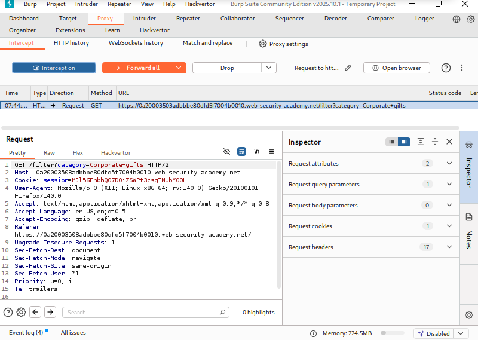
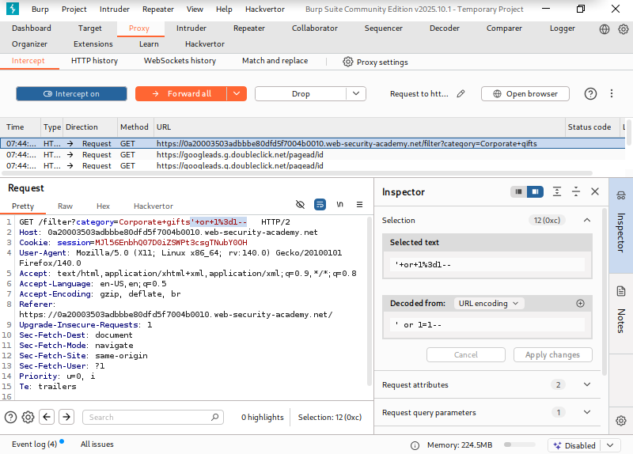
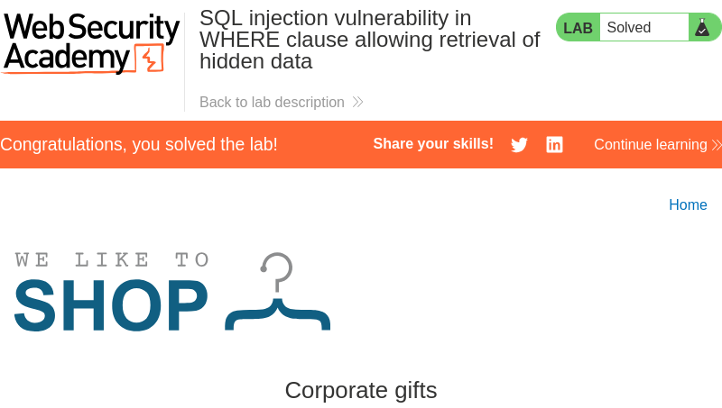

# SQL injection vulnerability in WHERE clause allowing retrieval of hidden data

## Overview
This lab demonstrates a SQL injection vulnerability in the product category filter.
When a category is selected, the application builds a SQL query that only shows
products marked as released.

The query used by the application is:
```sql
SELECT * FROM products WHERE category = 'Gifts' AND released = 1
```

Since the category value comes directly from user input and is not properly handled,
the query logic can be manipulated using SQL injection.

The goal of this lab is to retrieve one or more unreleased products.

## Solution

### Step 1: Intercept the request
Select any product category on the website and intercept the request using Burp Suite.



### Step 2: Modify the category parameter
Edit the `category` parameter and inject the following payload:
```text
' OR 1=1--
```

This payload makes the WHERE condition always true, which causes all products
to be returned by the query.



### Step 3: Check the response
Forward the modified request to the server. The response now contains unreleased products, which verifies that the SQL injection was successful.



---

## 📂 Screenshots folder
```text
screenshots/
├── 01-original-request.png
├── 02-payload-injected.png
└── 03-unreleased-products.png
```