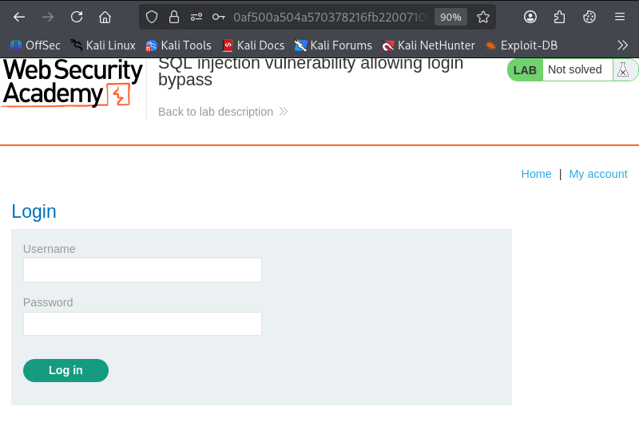
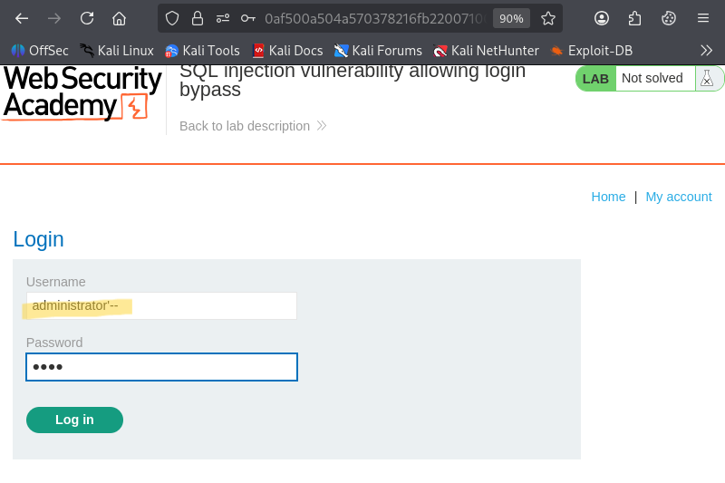
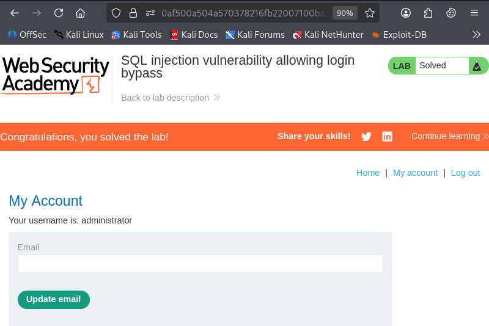

# SQL injection vulnerability allowing login bypass
*Written by Dnyaneshwar Yadav*
## Overview
This lab contains a SQL injection vulnerability in the login functionality.
The application does not properly handle user input in the login form, which
allows the authentication logic to be bypassed.

The goal of this lab is to log in to the application as the `administrator`
user without knowing the password.

## Solution

### Step 1: Open the login page
Open the login page of the application.



### Step 2: Inject payload in the username field
In the username field, enter the following payload and submit the login form:
```text
administrator'--
```

This payload comments out the rest of the SQL query, bypassing the password verification.



### Step 3: Verify successful login
After submitting the form, the application logs in successfully as the administrator user.



---

## 📂 Screenshots folder
```text
screenshots/
├── 01-login-page.png
├── 02-username-payload.png
└── 03-admin-dashboard.png
```