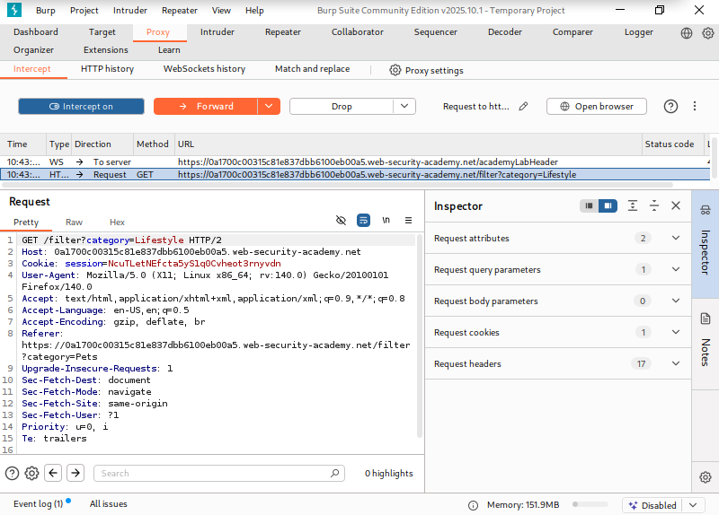
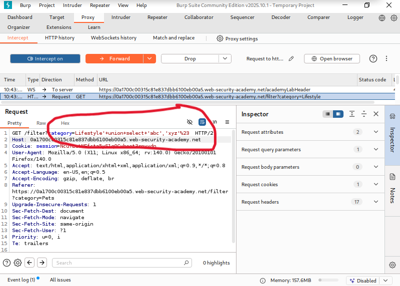
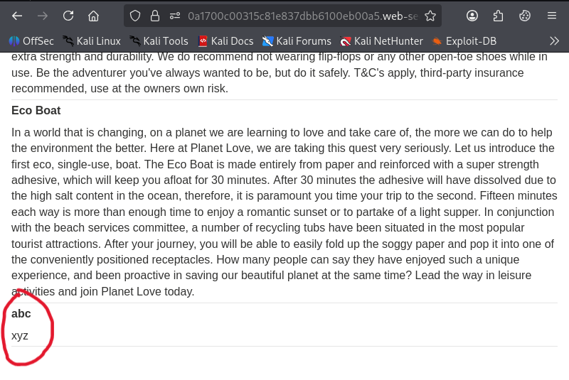
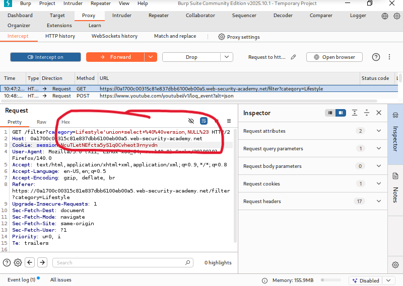
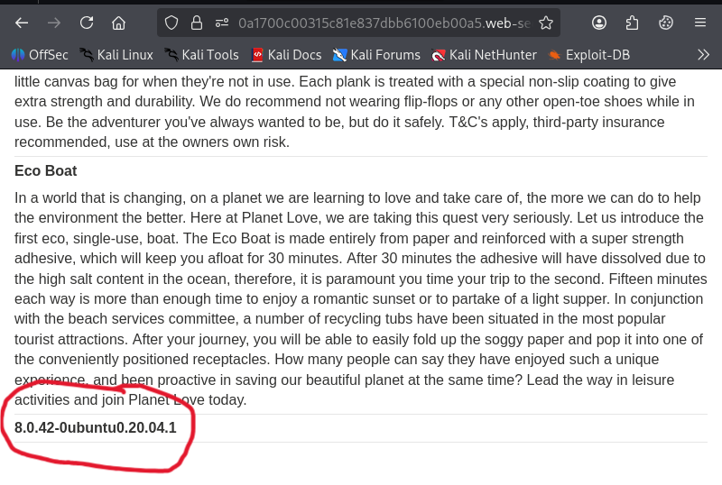

# SQL Injection Attack,Querying Database Type and Version on MySQL and Microsoft

**Written by Dnyaneshwar Yadav..**

---

## Overview

This lab contains a SQL injection vulnerability in the product category filter. When a user selects a category, the application executes a SQL query to retrieve product information from the database.

Because user input is directly included in the query, the application is vulnerable to a UNION-based SQL injection. This allows an attacker to inject an additional SELECT statement and retrieve data from the database.

**Objective:** Identify the database type and display the database version string for MySQL or Microsoft SQL Server.

---

## Solution

### Step 1: Intercept the Original Request

Select any product category on the application and intercept the request that sets the `category` parameter.



---

### Step 2: Determine the Number of Columns

To determine how many columns are returned by the query and confirm which columns accept text data, inject the following payload into the `category` parameter:
```sql
' UNION SELECT 'abc','xyz'#
```



---

### Step 3: Verify Column Output

Confirm that both columns are displayed in the application response.



---

### Step 4: Retrieve the Database Version

After confirming that the query returns two columns and both accept text data, use the following payload to retrieve the database version string:
```sql
' UNION SELECT @@version, NULL#
```



---

### Step 5: Verify the Result

The database version is now displayed in the application response, confirming successful exploitation.



---

## 📂 Screenshots Folder Structure
```
screenshots/
├── 01-original-request.png
├── 02-union-column-test.png
├── 03-union-column-verified.png
├── 04-version-query.png
└── 05-version-result.png
```

---