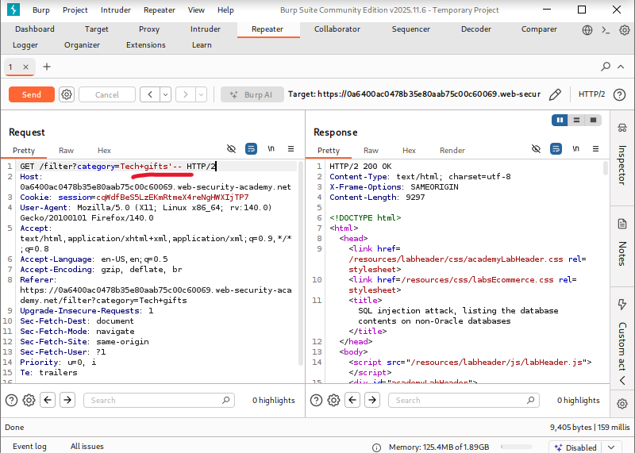
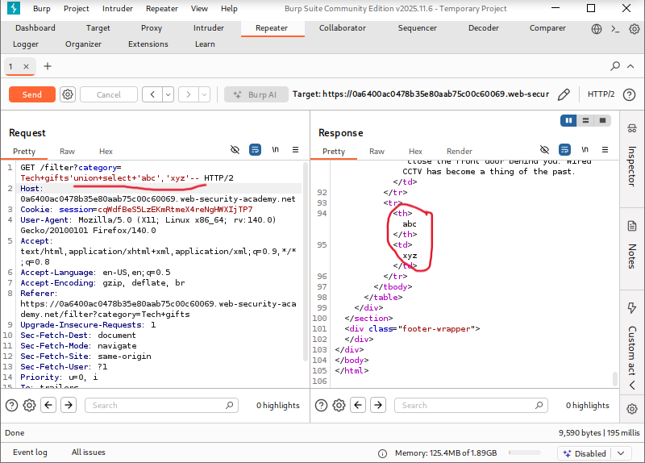
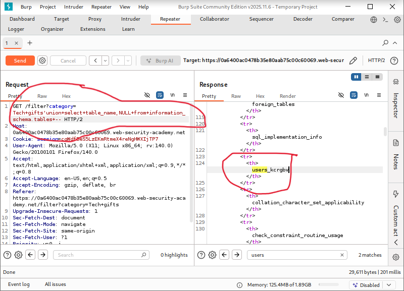
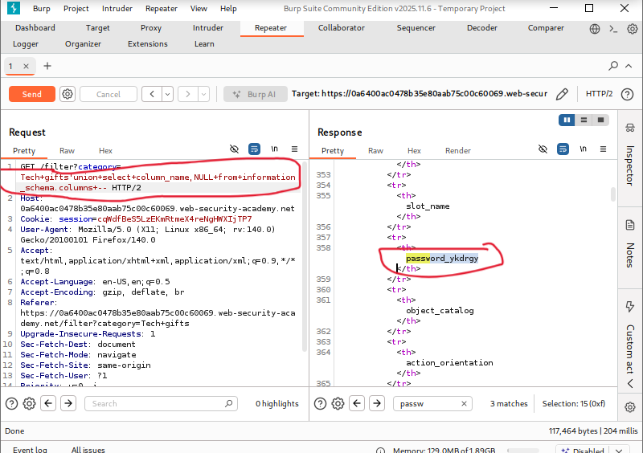
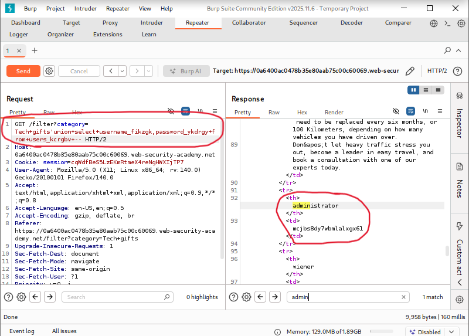
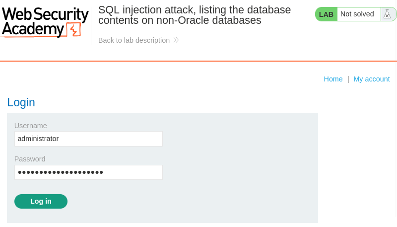
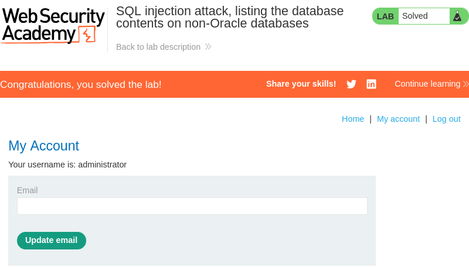

# SQL Injection Attack: Listing the Database Contents (Non-Oracle Databases)

**Written by Dnyaneshwar Yadav**

---

## Overview

This lab contains a **SQL injection vulnerability** in the product category filter.

The results of the SQL query are returned directly in the application response, which makes it possible to exploit the vulnerability using a **UNION-based SQL injection attack**.

The application includes a login feature, and the database contains a table storing usernames and passwords.

The objective of this lab is to enumerate the database structure, retrieve user credentials, and log in as the **administrator** user.

---

## Solution

### Step 1: Identify SQL injection vulnerability

Navigate to the product category filter and intercept the request using **Burp Suite**.

The request was sent to **Repeater**, and a single quote payload was injected to test for SQL injection:
```sql
'
```

The application responded with abnormal behavior, confirming that the parameter is vulnerable to SQL injection.



---

### Step 2: Confirm number of columns and text data support

To identify the number of columns returned by the query and confirm which columns support text data, the following payload was injected:
```sql
' UNION SELECT 'abc','xyz'--
```

The response successfully displayed the injected values, confirming that:
- The query returns **two columns**
- Both columns accept **text data**



---

### Step 3: Enumerate database tables

After confirming the column structure, the next step was to identify the tables present in the database.

The following payload was used to retrieve table names:
```sql
' UNION SELECT table_name, NULL FROM information_schema.tables--
```

From the response, the table containing user credentials was identified.



---

### Step 4: Enumerate column names (username and password)

Once the user table was identified, the column names were enumerated using the following payload:
```sql
' UNION SELECT column_name, NULL FROM information_schema.columns WHERE table_name='users_abcdef'--
```

The screenshot shows both the **username column** and **password column** discovered in the table.



---

### Step 5: Extract usernames and passwords

After identifying both the table name and column names, the following payload was used to retrieve all usernames and passwords:
```sql
' UNION SELECT username_abcdef, password_abcdef FROM users_abcdef--
```

The response revealed the credentials for all users, including the **administrator** account.



---

### Step 6: Log in as administrator

Using the retrieved administrator credentials, the login form was accessed and the administrator username and password were submitted.



---

### Step 7: Confirm lab completion

After successful authentication, the application logged in as the administrator, and the lab was marked as **solved**.



---

## Result

The successful enumeration of database tables and columns, extraction of user credentials, and login as the administrator confirm a **critical SQL injection vulnerability** in the application.

---

## 📂 Screenshots Folder Structure
```text
screenshots/
├── 01-sqli-detected.png
├── 02-union-column-confirmed.png
├── 03-table-names.png
├── 04-username-password-columns.png
├── 05-admin-credentials.png
├── 06-admin-login.png
└── 07-lab-solved.png
```

---
