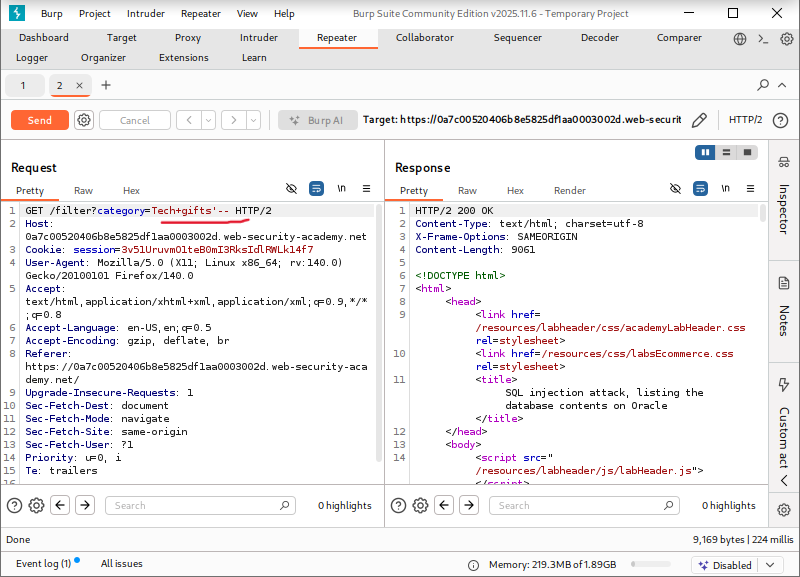
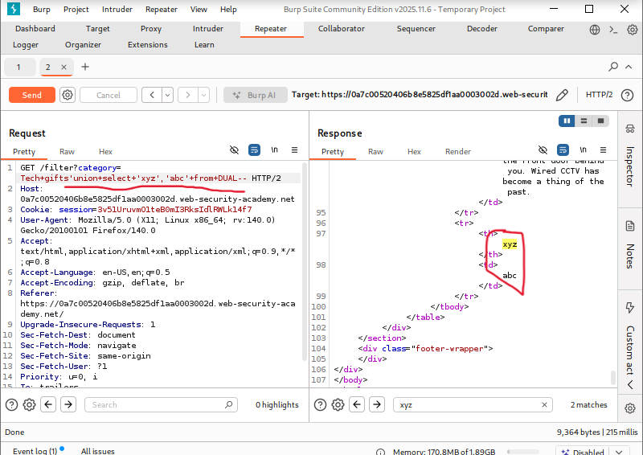
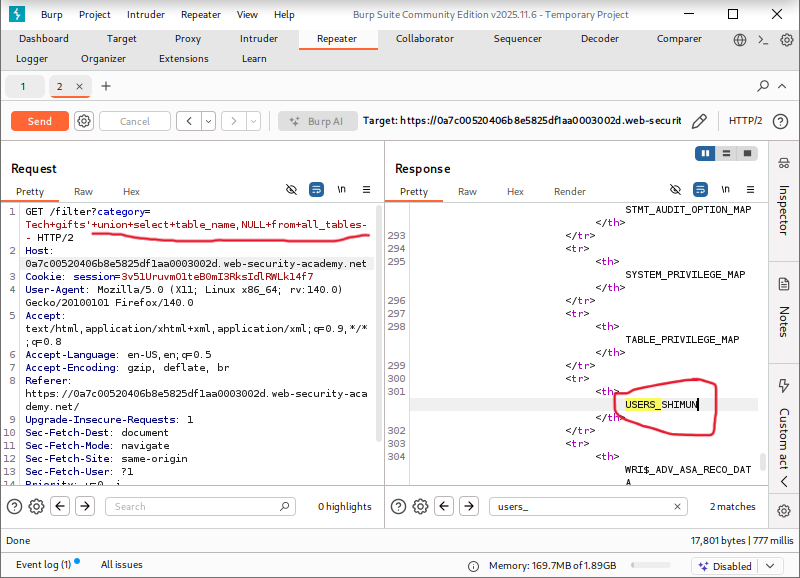
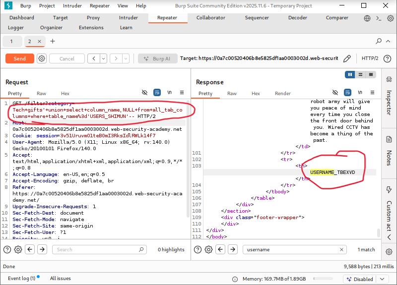
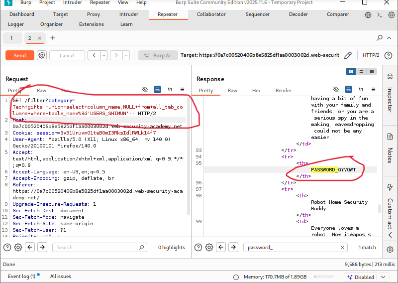
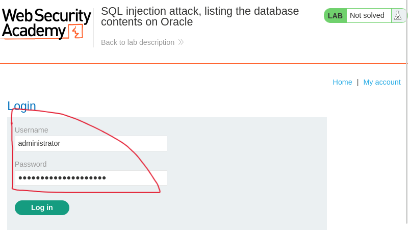
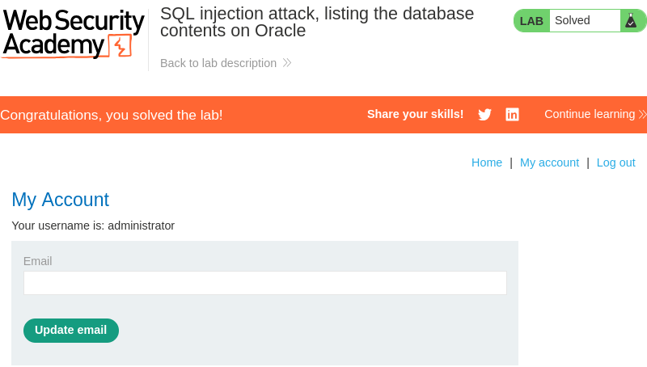

# SQL Injection Attack: Listing the Database Contents on Oracle

**Written by Dnyaneshwar Yadav**

---

## Overview

This lab contains a **SQL injection vulnerability** in the product category filter.

The results of the SQL query are returned directly in the application response, which allows the use of a **UNION-based SQL injection attack**.

The backend database is **Oracle**, and the application includes a login function. The database contains a table storing usernames and passwords.

The objective of this lab is to enumerate the database structure, extract user credentials, and log in as the **administrator** user.

---

## Solution

### Step 1: Intercept request and confirm SQL injection

Navigate to the product category filter and intercept the request using **Burp Suite**.

The request was sent to **Repeater**, and a basic SQL injection test payload was injected to confirm vulnerability:
```sql
'
```

The response behavior confirmed that the parameter is vulnerable to SQL injection.



---

### Step 2: Confirm number of columns and text support

To determine the number of columns returned by the query and confirm which columns accept text data, the following payload was used:
```sql
' UNION SELECT 'abc','xyz' FROM dual--
```

The injected values were reflected in the response, confirming that:
- The query returns **two columns**
- Both columns accept **text data**



---

### Step 3: Enumerate table names

After confirming the column structure, the next step was to identify tables present in the Oracle database.

The following payload was used:
```sql
' UNION SELECT table_name, NULL FROM all_tables--
```

From the response, the table containing user credentials was identified.



---

### Step 4: Enumerate username column

Once the user table was identified, column names were enumerated using:
```sql
' UNION SELECT column_name, NULL FROM all_tab_columns WHERE table_name='USERS_ABCDEF'--
```

One screenshot shows the column containing usernames.



---

### Step 5: Enumerate password column

Further enumeration revealed the column containing passwords.

Since the columns appeared separately, a second screenshot was captured.



---

### Step 6: Extract administrator credentials

After identifying the table and column names, the following payload was used to extract usernames and passwords:
```sql
' UNION SELECT USERNAME_ABCDEF, PASSWORD_ABCDEF FROM USERS_ABCDEF--
```

The administrator username and password were successfully retrieved.


---

### Step 7: Log in as administrator

Using the extracted credentials, the administrator username and password were entered into the login form.



---

### Step 8: Confirm lab completion

After successful authentication, the application logged in as the administrator and the lab was marked as **solved**.



---

## Result

The successful enumeration of Oracle database tables and columns, extraction of user credentials, and administrator login confirm a **critical SQL injection vulnerability** in the application.

---

## 📂 Screenshots Folder Structure
```text
screenshots/
├── 01-sqli-detected.png
├── 02-union-columns.png
├── 03-table-names.png
├── 04-username-column.png
├── 05-password-column.png
├── 06-admin-credentials.png
├── 07-admin-login.png
└── 08-lab-solved.png
```

---

