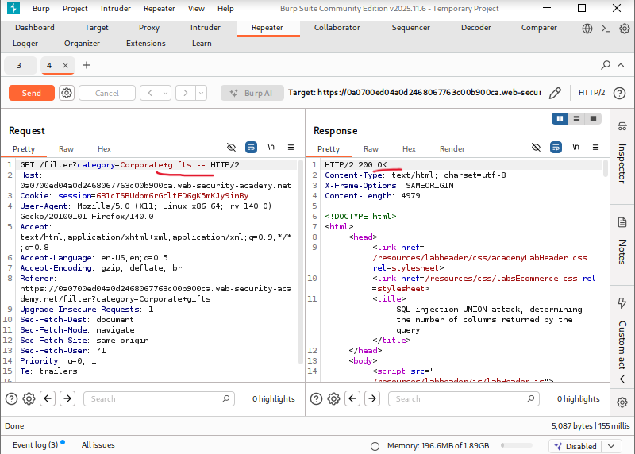
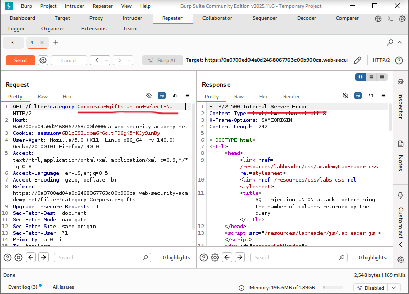
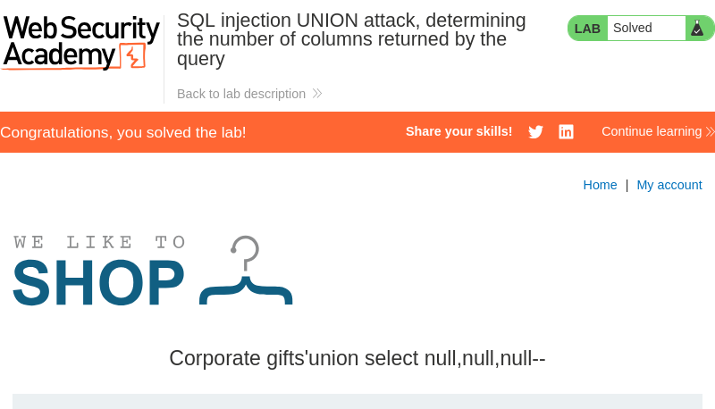

# SQL Injection UNION Attack: Determining the Number of Columns Returned by the Query

**Written by Dnyaneshwar Yadav**

---

## Overview

This lab contains a **SQL injection vulnerability** in the product category filter.

The results of the SQL query are returned directly in the application response, which allows the use of a **UNION-based SQL injection attack**.

Before extracting any data using UNION, it is necessary to determine the number of columns returned by the original query.

The objective of this lab is to identify the correct number of columns by injecting `NULL` values until the SQL error disappears.

---

## Solution

### Step 1: Confirm SQL injection vulnerability

Navigate to the product category filter and intercept the request using **Burp Suite**.

The request was sent to **Repeater**, and a basic SQL injection test payload was injected:
```sql
'
```

The response behavior confirmed that the parameter is vulnerable to SQL injection.



---

### Step 2: Test UNION SELECT with a single NULL value

To determine the number of columns, the following payload was injected:
```sql
' UNION SELECT NULL--
```

This resulted in a SQL error, indicating that the number of columns provided does not match the original query.



---

### Step 3: Identify correct column count

The payload was modified by adding additional `NULL` values:
```sql
' UNION SELECT NULL, NULL, NULL--
```

This time, the error disappeared and the response included additional content, confirming that the original query returns **three columns**.


---

### Step 4: Confirm lab completion

After successfully determining the number of columns, the lab was marked as solved by the application.



---

## Result

The successful UNION-based SQL injection confirms that the original query returns **three columns**. This information can be used in subsequent labs to construct more advanced SQL injection attacks.

---

## 📂 Screenshots Folder Structure
```text
screenshots/
├── 01-sqli-detected.png
├── 02-union-null-error.png
├── 03-union-null-success.png
└── 04-lab-solved.png
```

---
