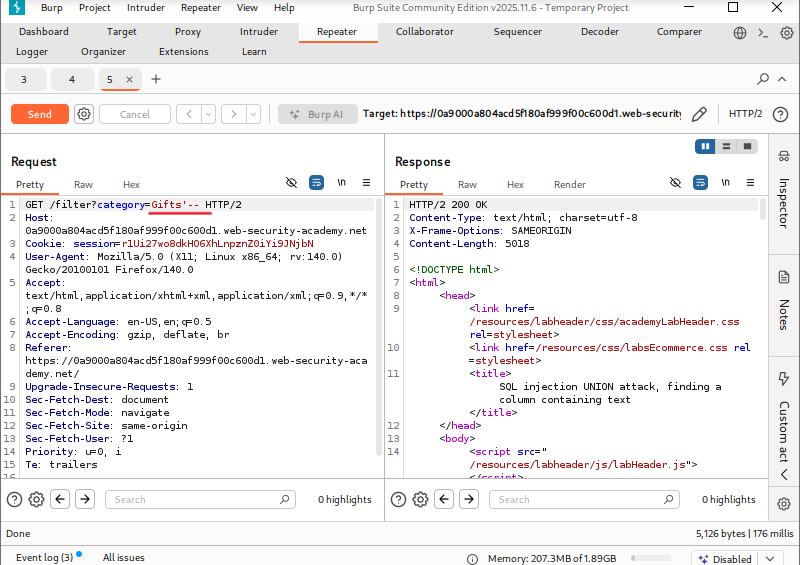
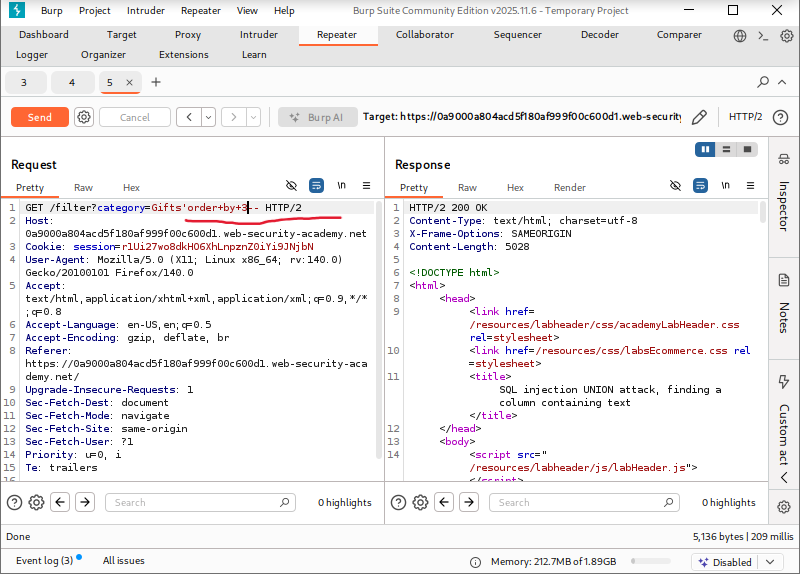
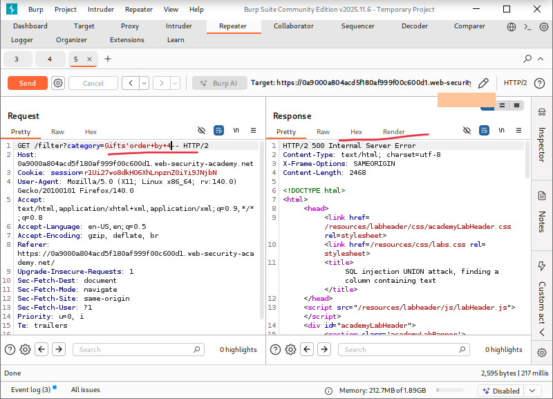
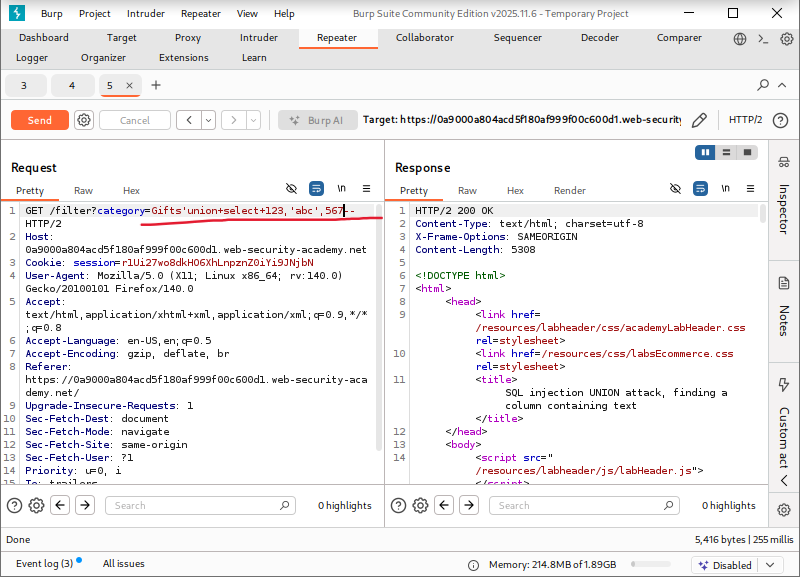
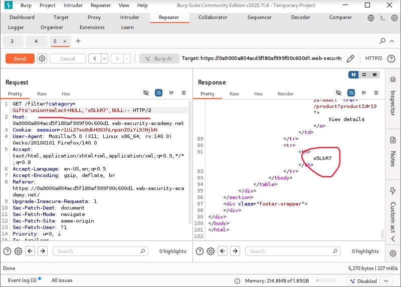
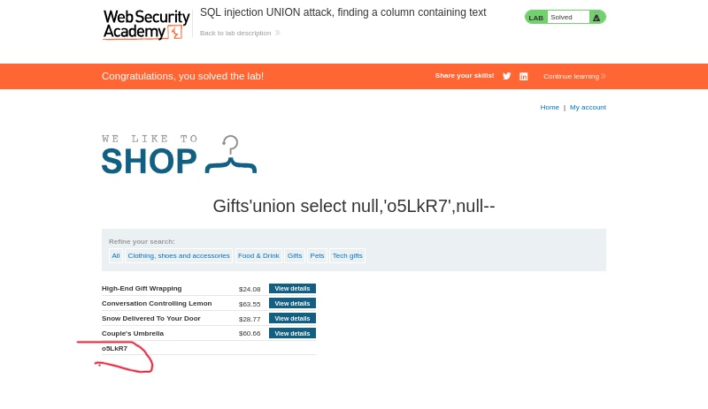

# SQL Injection UNION Attack: Finding a Column Containing Text

**Written by Dnyaneshwar Yadav**

---

## Overview

This lab contains a **SQL injection vulnerability** in the product category filter.

The results of the SQL query are returned directly in the application response, allowing the use of a **UNION-based SQL injection attack**.

After determining the number of columns returned by the query, the next step is to identify **which column supports string (text) data**.

The lab provides a random string value that must be injected and reflected in the response to identify the text-compatible column.

---

## Solution

### Step 1: Confirm SQL injection vulnerability

The product category request was intercepted using **Burp Suite** and sent to **Repeater**.

A basic SQL injection test payload was injected:
```sql
'
```

The response behavior confirmed that the parameter is vulnerable to SQL injection.



---

### Step 2: Determine number of columns using ORDER BY

To identify the number of columns returned by the query, `ORDER BY` clauses were tested.

The following payloads were tried:
```sql
' ORDER BY 1--
' ORDER BY 2--
' ORDER BY 3--
```

The query executed successfully with `ORDER BY 3`, confirming that the query returns **three columns**.



---

### Step 3: Confirm column limit using ORDER BY error

To verify the column limit, the following payload was injected:
```sql
' ORDER BY 4--
```

This resulted in a SQL error, further confirming that the query only returns **three columns**.



---

### Step 4: Identify column data types

To determine which column accepts string data, the following payload was used:
```sql
' UNION SELECT 123,'abc',567--
```

The response successfully displayed the string value `'abc'`, indicating that the **second column supports text data**, while the other columns expect numeric values.



---

### Step 5: Inject the provided random string

The lab provided a random string value that needed to appear in the response.

The following payload was used to inject the string into the text-compatible column:
```sql
' UNION SELECT NULL,'o5LkR7',NULL--
```

The random string appeared in the application response, confirming that the correct text-compatible column was identified.



---

### Step 6: Confirm lab completion

After the required string was successfully displayed in the response, the lab was automatically marked as **solved**.



---

## Result

The successful reflection of the provided random string confirms that the **second column** returned by the query supports **string data**. This information is essential for constructing further UNION-based SQL injection attacks.

---

## 📂 Screenshots Folder Structure
```text
screenshots/
├── 01-sqli-confirmed.png
├── 02-order-by-3.png
├── 03-order-by-4-error.png
├── 04-column-datatype.png
├── 05-random-string.png
└── 06-lab-solved.png
```

---
