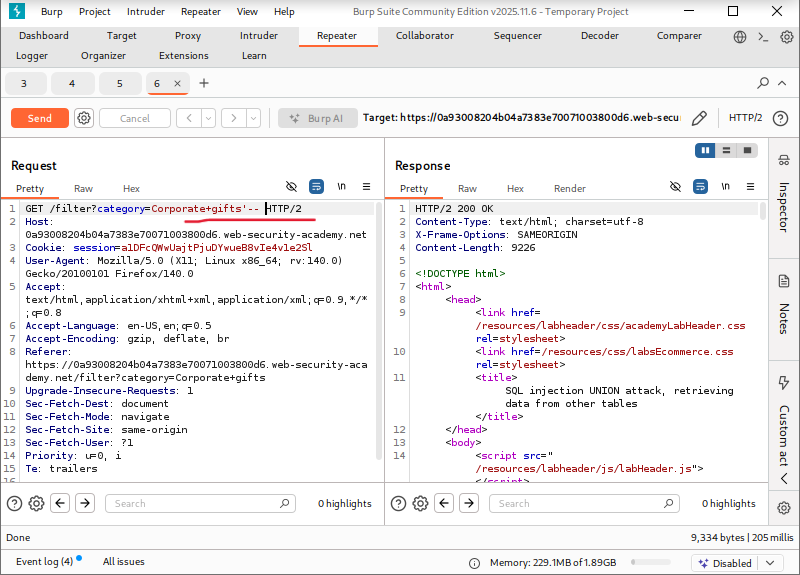
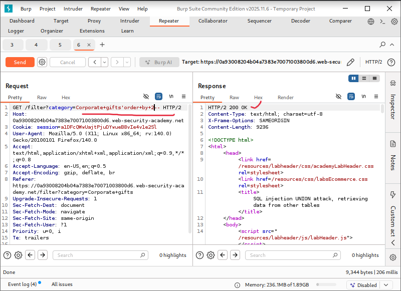
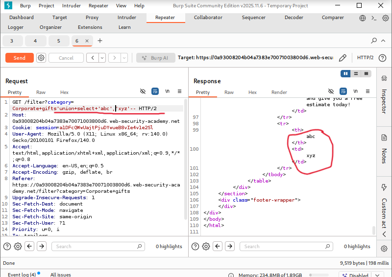
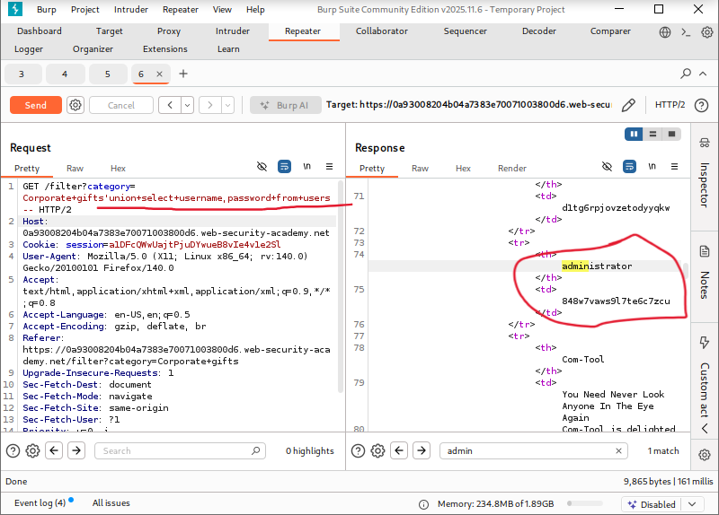
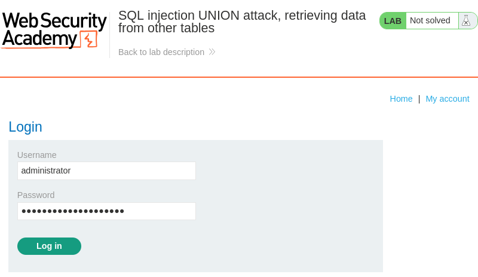
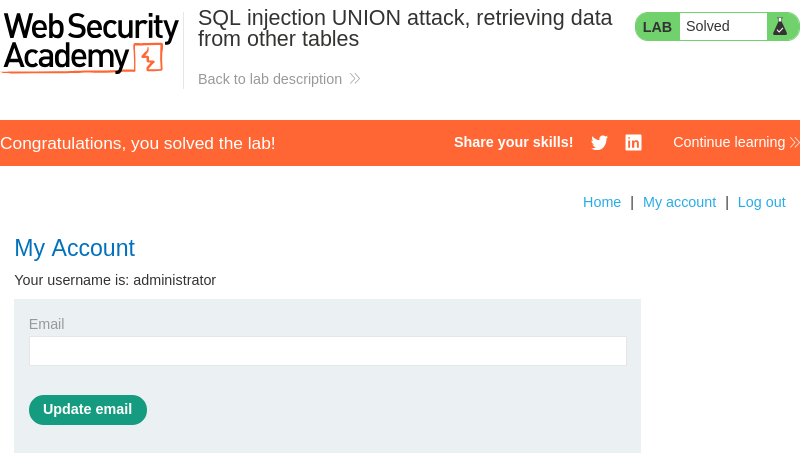

# SQL Injection UNION Attack: Retrieving Data from Other Tables

**Written by Dnyaneshwar Yadav..**

---

## Overview

This lab contains a **SQL injection vulnerability** in the product category filter.

The results of the SQL query are returned directly in the application's response, which allows the use of a **UNION-based SQL injection attack**.

The database contains a table named `users` with the columns `username` and `password`.

The objective of this lab is to retrieve all usernames and passwords from the `users` table and use the administrator credentials to log in.

---

## Solution

### Step 1: Confirm SQL injection vulnerability

The product category request was intercepted using **Burp Suite** and sent to **Repeater**.

A basic SQL injection test payload was injected:
```sql
'
```

The response behavior confirmed that the parameter is vulnerable to SQL injection.



---

### Step 2: Determine the number of columns

To determine how many columns are returned by the original query, the following payload was used:
```sql
' ORDER BY 2--
```

The response returned normally, confirming that the query contains **two columns**.



---

### Step 3: Identify text-compatible columns

To identify which columns accept text data, the following payload was injected:
```sql
' UNION SELECT 'xyz','abc'--
```

Both string values were reflected in the response, confirming that **both columns support text data**.



---

### Step 4: Retrieve usernames and passwords

After confirming the column structure and data types, the following payload was used to extract credentials from the `users` table:
```sql
' UNION SELECT username, password FROM users--
```

The response displayed usernames and passwords, including the **administrator credentials**.



---

### Step 5: Log in as administrator

Using the extracted administrator username and password, the login form was accessed and the credentials were submitted.



---

### Step 6: Confirm lab completion

After successful authentication, the application logged in as the administrator and the lab was marked as **solved**.



---

## Result

The successful extraction of usernames and passwords from another database table and administrator login confirm a **critical SQL injection vulnerability** in the application.

---

## 📂 Screenshots Folder Structure
```text
screenshots/
├── 01-sqli-confirmed.png
├── 02-order-by-2.png
├── 03-union-text-columns.png
├── 04-admin-credentials.png
├── 05-admin-login.png
└── 06-lab-solved.png
```

---

