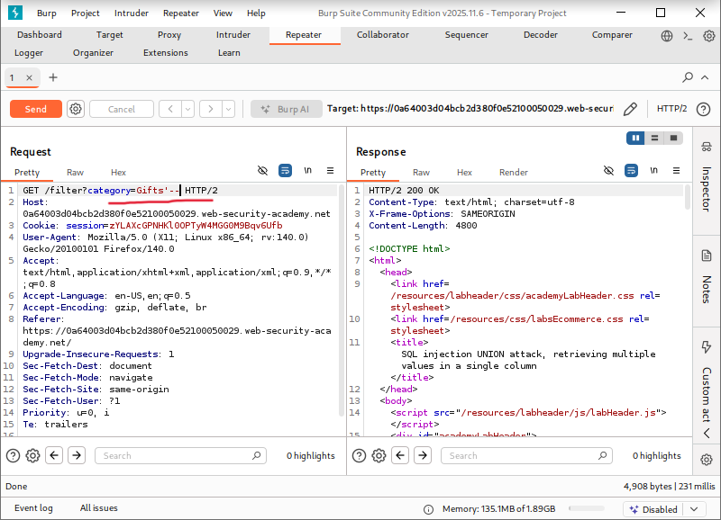
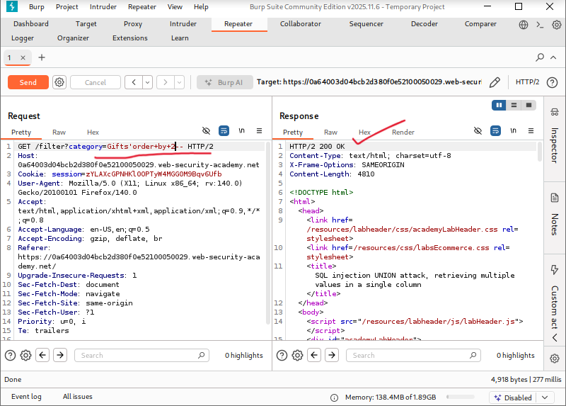
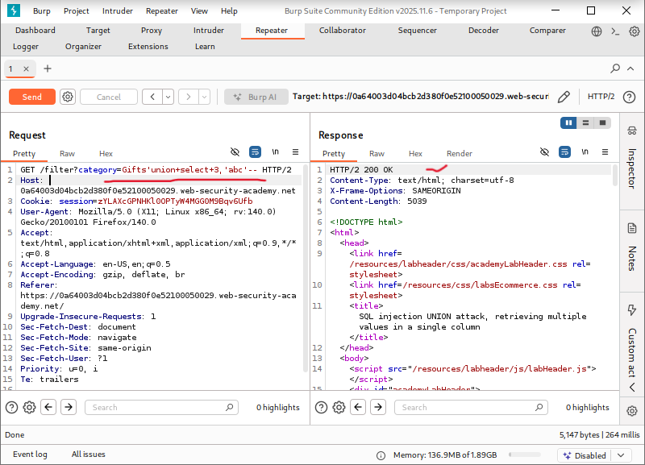
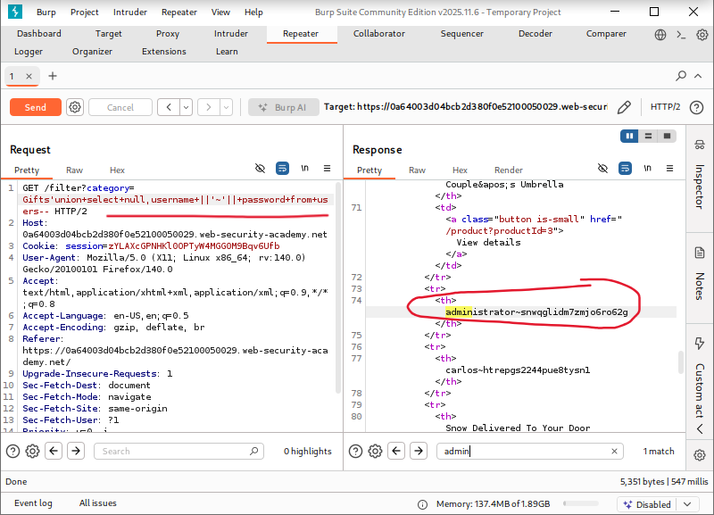
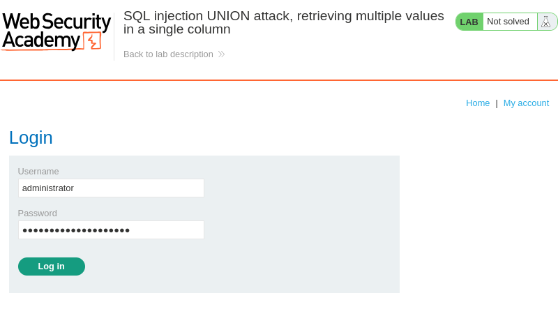
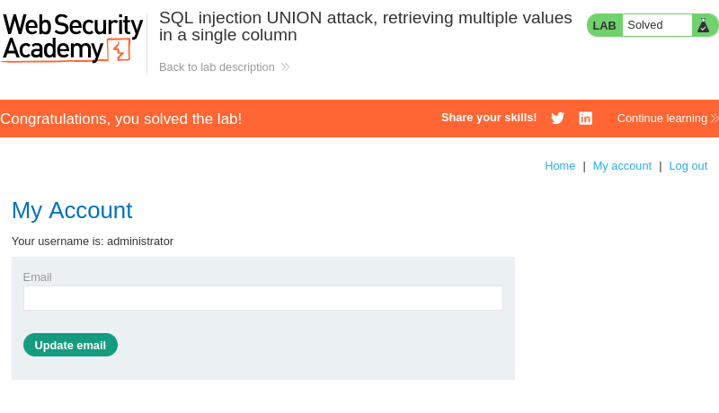

# SQL Injection UNION Attack: Retrieving Multiple Values in a Single Column

**Written by Dnyaneshwar Yadav**

---

## Overview

This lab contains a **SQL injection vulnerability** in the product category filter.

The results of the SQL query are returned directly in the application's response, allowing the use of a **UNION-based SQL injection attack**.

The database contains a table named `users` with the columns `username` and `password`.

However, only **one column** in the original query supports **text data**, which requires combining multiple values into a single column.

The objective of this lab is to retrieve all usernames and passwords and use the administrator credentials to log in.

---

## Solution

### Step 1: Confirm SQL injection vulnerability

The product category request was intercepted using **Burp Suite** and sent to **Repeater**.

A basic SQL injection test payload was injected:
```sql
'
```

The response behavior confirmed that the parameter is vulnerable to SQL injection.



---

### Step 2: Determine the number of columns

To identify the number of columns returned by the original query, the following payload was used:
```sql
' ORDER BY 2--
```

The response executed successfully, confirming that the query returns **two columns**.



---

### Step 3: Identify the text-compatible column

To determine which column accepts text data, the following payload was injected:
```sql
' UNION SELECT 3,'abc'--
```

The string `'abc'` appeared in the response, confirming that only the **second column supports text data**.



---

### Step 4: Retrieve usernames and passwords in a single column

Since only one column supports text, the `username` and `password` values were combined using string concatenation.

The following payload was used:
```sql
' UNION SELECT NULL, username || '~' || password FROM users--
```

The response displayed usernames and passwords together, separated by `~`, including the **administrator credentials**.



---

### Step 5: Log in as administrator

Using the extracted administrator username and password, the login form was accessed and the credentials were submitted.



---

### Step 6: Confirm lab completion

After successful authentication, the application logged in as the administrator and the lab was marked as **solved**.



---

## Result

The successful extraction of multiple values within a single text-compatible column confirms a **critical SQL injection vulnerability** and demonstrates how string concatenation can be used to bypass column limitations.

---

## 📂 Screenshots Folder Structure
```text
screenshots/
├── 01-sqli-confirmed.png
├── 02-order-by-2.png
├── 03-text-column.png
├── 04-admin-credentials.png
├── 05-admin-login.png
└── 06-lab-solved.png
```

---
