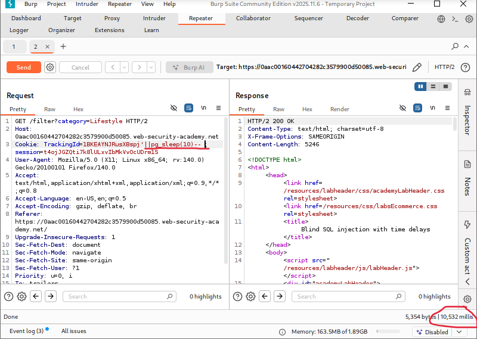
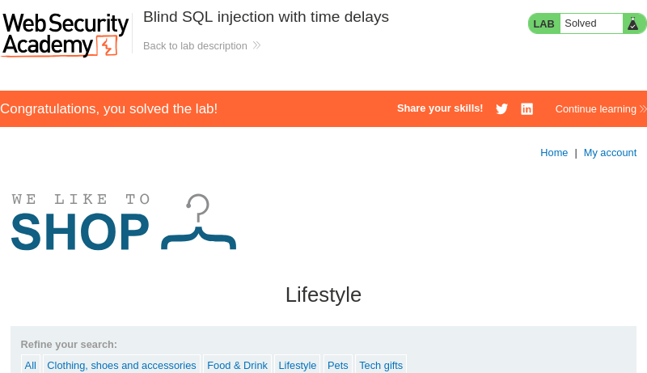

# Blind SQL Injection with Time Delays

**Written by Dnyaneshwar Yadav..**

---

## Overview

This lab contains a **blind SQL injection vulnerability** in the application.

The application uses a **TrackingId cookie** for analytics and includes its value inside a SQL query.

The results of the SQL query are **not returned** in the response, and the application does not display any error messages. However, the query is executed **synchronously**, which makes it possible to infer SQL injection by triggering **time delays**.

The objective of this lab is to exploit the blind SQL injection vulnerability and cause the application to delay its response by **10 seconds**.

---

## Solution

### Step 1: Inject a time-delay payload via the TrackingId cookie

Navigate to the front page of the application and intercept the request using **Burp Suite**.

Modify the `TrackingId` cookie with the following payload:
```sql
'||pg_sleep(10)--
```

This payload forces the database to pause execution for 10 seconds if the SQL injection is successful.



---

### Step 2: Verify the time delay and lab completion

Send the modified request and observe the server response time.

The application takes approximately **10 seconds** to respond, confirming that the injected SQL query was executed successfully.

After the delay is observed, the lab is marked as **solved**.



---

## Result

The successful 10-second response delay confirms the presence of a **blind SQL injection vulnerability**. Even though no query results are displayed, execution timing can be used to infer SQL injection.

---

## 📂 Screenshots Folder Structure
```text
screenshots/
├── 01-time-delay-payload.png
└── 02-lab-solved.png
```

---
