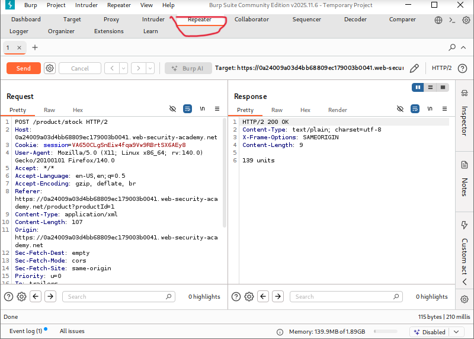
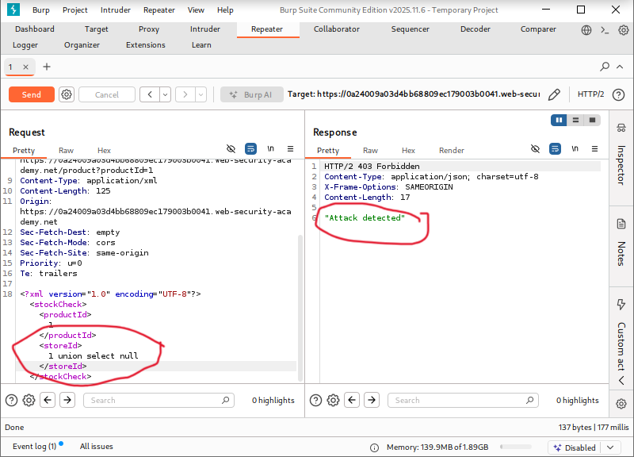
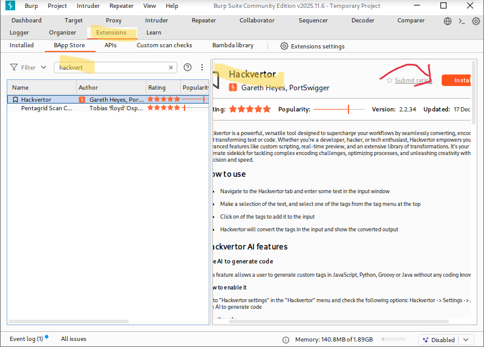
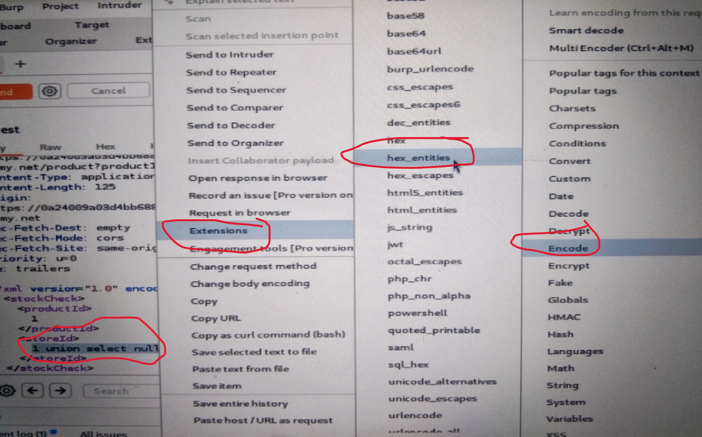
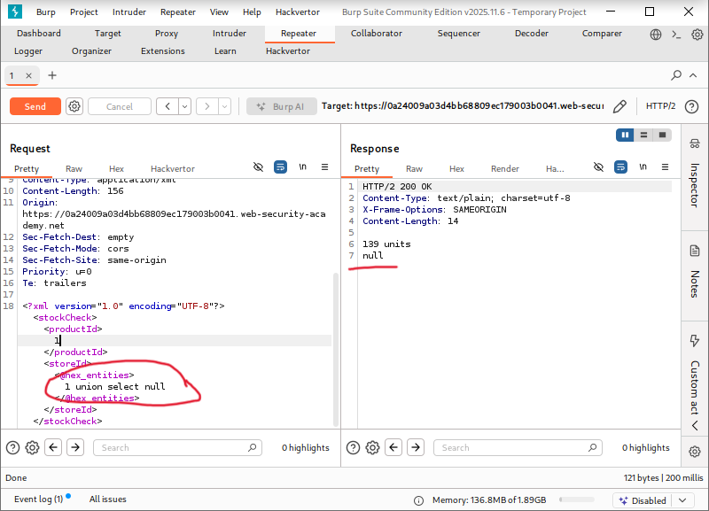
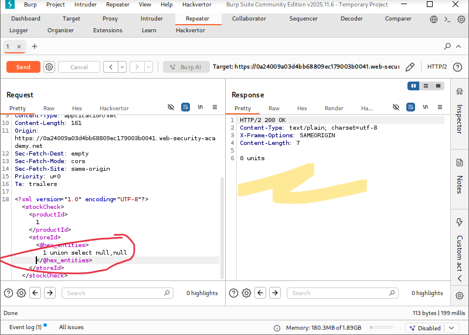
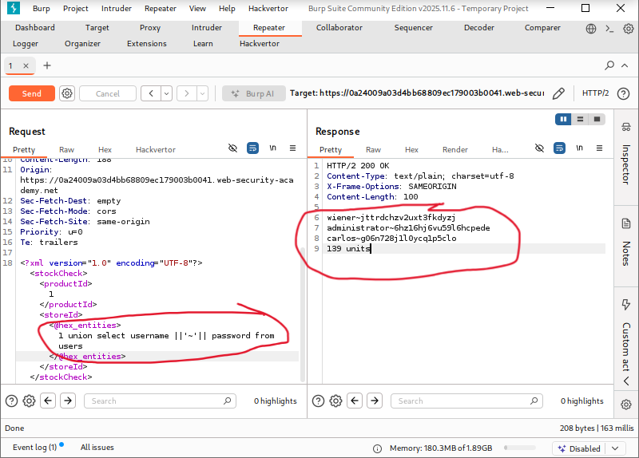
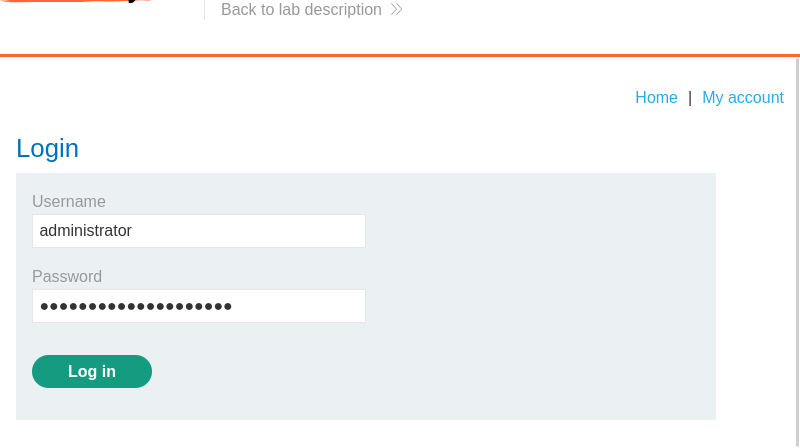
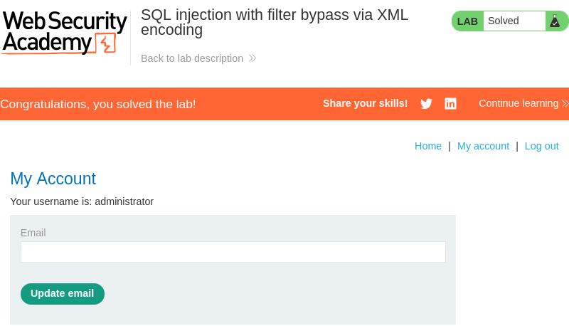

# SQL Injection with Filter Bypass via XML Encoding

**Written by Dnyaneshwar Yadav**

---

## Overview

This lab contains a **SQL injection vulnerability** in the product stock check functionality.

The application sends user input in **XML format**, and the input is used directly in a backend SQL query.

A Web Application Firewall (WAF) blocks obvious SQL injection attempts. However, because the injection occurs inside XML, it is possible to **bypass the filter using XML entity encoding**.

The database contains a `users` table with `username` and `password` columns.

The objective of this lab is to bypass the WAF, extract administrator credentials, and log in as the admin user.

---

## Solution

### Step 1: Intercept the stock check request

Navigate to any product and click on **Check stock**.

Intercept the request using **Burp Suite** and send the `POST /product/stock` request to **Repeater**.



---

### Step 2: Test SQL injection and observe WAF blocking

To test SQL injection, the following payload was injected into the `storeId` parameter:
```xml
<storeId>1 UNION SELECT NULL</storeId>
```

The application responded with an **attack detected** message, confirming that a WAF is blocking the injection.



---

### Step 3: Install Hackvertor extension

To bypass the WAF, the **Hackvertor** Burp extension was installed:

- Open **Burp → Extensions → BApp Store**
- Search for **Hackvertor**
- Click **Install**



---

### Step 4: Encode payload using XML entities

The blocked payload was selected in Repeater, then:

- Right-click → Extensions
- Hackvertor → Encode → **Hex Entities**

This encoded the SQL injection payload into XML entities.



---

### Step 5: Verify WAF bypass

The encoded payload was resent:
```xml
<storeId>&#x31;&#x20;&#x55;&#x4e;&#x49;&#x4f;&#x4e;...</storeId>
```

This time, the application returned a **normal response**, confirming that the WAF had been successfully bypassed.



---

### Step 6: Determine number of columns

To determine the number of columns returned by the query, the following encoded payload was tested:
```sql
UNION SELECT NULL, NULL
```

This resulted in an error, indicating that the query returns **only one column**.



---

### Step 7: Extract usernames and passwords

Since only one column is returned, the `username` and `password` values were concatenated using the `||` operator.

The final encoded payload used was:
```sql
UNION SELECT username || '~' || password FROM users
```

The response displayed usernames and passwords, including the **administrator credentials**.



---

### Step 8: Log in as administrator

Using the extracted administrator username and password, the login form was accessed and the credentials were submitted.



---

### Step 9: Confirm lab completion

After successful authentication, the application logged in as the administrator and the lab was marked as **solved**.



---

## Result

The successful bypass of the WAF using XML entity encoding and extraction of administrator credentials confirms a **critical SQL injection vulnerability** in the stock check feature.

---

## 📂 Screenshots Folder Structure
```text
screenshots/
├── 01-stock-request.png
├── 02-attack-detected.png
├── 03-hackvertor-installed.png
├── 04-payload-encoded.jpg
├── 05-waf-bypassed.png
├── 06-single-column.png
├── 07-admin-credentials.png
├── 08-admin-login.png
└── 09-lab-solved.png
```

---
