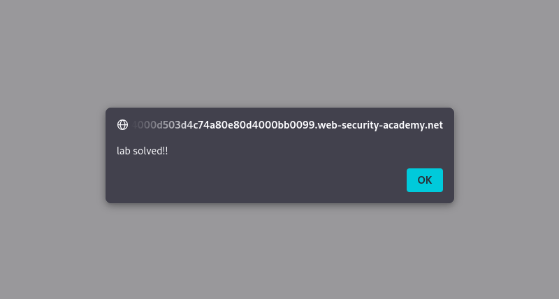

# Reflected XSS into HTML Context with Nothing Encoded

**Written by Dnyaneshwar Yadav**

---

## Overview

This lab contains a **reflected cross-site scripting (XSS)** vulnerability in the application's search functionality.

The application reflects user input directly into the HTML response **without any encoding or sanitization**, which allows injected JavaScript code to execute in the victim's browser.

The objective of this lab is to exploit the reflected XSS vulnerability and successfully execute a JavaScript `alert()` function.

---

## Solution

### Step 1: Identify the search input

The search box was identified as a vulnerable input point where user-supplied data is reflected back into the page response.


---

### Step 2: Inject the XSS payload

The following payload was entered into the search box:
```html
<script>alert("lab solved!!")</script>
```

This payload executes JavaScript when reflected into the HTML page without output encoding.


---

### Step 3: JavaScript alert execution

After submitting the search request, the application reflected the payload directly into the HTML response.

As a result, the browser executed the injected JavaScript and displayed an alert message confirming successful exploitation.



---

### Step 4: Lab solved confirmation

Once the alert was successfully triggered, the application marked the lab as **solved**, confirming that the exploit was successful.


---

## Result

The successful execution of the JavaScript payload confirms the presence of a **reflected XSS vulnerability in an HTML context with no output encoding**.

---

## 📂 Screenshots Folder Structure
```text
screenshots/
├── 01-search-box.png
├── 02-payload-entered.png
├── 03-alert-triggered.png
└── 04-lab-solved.png
```

---
