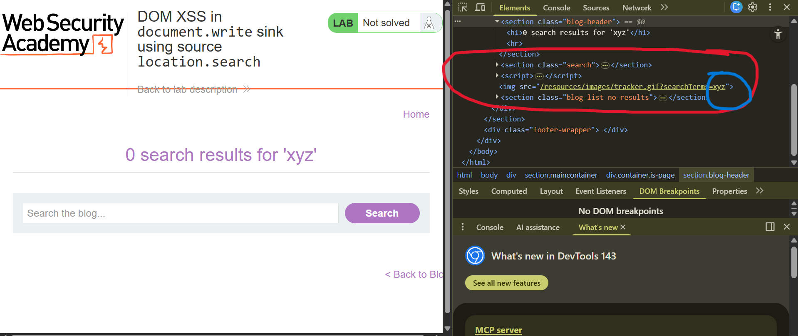
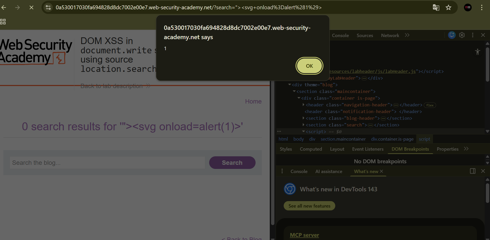

# DOM XSS in document.write Sink Using location.search

**Written by Dnyaneshwar Yadav..**

---

## Overview

This lab contains a **DOM-based cross-site scripting (XSS)** vulnerability in the search query tracking functionality.

The application uses the JavaScript `document.write()` function to write data directly to the page. The data passed into this function is taken from `location.search`, which is fully controlled by the user via the URL.

Because the input is written to the page **without validation or encoding**, it is possible to inject and execute arbitrary JavaScript code in the browser.

The goal of this lab is to exploit the DOM XSS vulnerability and trigger a JavaScript `alert()` function.

---

## Solution

### Step 1: Identify the search box

When the lab is opened, a search box is displayed on the page.

This search functionality is the vulnerable entry point where user input is processed.


---

### Step 2: Test input reflection and inspect the DOM

Enter a random alphanumeric string such as `xyz` into the search box.

Right-click on the page and select **Inspect**.

While inspecting the HTML, observe that the entered value is reflected inside an `img` tag's `src` attribute.

This confirms that user input from `location.search` is being written to the page using `document.write()`.



---

### Step 3: Inject the DOM XSS payload

To break out of the `img` attribute and execute JavaScript, enter the following payload into the search box:
```html
"><svg onload=alert(1)>
```

This payload closes the existing attribute and injects an SVG element with an `onload` event handler, resulting in JavaScript execution.

An alert box is displayed, confirming successful exploitation.



---

### Step 4: Confirm lab completion

After the JavaScript alert is triggered, the lab is automatically marked as solved.


---

## Result

The successful execution of the `alert(1)` function confirms the presence of a **DOM-based XSS vulnerability** caused by unsafe use of `document.write()` with data taken directly from `location.search`.

---

## 📂 Screenshots Folder Structure
```text
screenshots/
├── 01-blank-page.png
├── 02-normal-input-inspect.png
├── 03-xss-alert.png
└── 04-lab-solved.png
```

---
