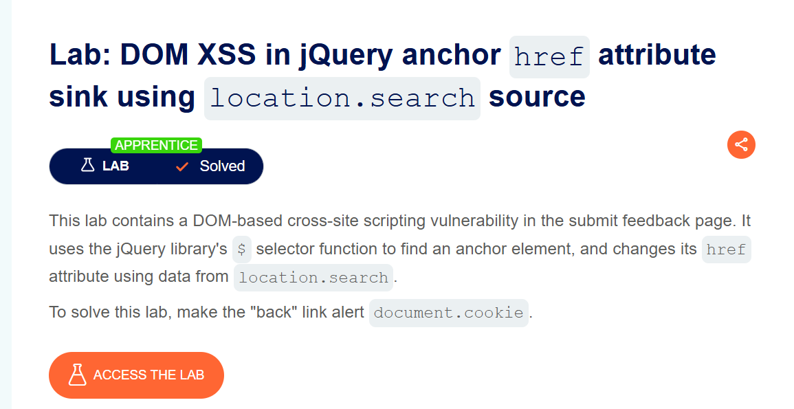
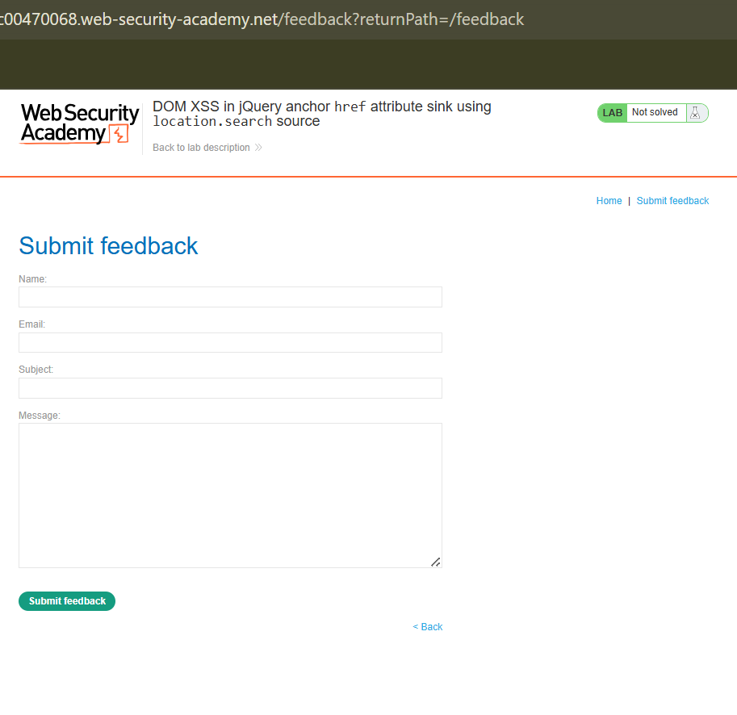
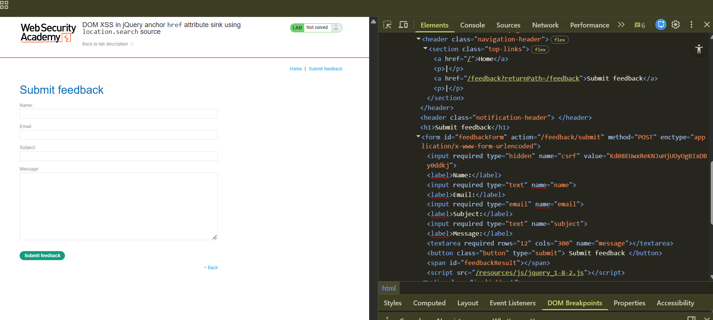
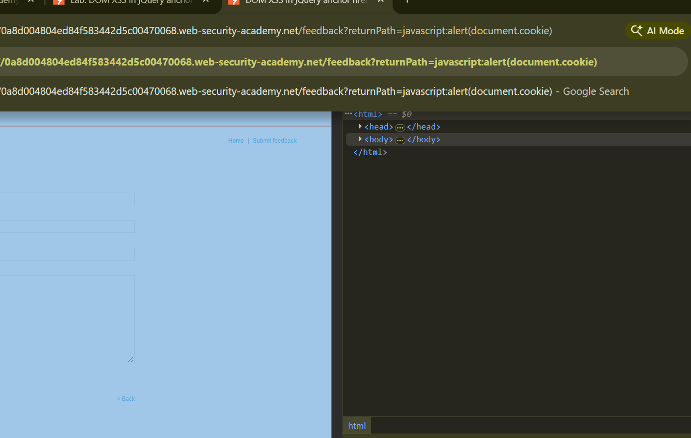
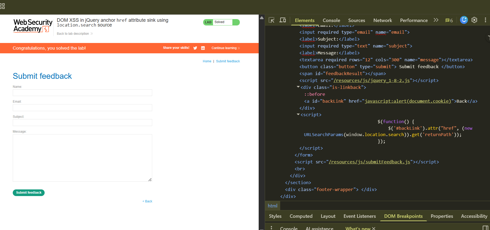

# DOM XSS in jQuery Anchor `href` Attribute Sink Using `location.search`

**Author:** Dnyaneshwar Yadav

---

## Overview

This lab contains a **DOM-based Cross-Site Scripting (XSS)** vulnerability in the Submit feedback page.

The application uses the jQuery `$()` selector to locate an anchor (`<a>`) element and dynamically update its `href` attribute using data taken directly from `location.search`.

Because the value from the URL parameter is used without any validation or sanitization, an attacker can inject a malicious `javascript:` URL and execute JavaScript in the browser.

**Goal:** Make the Back link trigger `alert(document.cookie)`.

---

## Vulnerable Code

While inspecting the DOM, the following behavior was observed:
```html
<a id="backLink" href="...">Back</a>
```
```javascript
$(function() {
    $('#backLink').attr(
        'href',
        (new URLSearchParams(window.location.search)).get('returnPath')
    );
});
```

The value of the `returnPath` parameter is taken directly from `location.search` and assigned to the `href` attribute of the anchor tag.

---

## Solution

### Step 1: Observe the lab description page

Open the lab and observe the lab title and description page.

At this stage, the lab is not yet solved.



---

### Step 2: Navigate to the Submit Feedback page

Go to the **Submit feedback** page.

Observe the URL and notice the presence of the `returnPath` parameter:
```
/feedback?returnPath=/feedback
```



---

### Step 3: Inspect where `returnPath` is used in the DOM

Right-click on the **Back** link and inspect the element.

It can be observed that the value of `returnPath` from the URL is directly reflected inside the `href` attribute of the anchor tag.



---

### Step 4: Inject the payload via the URL

Modify the `returnPath` parameter in the URL and inject the following payload:
```
javascript:alert(document.cookie)
```

Press **Enter** to load the page with the injected payload.



---

### Step 5: Trigger the payload and solve the lab

Click on the **Back** link.

The injected JavaScript executes successfully, triggering the `alert(document.cookie)` function.

After execution, the lab is marked as **solved**.



---

## Result

The successful execution of `alert(document.cookie)` confirms the presence of a **DOM-based XSS vulnerability** caused by unsafe use of jQuery to update an anchor tag's `href` attribute using data taken directly from `location.search`.

---

## Screenshots Folder Structure
```text
screenshots/
├── 01-lab-description.png
├── 02-feedback-page.png
├── 03-inspect-dom.png
├── 04-payload-url.png
└── 05-lab-solved.png
```

---

## Disclaimer

This repository is for educational purposes only. The techniques demonstrated here should only be used in authorized environments such as security labs and CTF challenges.

---