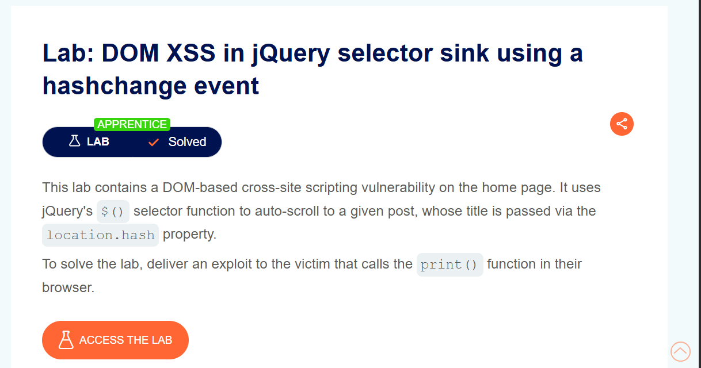
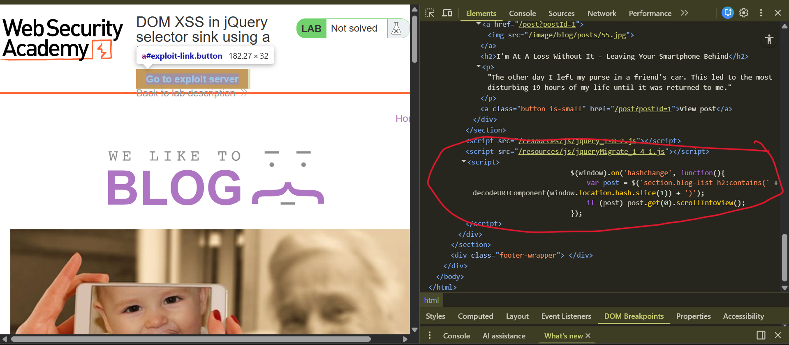
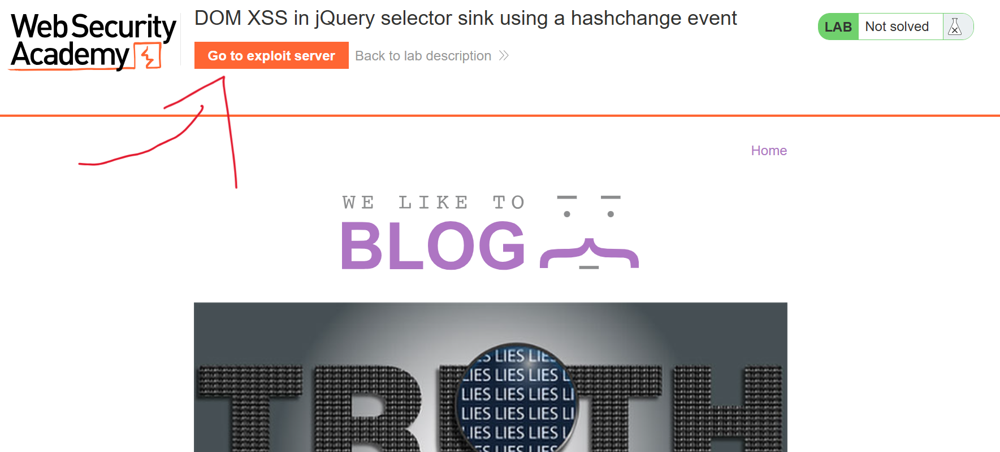
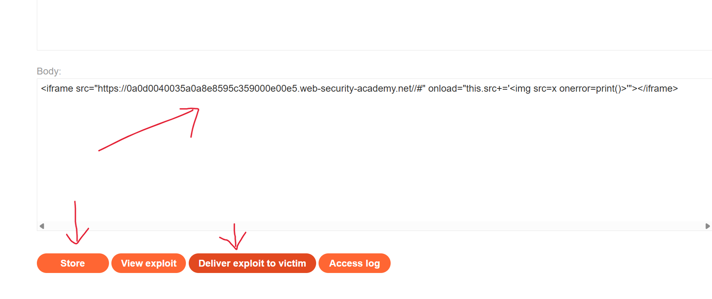
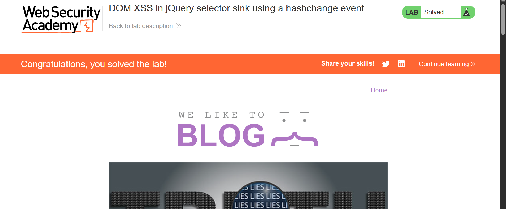

# DOM XSS in jQuery Selector Sink Using a `hashchange` Event

**Author:** Dnyaneshwar Yadav

---

## Overview

This lab contains a **DOM-based Cross-Site Scripting (XSS)** vulnerability on the home page.

The application uses jQuery's `$()` selector function to auto-scroll to a specific blog post. The post title is taken directly from the `location.hash` property.

Because the value from `location.hash` is user-controlled and used inside a jQuery selector without sanitization, it allows an attacker to execute JavaScript in the victim's browser.

**Goal:** Deliver an exploit to the victim that triggers the `print()` function.

---

## Vulnerable Code

While inspecting the home page using browser DevTools, the following JavaScript code was identified:
```javascript
$(window).on('hashchange', function() {
    var post = $('section.blog-list h2:contains(' +
        decodeURIComponent(window.location.hash.slice(1)) +
    ')');
    if (post) post.get(0).scrollIntoView();
});
```

The value from `location.hash` is directly inserted into a jQuery selector, making it vulnerable to DOM-based XSS.

---

## Solution

### Step 1: Observe the lab description page

Open the lab and observe the lab title and description.

At this stage, the lab status is **Not solved**.



---

### Step 2: Inspect the vulnerable code on the home page

Using the browser's DevTools, inspect the page source and observe how `location.hash` is used inside the jQuery selector.



---

### Step 3: Open the exploit server

From the lab banner, click on **Go to exploit server**.

This opens the exploit server where the malicious payload is added.



---

### Step 4: Add payload, store, and deliver exploit

In the **Body** section of the exploit server, add the following payload:
```html
<iframe src="https://YOUR-LAB-ID.web-security-academy.net/#"
onload="this.src+=''"></iframe>
```

Click **Store**, then **View exploit**, and finally **Deliver to victim**.



---

### Step 5: Confirm lab solved

After delivering the exploit to the victim, the lab status changes to **Solved**.



---

## Result

The successful execution of the `print()` function confirms the presence of a **DOM-based XSS vulnerability** caused by unsafe use of a jQuery selector with data taken directly from `location.hash` during a `hashchange` event.

---

## Screenshots Folder Structure
```text
screenshots/
├── 01-lab-description.png
├── 02-vulnerable-code.png
├── 03-exploit-server.png
├── 04-payload-delivered.png
└── 05-lab-solved.png
```

---

## Disclaimer

This repository is for educational purposes only. The techniques demonstrated here should only be used in authorized environments such as security labs and CTF challenges.

---