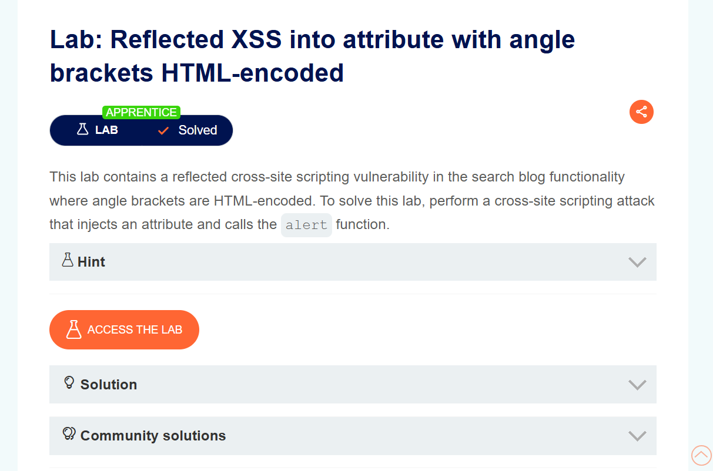
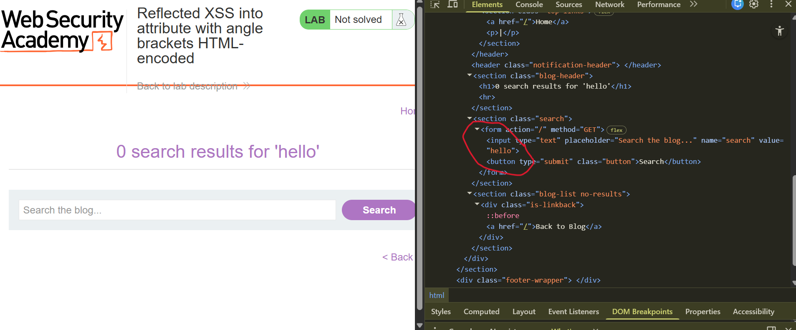
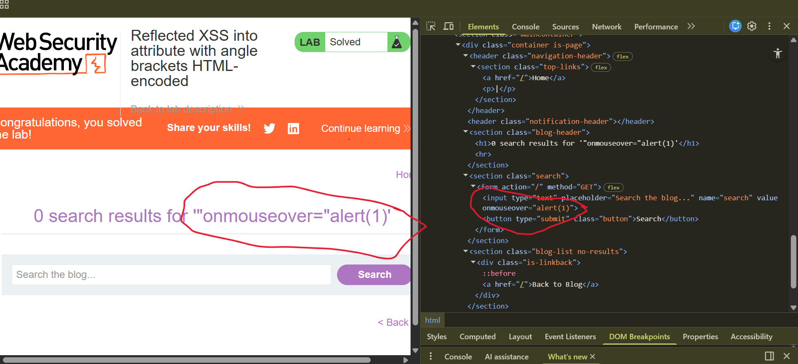

# Reflected XSS into Attribute with Angle Brackets HTML-Encoded

**Author:** Dnyaneshwar Yadav

---

## Overview

This lab contains a **reflected Cross-Site Scripting (XSS)** vulnerability in the search blog functionality where angle brackets are HTML-encoded.

User input is reflected inside an HTML attribute. Although angle brackets are encoded, it is still possible to break out of the attribute context and inject a malicious event handler.

**Goal:** Inject an attribute and trigger the `alert()` function.

---

## Vulnerable Behavior

After submitting a search value and inspecting the page, the input is reflected inside a quoted attribute value of the search input field.

Because the value is placed inside quotes, it is possible to escape the attribute and inject a new event handler.

---

## Solution

### Step 1: Open the lab and observe the description

Open the lab page and review the lab description for **Reflected XSS into attribute with angle brackets HTML-encoded**.



---

### Step 2: Submit a test search value and inspect reflection

Enter a random value (for example: `hello`) in the search box and submit.

Open **DevTools → Elements** and observe that the value is reflected inside the `value` attribute of the input tag.



---

### Step 3: Inject attribute-breaking payload

Intercept the request and replace the search parameter with the following payload:
```html
"onmouseover="alert(1)
```

Load the modified URL in the browser.

When the mouse is moved over the injected element, the JavaScript executes and an alert appears.

The lab is then marked as **Solved**.



---

## Result

The alert execution confirms a **reflected XSS vulnerability** where user input is reflected inside a quoted HTML attribute and can be exploited by injecting an event handler despite angle brackets being HTML-encoded.

---

## Screenshots Folder Structure
```text
screenshots/
├── 01-lab-description.png
├── 02-reflection-inspect.png
└── 03-lab-solved.png
```

---

## Disclaimer

This repository is for educational purposes only. The techniques demonstrated here should only be used in authorized environments such as security labs and CTF challenges.

---