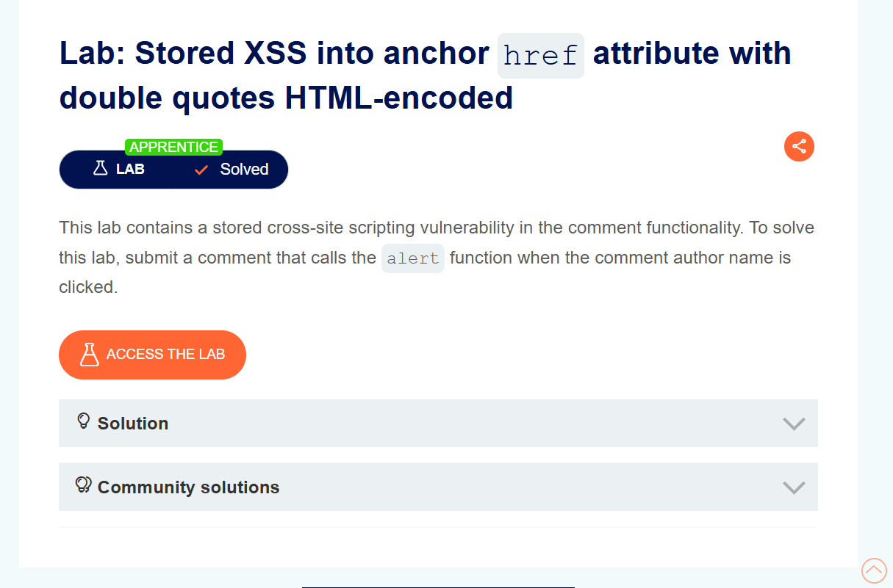
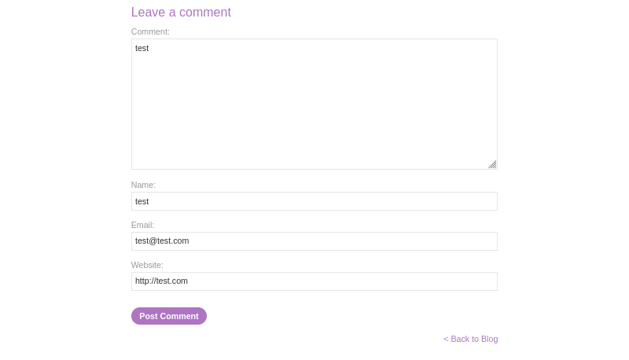
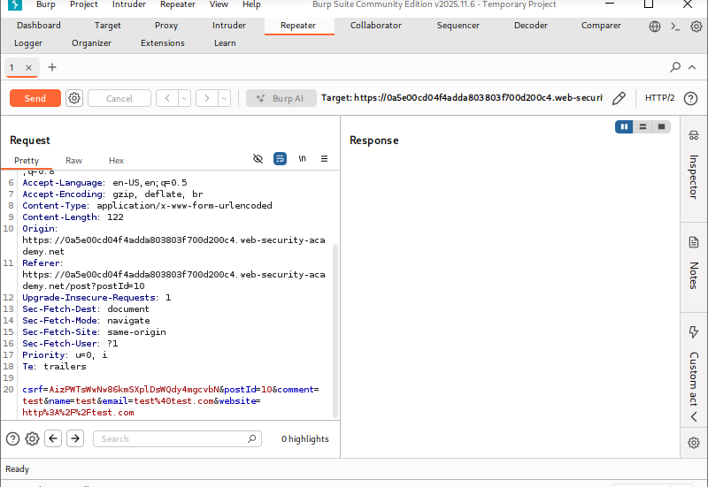
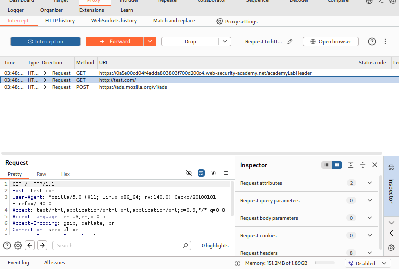
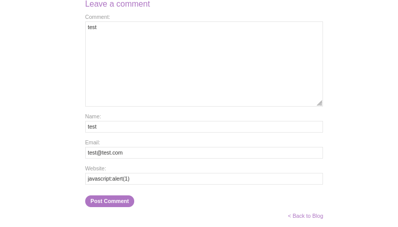

# Stored XSS into Anchor `href` Attribute with Double Quotes HTML-Encoded

**Author:** Dnyaneshwar Yadav

---

## Overview

This lab contains a **stored Cross-Site Scripting (XSS)** vulnerability in the **comment functionality**.

User input supplied in the **Website** field is stored and later reflected inside an anchor tag's `href` attribute. Although double quotes are HTML-encoded, it is still possible to inject a malicious JavaScript URL.

**Goal:** Submit a comment that triggers the `alert()` function when the **comment author name is clicked**.

---

## Vulnerable Behavior

After submitting a comment, the Website field value is reflected inside an anchor tag:
```html
<a href="USER_INPUT">Author Name</a>
```

Because this value controls the `href` attribute, a `javascript:` URL can be injected and executed when the link is clicked.

---

## Solution

### Step 1: Open lab description page

Open the lab and review the Stored XSS lab description.



---

### Step 2: Open comment form and submit test data

Open the blog post comment form and submit a normal test comment with a random value in the **Website** field.



---

### Step 3: Intercept submission in Burp Suite

Use **Burp Suite** to intercept the comment submission request and send it to **Repeater** for inspection.



---

### Step 4: Observe reflection in Repeater response

Request the blog post again and inspect the response in Repeater.

Observe that the Website value appears inside an anchor `href` attribute.



---

### Step 5: Submit payload in Website field

Repeat the process but replace the Website field value with:
```text
javascript:alert(1)
```

Submit the modified request.



---

### Step 6: Click author name and confirm lab solved

Open the post and click the **author name** above your comment.

The alert triggers and the lab shows **Solved**.


---

## Result

The alert confirms a **stored XSS vulnerability** where user input is stored and later embedded into an anchor tag's `href` attribute, allowing execution of a malicious JavaScript URL when clicked.

---

## Screenshots Folder Structure
```text
screenshots/
├── 01-lab-description.png
├── 02-comment-form.png
├── 03-burp-intercept.png
├── 04-reflection.png
├── 05-payload.png
└── 06-lab-solved.png
```

---

## Disclaimer

This repository is for educational purposes only. The techniques demonstrated here should only be used in authorized environments such as security labs and CTF challenges.

---