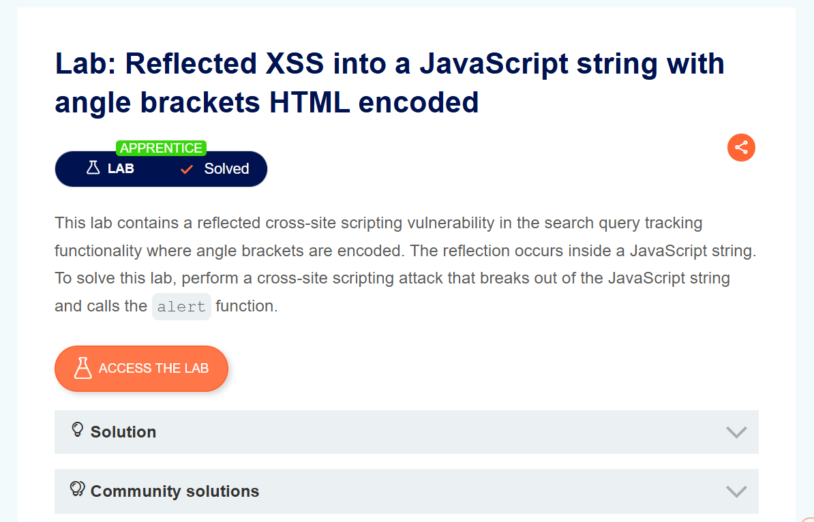
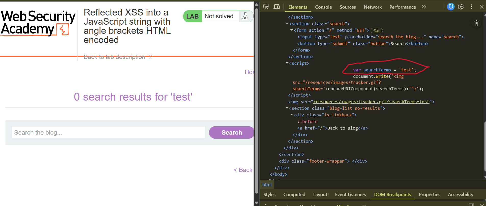
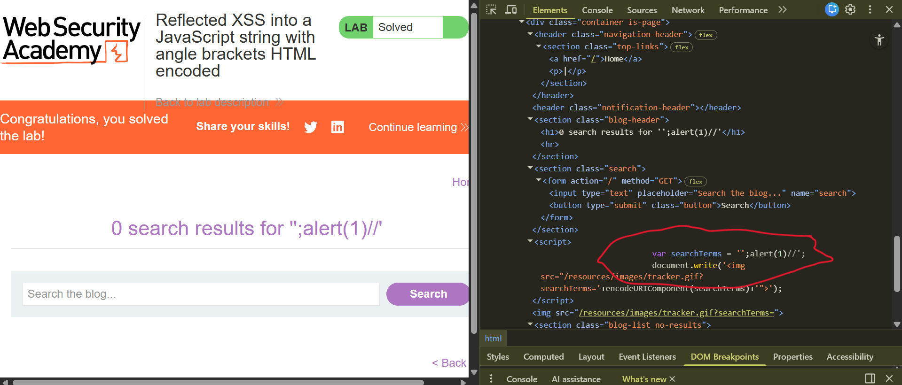

# Reflected XSS into a JavaScript String with Angle Brackets HTML-Encoded

**Author:** Dnyaneshwar Yadav

---

## Overview

This lab contains a **reflected Cross-Site Scripting (XSS)** vulnerability in the search query tracking functionality where angle brackets are HTML-encoded.

The user input is reflected inside a JavaScript string.

**Goal:** Break out of the JavaScript string context and execute the `alert()` function.

---

## Vulnerable Behavior

By inspecting the page source in DevTools, the search value is inserted inside a JavaScript variable and used inside a `<script>` block.

Because it is placed directly inside a quoted string, it can be broken using a crafted payload.

---

## Solution

### Step 1: Open lab description page

Open the lab and review the description for **Reflected XSS into a JavaScript string with angle brackets HTML-encoded**.



---

### Step 2: Perform normal search and inspect script

Search with a normal value like `test`.

Open **DevTools → Elements** and inspect the script section.

The search value appears inside a JavaScript string variable.



---

### Step 3: Inject payload and verify execution

Replace the search value with this payload:
```text
';alert(1)//
```

Load the page and inspect again.

The JavaScript string is broken and the alert executes.

The lab is marked as **Solved**.



---

## Result

The alert confirms a **reflected XSS vulnerability** where user input is reflected inside a JavaScript string and can be exploited by breaking out of the string context.

---

## Screenshots Folder Structure
```text
screenshots/
├── 01-lab-description.png
├── 02-normal-search-inspect.png
└── 03-payload-inspect-execution.png
```

---

## Disclaimer

This repository is for educational purposes only. The techniques demonstrated here should only be used in authorized environments such as security labs and CTF challenges.

---