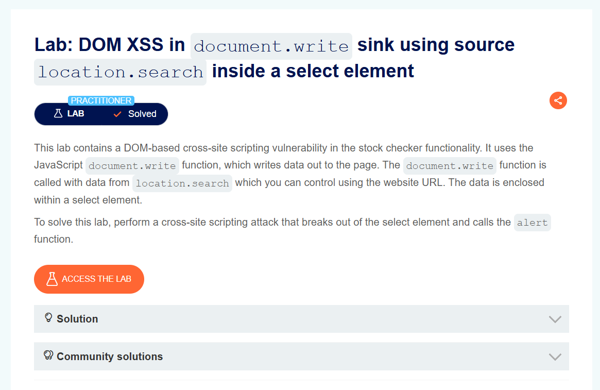
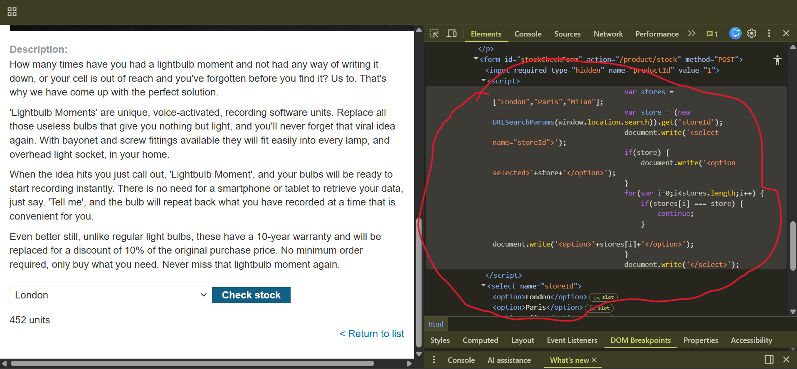
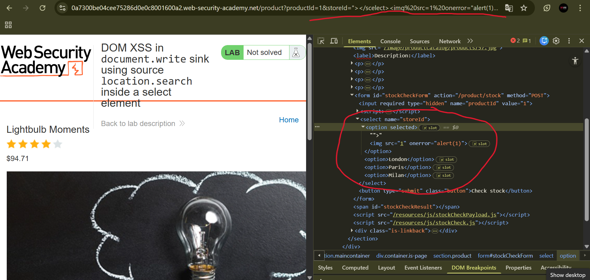
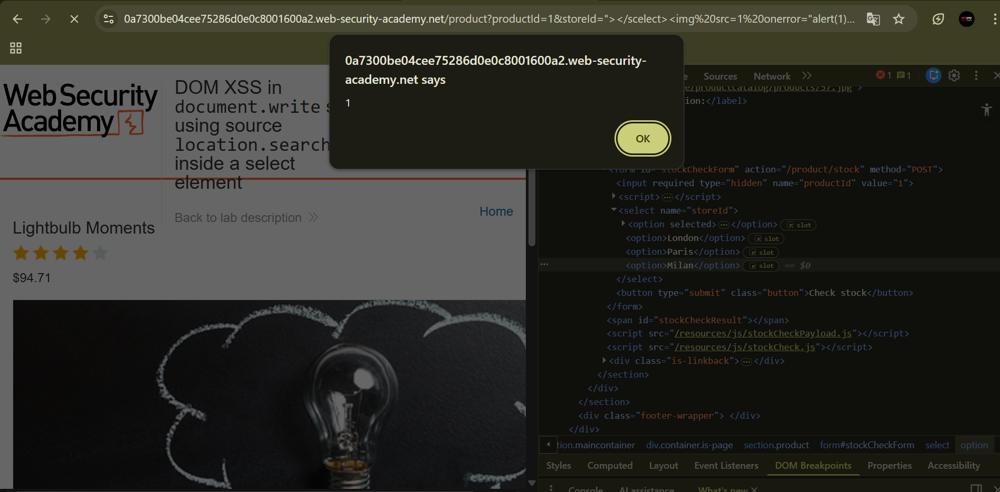

# DOM XSS in document.write Sink Using location.search Inside a Select Element

**Author:** Dnyaneshwar Yadav

---

## Overview

This lab contains a **DOM-based Cross-Site Scripting (XSS)** vulnerability in the stock checker functionality.

The application uses the JavaScript `document.write` function to write content into the page. The value written comes from `location.search`, which is fully controlled by the user through the URL.

The user input is inserted inside a select element without proper validation. Because of this, it is possible to break out of the select tag and inject malicious HTML/JavaScript.

**Goal:** Break out of the select element and trigger the JavaScript `alert()` function.

---

## Vulnerable Code

While inspecting the page, the following behavior was observed:
```javascript
var store = (new URLSearchParams(window.location.search)).get('storeId');
document.write('<select name="storeId">');

if(store) {
    document.write('<option selected>'+store+'</option>');
}
```

The value of `storeId` comes from `location.search` and is written using `document.write` inside a select element without sanitization.

---

## Solution

### Step 1: Observe the lab description page

Open the lab and read the vulnerability description.



---

### Step 2: Add random value in storeId parameter

Open a product page and add a random value in the URL:
```
&storeId=xyz
```

The value appears inside the dropdown list.


---

### Step 3: Inspect the select element

Right-click and inspect the dropdown.

Observe that your `storeId` value is inserted inside the `<select><option>` element using `document.write`.



---

### Step 4: Inject payload in URL

Modify the URL and replace storeId value with payload:
```
storeId="></select>
```

Load the URL.

The payload breaks out of the select element and injects an image tag with an onerror handler.



---

### Step 5: Alert triggered and lab solved

After loading the payload URL, the alert box is triggered and the lab is marked as **Solved**.



---

## Result

The successful execution of `alert(1)` confirms a **DOM-based XSS vulnerability** caused by unsafe use of `document.write` with data taken directly from `location.search` inside a select element.

---

## Screenshots Folder Structure
```text
screenshots/
├── 01-lab-description.png
├── 02-random-storeid.png
├── 03-inspect-select.png
├── 04-payload-url.png
└── 05-lab-solved.png
```

---

## Disclaimer

This repository is for educational purposes only. The techniques demonstrated here should only be used in authorized environments such as security labs and CTF challenges.

---