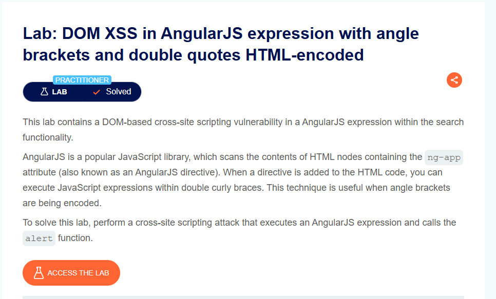
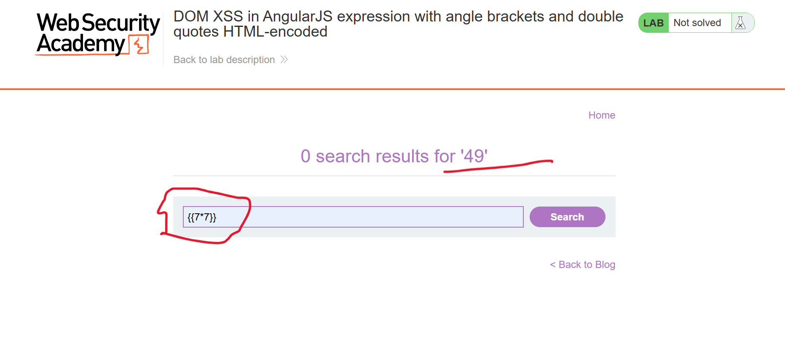
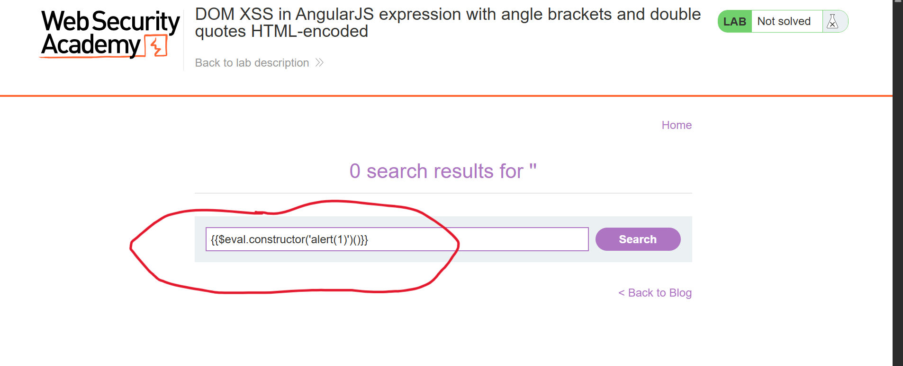
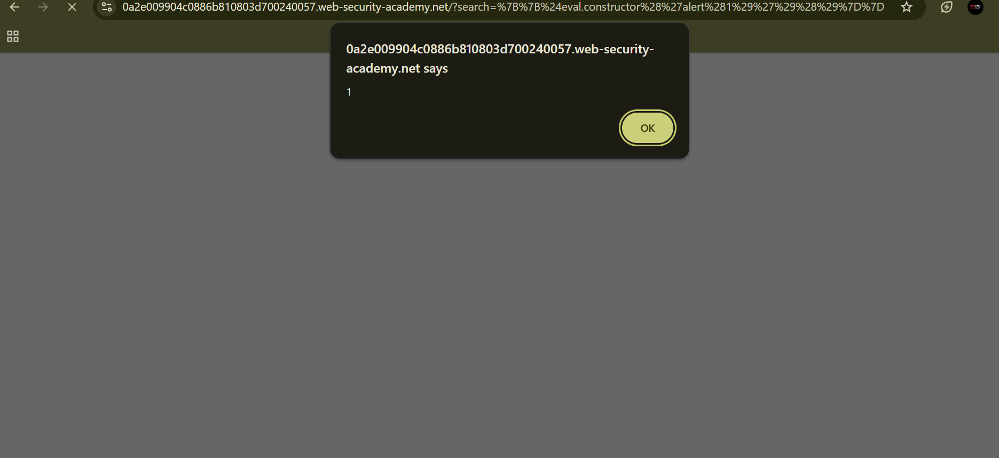

# DOM XSS in AngularJS Expression with Angle Brackets and Double Quotes HTML-Encoded

**Author:** Dnyaneshwar Yadav

---

## Overview

This lab contains a **DOM-based Cross-Site Scripting (XSS)** vulnerability in an AngularJS expression within the search functionality.

AngularJS processes expressions written inside double curly braces. Even when angle brackets and double quotes are HTML-encoded, AngularJS expressions can still be executed.

**Goal:** Execute an AngularJS expression that calls the `alert()` function.

---

## Vulnerable Behavior

The search functionality processes AngularJS expressions inside double curly braces.

This allows execution of JavaScript expressions without needing HTML tags.

---

## Solution

### Step 1: Open lab description page

Open the lab and review the description for **DOM XSS in AngularJS expression with angle brackets and double quotes HTML-encoded**.



---

### Step 2: Test AngularJS expression in search

Enter a test AngularJS expression in the search box:
```text
{{7*7}}
```

Search is performed and the expression is evaluated by AngularJS.



---

### Step 3: Enter malicious AngularJS payload

Replace the search value with the following payload:
```text
{{$on.constructor('alert(1)')()}}
```

Submit the search.



---

### Step 4: Alert execution confirmed

After submitting the payload, an alert dialog appears showing execution of JavaScript.



---

### Step 5: Lab marked as solved

After successful execution, the lab status changes to **Solved**.


---

## Result

The alert confirms a **DOM-based XSS vulnerability** through AngularJS expression execution, even when angle brackets and quotes are HTML-encoded.

---

## Screenshots Folder Structure
```text
screenshots/
├── 01-lab-description.png
├── 02-test-expression.png
├── 03-payload-entered.png
├── 04-alert.png
└── 05-lab-solved.png
```

---

## Disclaimer

This repository is for educational purposes only. The techniques demonstrated here should only be used in authorized environments such as security labs and CTF challenges.

---