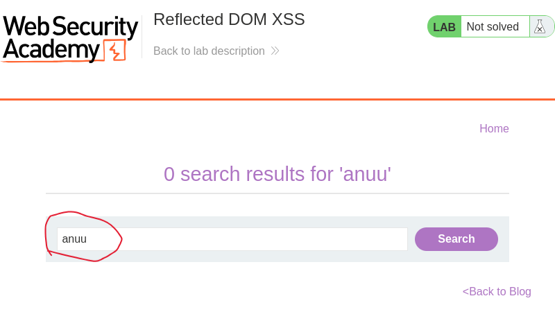
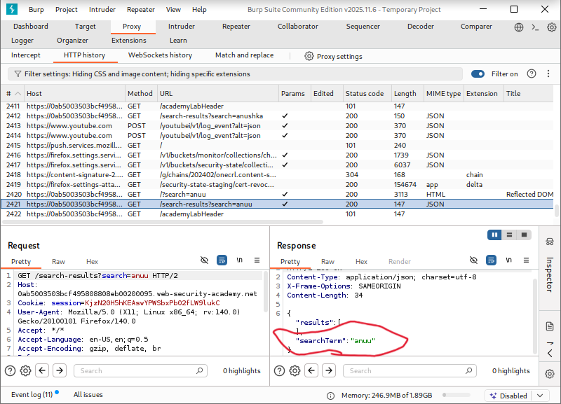
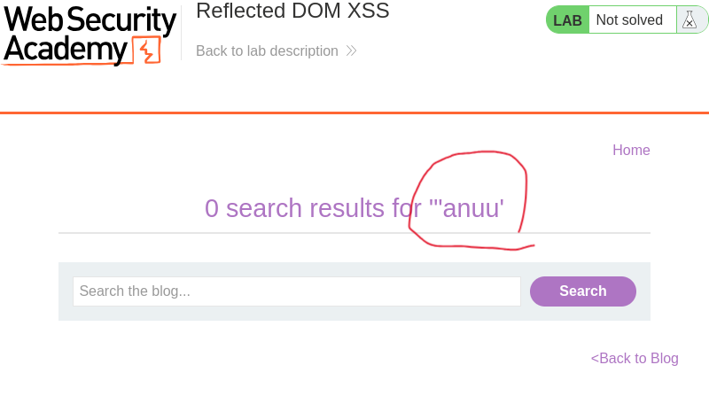
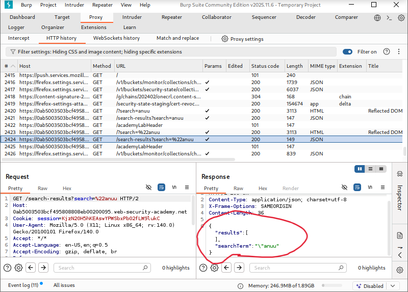
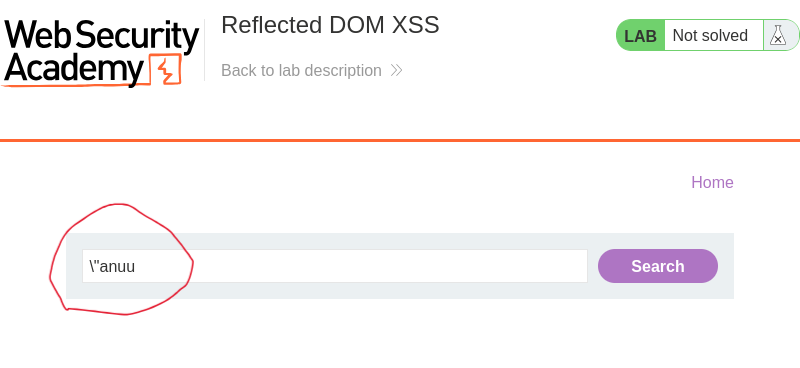
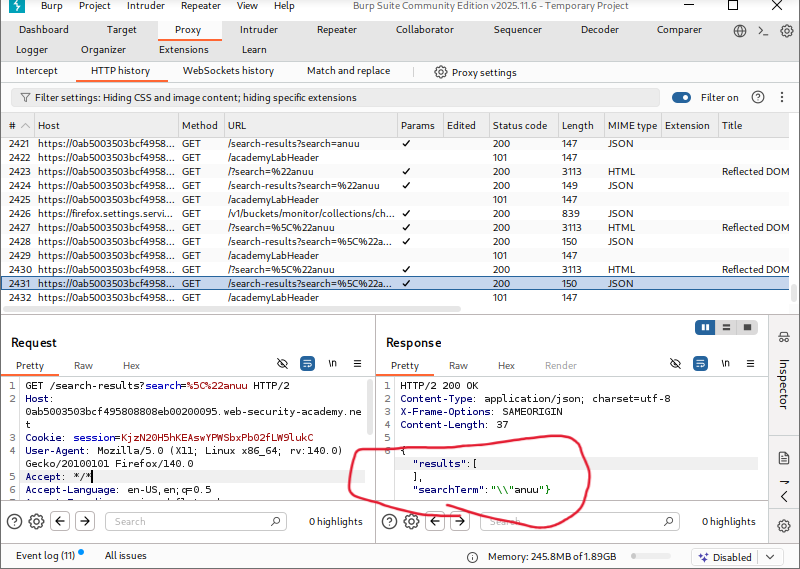
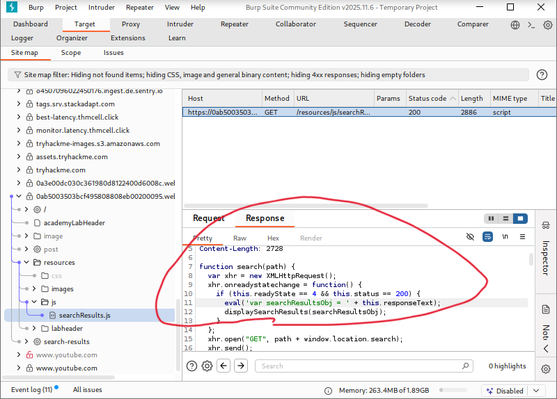
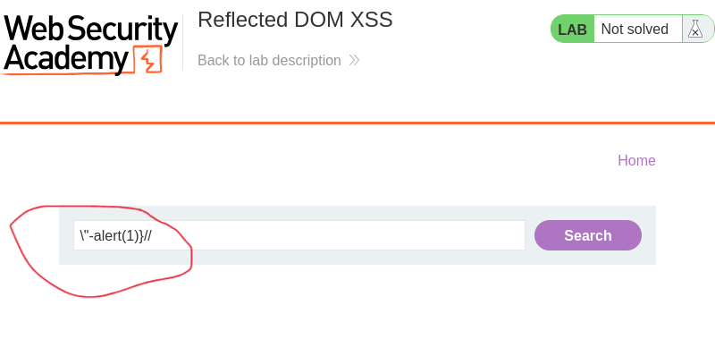
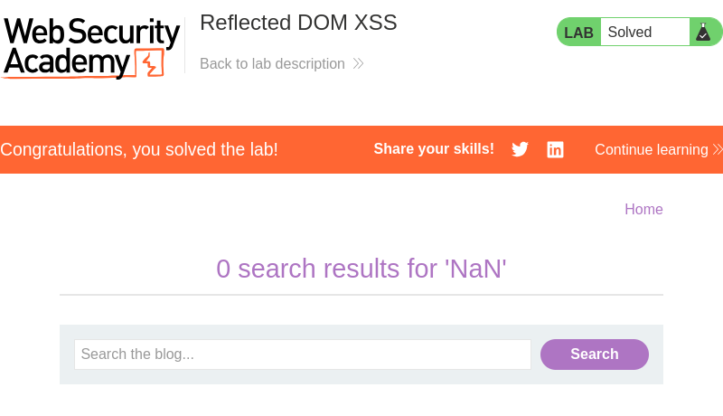

# Reflected DOM XSS

**Author:** Dnyaneshwar Yadav

---

## Overview

This lab demonstrates a **Reflected DOM-based Cross-Site Scripting (XSS)** vulnerability.

In this application, user input from the search parameter is reflected inside a **JSON response** returned by the server. A client-side JavaScript file processes this JSON using the unsafe `eval()` function.

Because user input is not handled safely, it is possible to break out of the JavaScript context and execute arbitrary JavaScript code.

**Goal:** Inject a payload that successfully calls the `alert()` function.

---

## Solution

### Step 1: View lab description page

Open the lab and read the vulnerability description.


---

### Step 2: Enter normal search input

Enter a normal search term (`anuu`) in the search box.



---

### Step 3: Observe JSON reflection in Burp Suite

Intercept the request in Burp Suite and observe that `anuu` is reflected in the JSON response.



---

### Step 4: Test with double quote in search box

Enter `"anuu` in the search box to test quote handling.



---

### Step 5: Observe quote escaping in JSON response

Check Burp Suite response and see that double quotes are escaped in JSON.



---

### Step 6: Test with backslash and quote in search box

Enter `\"anuu` in the search box to test backslash handling.



---

### Step 7: Observe backslash behavior in JSON response

Check Burp Suite and notice that backslashes are **not properly escaped** in the JSON response.



---

### Step 8: Inspect source file using eval()

Navigate to Burp **Site Map** and locate `searchResults.js`.

Observe the vulnerable `eval()` usage:
```javascript
eval('var searchResultsObj = ' + this.responseText);
```



---

### Step 9: Enter the exploit payload

Using the backslash weakness, enter the final payload:
```text
\"-alert(1)//
```



---

### Step 10: Alert execution confirmed

The browser displays the alert dialog, confirming successful XSS execution.


---

### Step 11: Lab solved confirmation

After successful execution, the lab status changes to **Solved**.



---

## Result

The successful execution of `alert(1)` confirms a **Reflected DOM XSS vulnerability** caused by:

* Unsafe use of `eval()`
* Improper escaping of backslashes
* User-controlled input being executed as JavaScript

---

## Screenshots Folder Structure
```text
screenshots/
├── 01-lab-description.png
├── 02-normal-search.png
├── 03-burp-intercept.png
├── 04-quote-search.png
├── 05-quote-json-response.png
├── 06-backslash-search.png
├── 07-backslash-json-response.png
├── 08-searchresults-js.png
├── 09-payload-entered.png
├── 10-browser-alert.png
└── 11-lab-solved.png
```

---

## Disclaimer

This repository is for educational purposes only. The techniques demonstrated here should only be used in authorized environments such as security labs and CTF challenges.

---