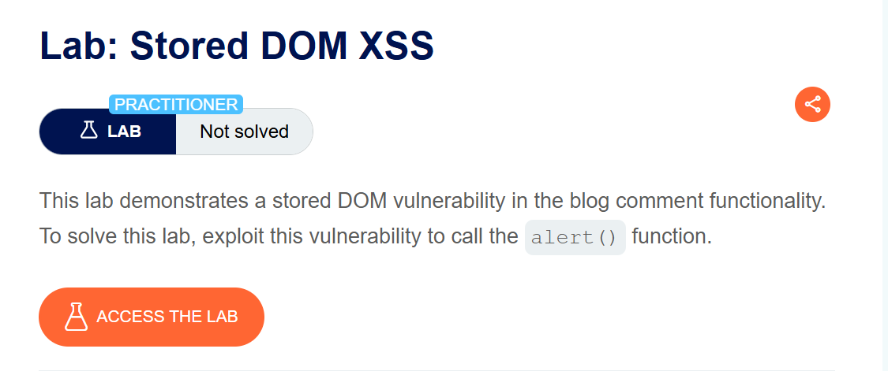
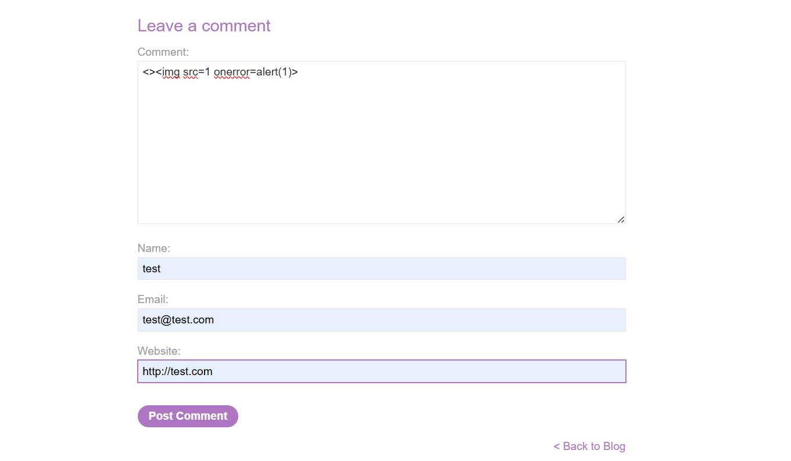
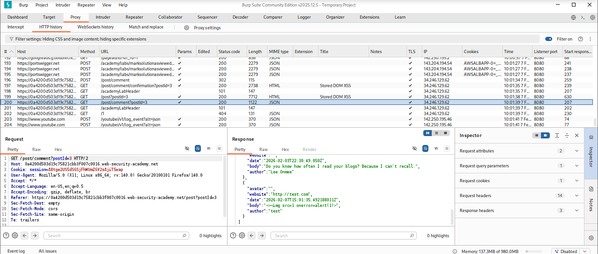
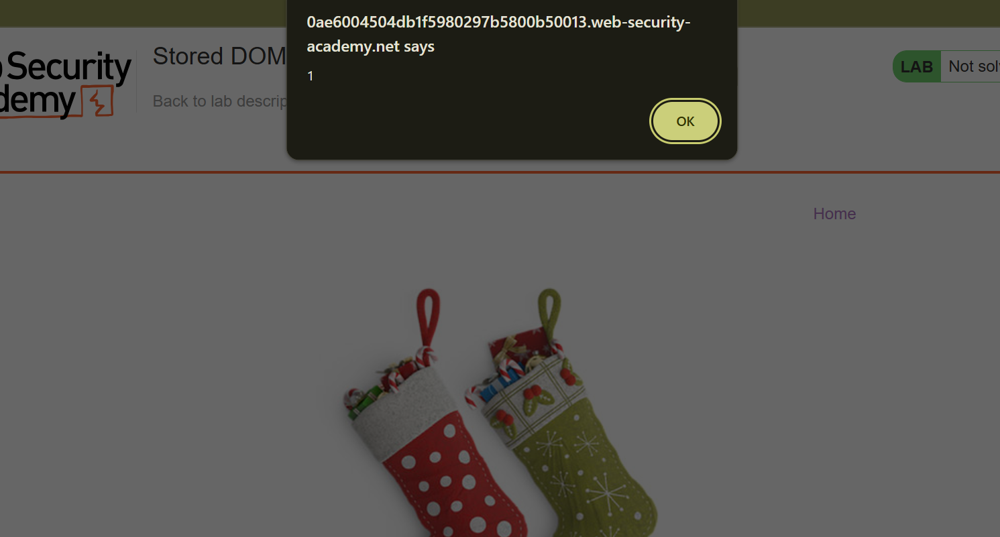

# Stored DOM XSS

**Author:** Dnyaneshwar Yadav

---

## Overview

This lab demonstrates a **Stored DOM-based Cross-Site Scripting (XSS)** vulnerability in the blog comment functionality.

The application attempts to prevent XSS by encoding angle brackets using the JavaScript `replace()` function. However, because `replace()` is used with a string argument, only the **first occurrence** of the target characters is replaced.

This flaw allows an attacker to bypass the filter by adding an extra set of angle brackets, resulting in successful HTML and JavaScript injection.

**Goal:** Exploit the stored DOM XSS vulnerability and trigger the `alert()` function.

---

## Lab Information

- **Difficulty Level:** Practitioner
- **Vulnerability Type:** Stored DOM XSS
- **Target:** Blog comment functionality

---

## Solution

### Step 1: View lab description page

Open the lab and review the description to understand the vulnerability.

At this stage, the lab status shows **Not solved**.



---

### Step 2: Submit malicious comment payload

In the blog comment section, submit the following payload:
```html
<>
```

**Explanation (based on observed behavior):**

* The first `<>` is encoded by the application
* The second `` tag remains unencoded
* This allows the injected HTML to execute JavaScript



---

### Step 3: Observe stored request in Burp Suite

Using **Burp Suite**, observe the request and response for the comment submission.

This confirms that:

* The payload is accepted
* The comment is stored successfully
* Input is not fully sanitized



---

### Step 4: Alert popup execution

Reload the blog post or scroll to the comments section.

When the stored comment is rendered, the `` tag loads with an invalid source, triggering the `onerror` event and executing `alert(1)`.



---

### Step 5: Lab solved confirmation

After the alert executes successfully, the lab is automatically marked as **Solved**.


---

## Result

The successful execution of `alert(1)` confirms a **Stored DOM XSS vulnerability** caused by improper use of the JavaScript `replace()` function, which only replaces the first occurrence of angle brackets.

---

## Screenshots Folder Structure
```text
screenshots/
├── 01-lab-description.png
├── 02-payload-comment.png
├── 03-burp-stored-request.png
├── 04-alert-popup.png
└── 05-lab-solved.png
```

---

## Disclaimer

This repository is for educational purposes only. The techniques demonstrated here should only be used in authorized environments such as security labs and CTF challenges.

---