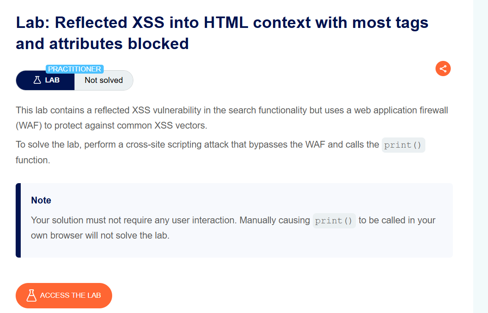
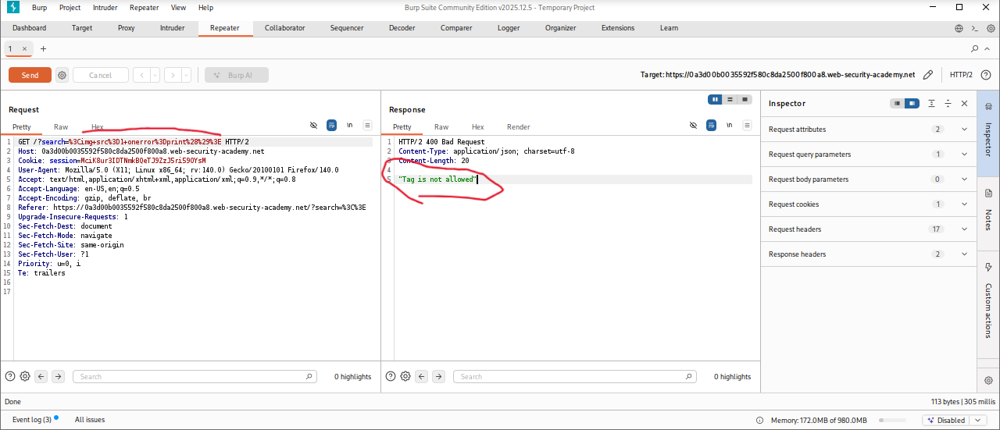
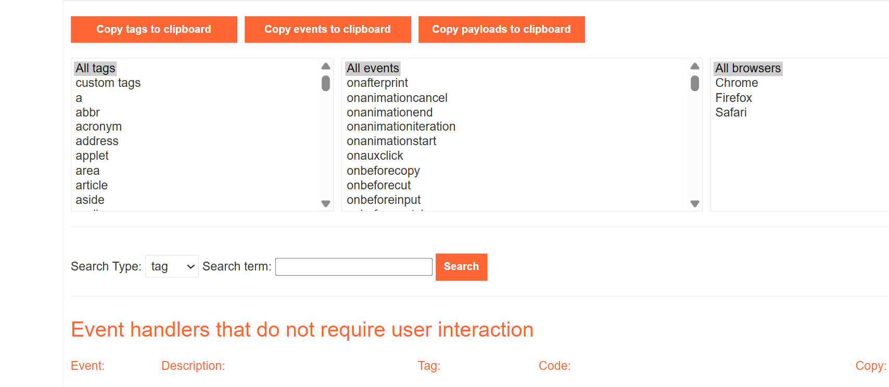
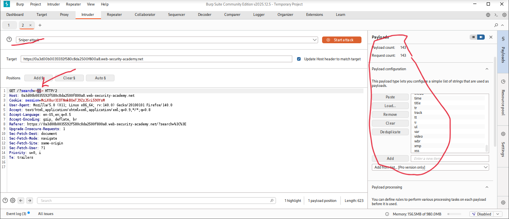
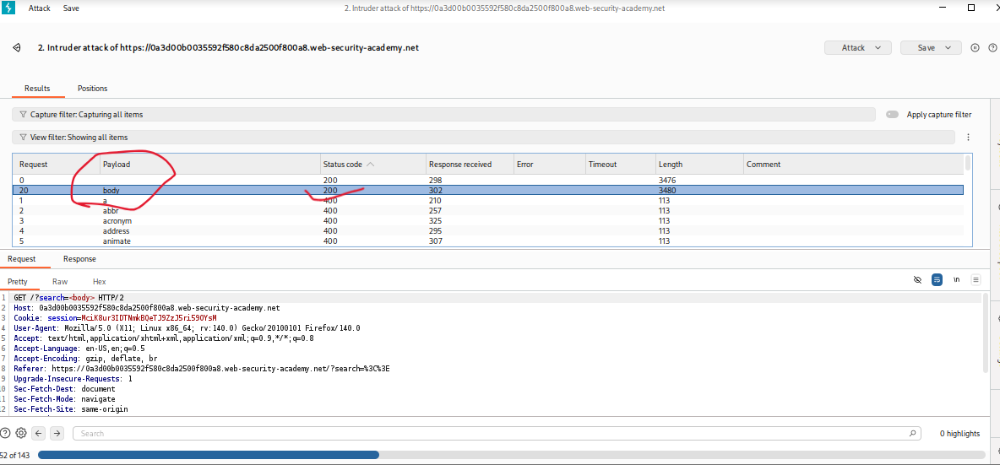
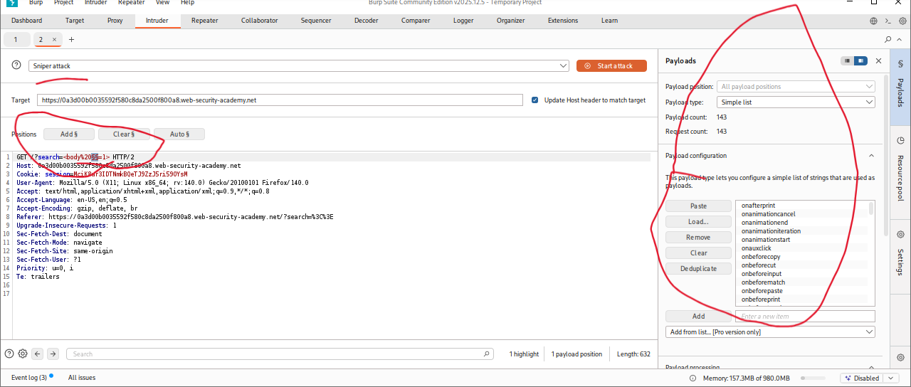
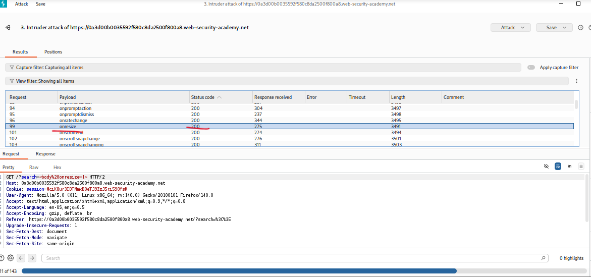
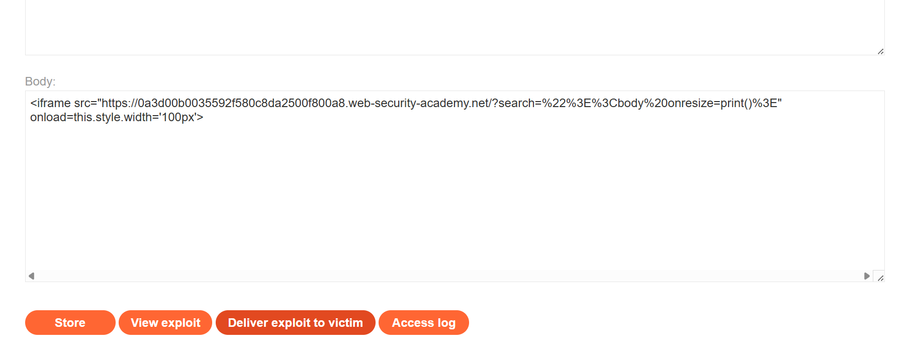
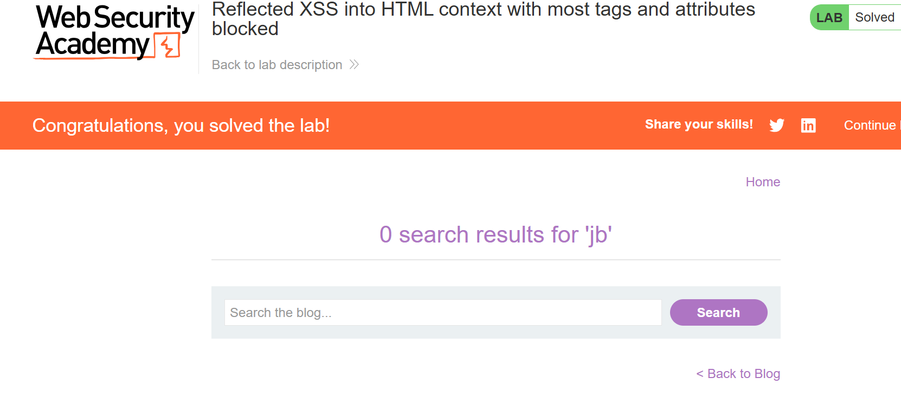

# Reflected XSS into HTML Context with Most Tags and Attributes Blocked

**Author:** Dnyaneshwar Yadav

---

## Overview

This lab contains a **Reflected Cross-Site Scripting (XSS)** vulnerability in the search functionality.

Although the application implements a **Web Application Firewall (WAF)** to block common XSS payloads, it is still possible to bypass these restrictions by carefully identifying which HTML tags and event attributes are allowed.

**Goal:** Bypass the WAF and execute the JavaScript `print()` function without any user interaction.

---

## Lab Information

- **Difficulty Level:** Practitioner
- **Vulnerability Type:** Reflected XSS
- **Target:** Search functionality with WAF protection

---

## Solution

### Step 1: Review the lab description

First, open the lab and carefully read the description to understand the restrictions.

**Key points:**

- Most HTML tags and attributes are blocked
- User interaction is not allowed
- Payload must auto-execute `print()`



---

### Step 2: Test a basic XSS payload (WAF validation)

To confirm the presence of a WAF, submit a standard XSS payload in the search box:
```html

```

**Result:**

- The payload does not execute
- Request is blocked by the WAF
- This confirms that basic XSS vectors are filtered



---

### Step 3: Analyze XSS cheat sheet (HTML tags)

Since common payloads are blocked, the next step is to identify allowed HTML tags.

Open the **XSS cheat sheet** and copy the list of HTML tags.

These tags will be tested using Burp Intruder to find which ones bypass the WAF.



---

### Step 4: Enumerate allowed HTML tags using Burp Intruder

Send the search request to **Burp Intruder**.

Replace the search parameter with:
```html
<>
```

Then add payload markers inside the brackets:
```html
<§§>
```

Paste the HTML tags list into the payload section and start the attack.



---

### Step 5: Identify allowed HTML tag

After the attack finishes, analyze the responses:

- Most payloads return **400 Bad Request**
- One payload returns **200 OK**

The allowed tag is identified as:
```html
<body>
```

This tag can pass through the WAF and be rendered by the browser.



---

### Step 6: Prepare event attribute enumeration

Now that the `<body>` tag is confirmed as allowed, the next step is to identify which event attributes can be used.

Modify the payload to:
```html
<body%20§§=1>
```

This allows testing different event attributes on the `<body>` tag.



---

### Step 7: Identify allowed event attribute (onresize)

Paste the list of event attributes from the XSS cheat sheet into Burp Intruder and run the attack again.

**Results:**

- Most events are blocked
- Only `onresize` returns **200 OK**

This confirms that `onresize` is allowed by the WAF.



---

### Step 8: Create and deliver the final exploit (auto-execution)

Go to the **Exploit Server** and add the following payload (replace `YOUR-LAB-ID` with your actual lab ID):
```html
<iframe src="https://YOUR-LAB-ID.web-security-academy.net/?search=%22%3E%3Cbody%20onresize=print()%3E"
onload=this.style.width='100px'></iframe>
```

**Explanation:**

- Breaks out of the HTML context
- Injects `<body onresize=print()>`
- `onload` resizes the iframe, triggering `onresize`
- `print()` executes automatically, no user interaction required

Store the exploit and **deliver it to the victim**.



---

### Step 9: Lab solved confirmation

After the exploit executes successfully, the lab status changes to **Solved**.



---

## Result

Successfully bypassed a strict WAF by:

* Enumerating allowed HTML tags
* Enumerating allowed event attributes
* Crafting a non-interactive exploit
* Automatically executing `print()`

This confirms a **Reflected XSS vulnerability** in HTML context, even when most vectors are blocked.

---

## Screenshots Folder Structure
```text
screenshots/
├── 01-lab-description.png
├── 02-waf-blocked-payload.png
├── 03-xss-cheat-sheet.png
├── 04-tag-enumeration-setup.png
├── 05-body-tag-allowed.png
├── 06-event-enum-setup-body.png
├── 07-onresize-allowed.png
├── 08-exploit-delivered.png
└── 09-lab-solved.png
```

---

## Disclaimer

This repository is for educational purposes only. The techniques demonstrated here should only be used in authorized environments such as security labs and CTF challenges.

---