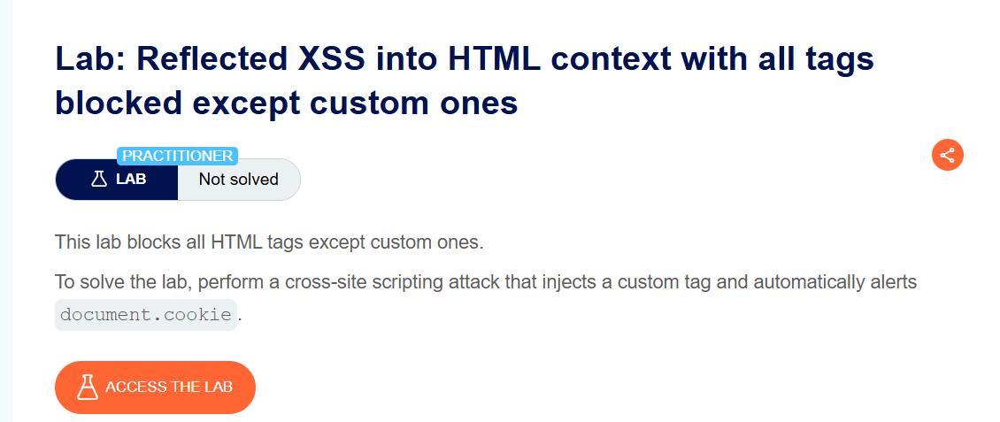
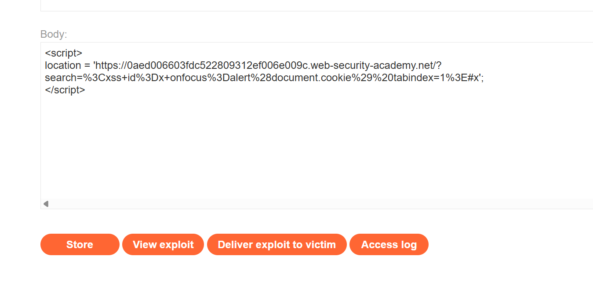
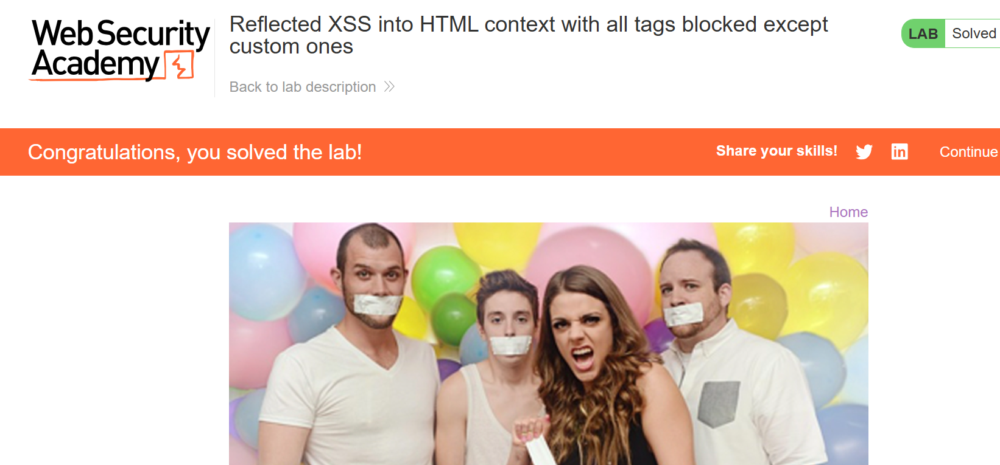

# Reflected XSS into HTML Context with All Tags Blocked Except Custom Ones

**Author:** Dnyaneshwar Yadav

---

## Overview

This lab demonstrates a **Reflected Cross-Site Scripting (XSS)** vulnerability where the application blocks all standard HTML tags, but still allows **custom HTML elements**.

Although common tags such as `<script>`, ``, and `<svg>` are filtered, modern browsers allow the creation of custom tags, which can still contain event handlers. This behavior can be abused to execute JavaScript automatically.

**Goal:** Inject a custom HTML tag that triggers `alert(document.cookie)` without any user interaction.

---

## Lab Information

- **Difficulty Level:** Practitioner
- **Vulnerability Type:** Reflected XSS
- **Target:** Search functionality with strict tag filtering

---

## Solution

### Step 1: Review the lab description

Open the lab and read the description to understand the filtering rules.

**Key observations:**

* All standard HTML tags are blocked
* Custom tags are allowed
* The payload must execute automatically



---

### Step 2: Create the exploit using a custom HTML tag

Since the vulnerability is reflected and custom tags are allowed, the exploit is delivered using the **Exploit Server**.

Add the following payload to the exploit server (replace `YOUR-LAB-ID` with your actual lab ID):
```html
<script>
location = 'https://YOUR-LAB-ID.web-security-academy.net/?search=%3Cxss+id%3Dx+onfocus%3Dalert%28document.cookie%29%20tabindex=1%3E#x';
</script>
```

**Why this works:**

* `<xss>` is a custom HTML tag, so it bypasses the filter
* `onfocus` executes JavaScript when the element receives focus
* `tabindex=1` makes the element focusable
* `#x` automatically focuses the element on page load

As a result, `alert(document.cookie)` executes automatically.



---

### Step 3: Deliver the exploit and solve the lab

Click **Store**, then **Deliver exploit to victim**.

When the page loads:

* The custom element gains focus
* The `onfocus` handler fires
* `alert(document.cookie)` is executed

The lab is then marked as **Solved**.



---

## Result

Successfully exploited a **Reflected XSS vulnerability** by:

* Bypassing HTML tag filtering using a custom element
* Leveraging the `onfocus` event handler
* Triggering JavaScript execution automatically
* Accessing sensitive data via `document.cookie`

This lab shows that blocking known HTML tags alone is not sufficient to prevent XSS attacks.

---

## Screenshots Folder Structure
```text
screenshots/
├── 01-lab-description.png
├── 02-exploit-server-payload.png
└── 03-lab-solved.png
```

---

## Disclaimer

This repository is for educational purposes only. The techniques demonstrated here should only be used in authorized environments such as security labs and CTF challenges.

---