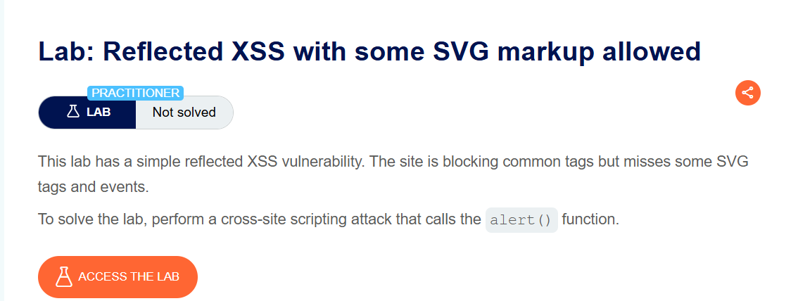
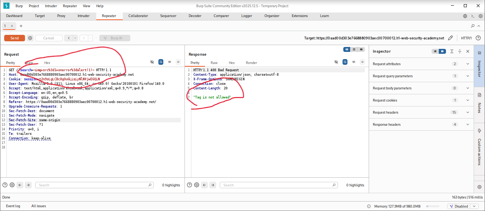
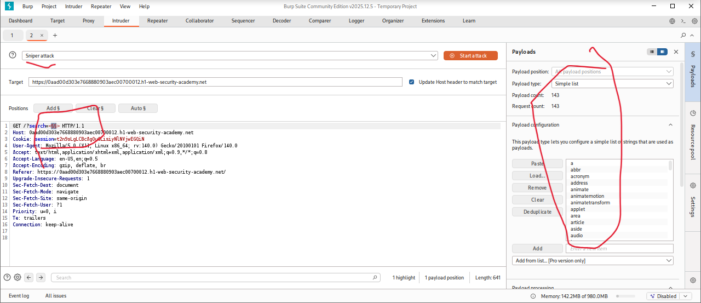
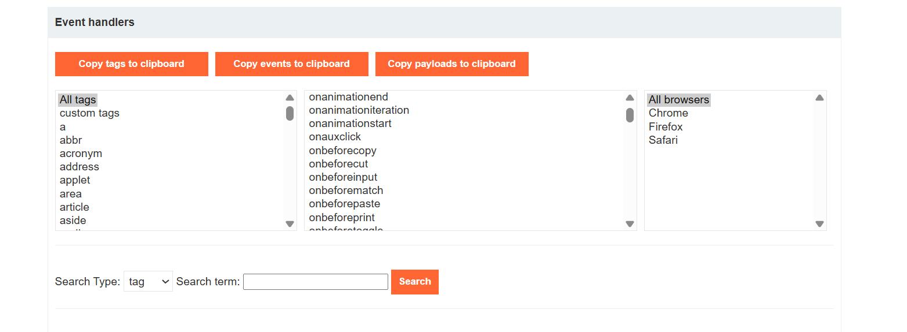
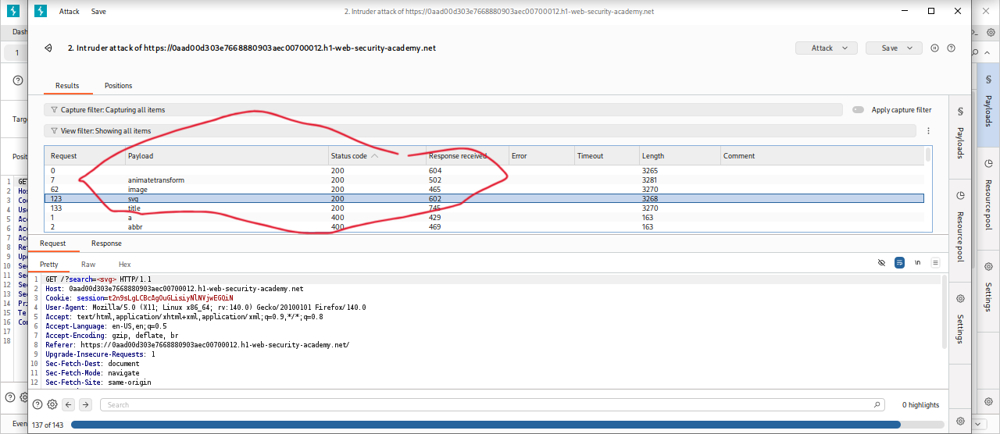
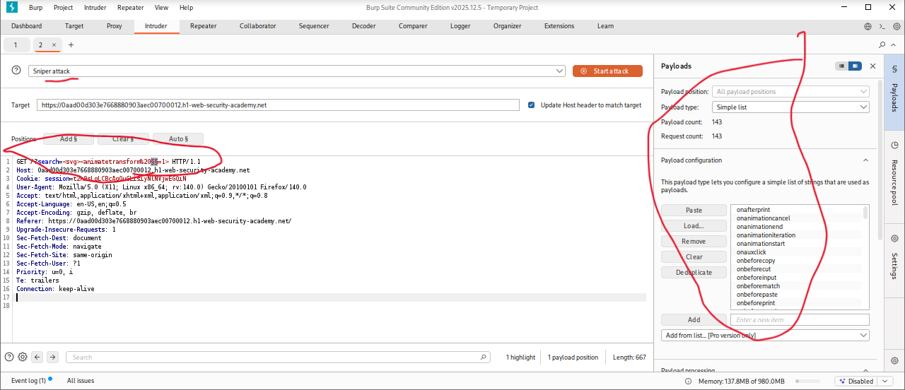
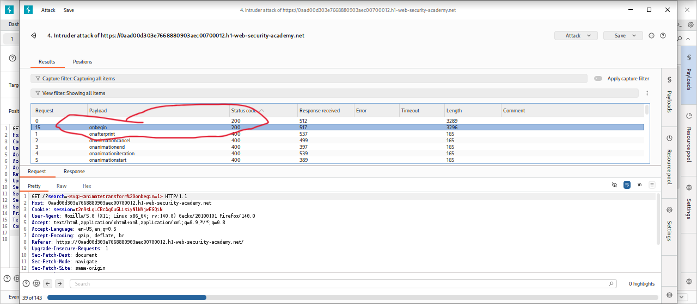
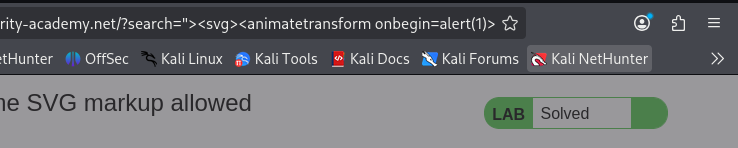
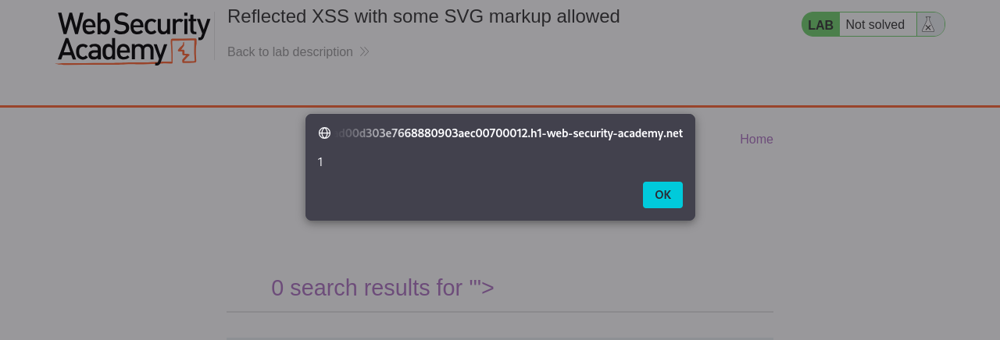
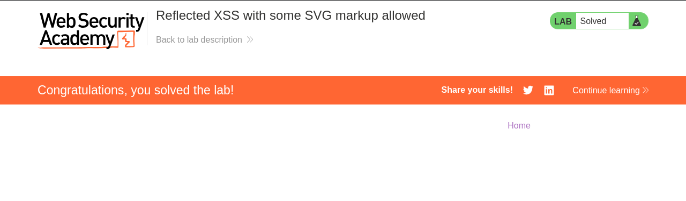

# Reflected XSS with Some SVG Markup Allowed

**Author:** Dnyaneshwar Yadav

---

## Overview

This lab demonstrates a **Reflected Cross-Site Scripting (XSS)** vulnerability in the search functionality.

Although the application blocks most common HTML tags and attributes using filtering rules, it fails to properly restrict certain **SVG-related tags and events**. By identifying which SVG elements and event handlers are allowed, it is possible to inject a payload that successfully executes JavaScript.

**Goal:** Bypass the filters and trigger the `alert()` function.

---

## Lab Information

- **Difficulty Level:** Practitioner
- **Vulnerability Type:** Reflected XSS
- **Target:** Search functionality with partial SVG filtering

---

## Solution

### Step 1: Review lab description

Open the lab and read the description to understand the restrictions.

**Key points:**

- Common HTML tags are blocked
- Some SVG markup is still allowed
- Payload is reflected in HTML context



---

### Step 2: Test a basic XSS payload (blocked)

Submit a standard XSS payload in the search box:
```html

```

**Observation:**

- The payload does not execute
- The request is blocked by the application's filtering rules
- This confirms that common XSS vectors are filtered



---

### Step 3: Prepare tag enumeration payload

Send the search request to **Burp Intruder**.

Replace the search value with:
```html
<>
```

Add payload markers between the brackets:
```html
<§§>
```

This setup will be used to test which HTML/SVG tags are allowed.



---

### Step 4: Use XSS cheat sheet for tag list

Open the **XSS cheat sheet** and copy the list of HTML/SVG tags.

These tags will be pasted into Burp Intruder as payloads for enumeration.



---

### Step 5: Identify allowed SVG tags

Run the Intruder attack and analyze the responses.

**Results:**

- Most tags return **400 Bad Request**
- The following SVG-related tags return **200 OK**:
  - `<svg>`
  - `<animatetransform>`
  - `<title>`
  - `<image>`

This confirms that SVG markup is partially allowed.



---

### Step 6: Prepare event enumeration on SVG tag

Now that allowed SVG tags are identified, test which event attributes are permitted.

Modify the payload to:
```html
<svg><animatetransform%20§§=1>
```

This setup allows enumeration of SVG event handlers.



---

### Step 7: Identify allowed SVG event attribute

Paste the list of event attributes from the XSS cheat sheet into Burp Intruder and start the attack.

**Results:**

- Most events return **400 Bad Request**
- The `onbegin` event returns **200 OK**

This confirms that `onbegin` is allowed and can be used for execution.



---

### Step 8: Craft final XSS payload

Using the allowed SVG tag and event, construct the final payload:
```html
"><svg><animatetransform onbegin=alert(1)>
```

**This payload:**

- Breaks out of the existing HTML context
- Injects SVG markup
- Executes JavaScript when the SVG animation begins



---

### Step 9: Alert execution confirmation

Load the crafted payload URL in the browser.

The JavaScript executes successfully and the `alert(1)` popup appears.



---

### Step 10: Lab solved confirmation

After successful execution of the payload, the lab status changes to **Solved**.



---

## Result

Successfully exploited a **Reflected XSS vulnerability** by:

* Enumerating allowed SVG tags
* Enumerating allowed SVG event attributes
* Crafting a valid SVG-based payload
* Triggering JavaScript execution using `onbegin`

This lab demonstrates that partial filtering of HTML is insufficient, and SVG contexts can still be abused for XSS.

---

## Screenshots Folder Structure
```text
screenshots/
├── 01-lab-description.png
├── 02-img-payload-blocked.png
├── 03-tag-enum-setup.png
├── 04-xss-cheat-sheet.png
├── 05-allowed-svg-tags.png
├── 06-event-enum-setup.png
├── 07-onbegin-allowed.png
├── 08-final-payload.png
├── 09-alert-popup.png
└── 10-lab-solved.png
```

---

## Disclaimer

This repository is for educational purposes only. The techniques demonstrated here should only be used in authorized environments such as security labs and CTF challenges.

---