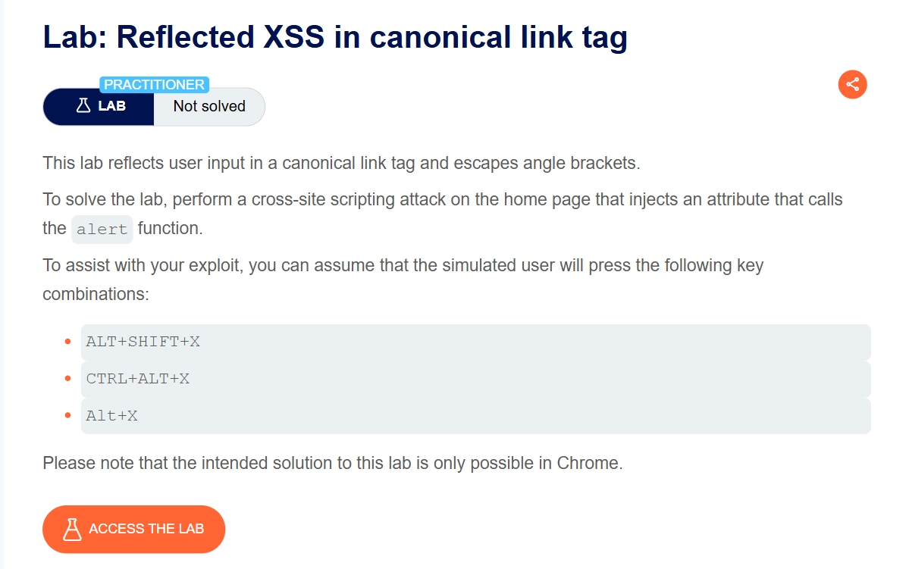
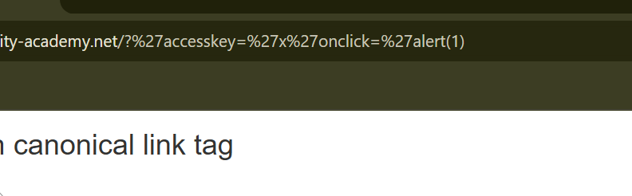
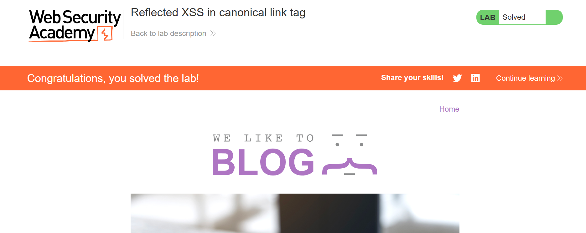

# Reflected XSS in Canonical Link Tag

**Author:** Dnyaneshwar Yadav

---

## Overview

This lab demonstrates a **Reflected Cross-Site Scripting (XSS)** vulnerability where user input is reflected inside a canonical `<link>` tag.

Although the application escapes angle brackets (`<` and `>`), it fails to properly sanitize HTML attributes, allowing an attacker to inject a malicious attribute that executes JavaScript.

**Goal:** Inject an attribute that calls the `alert()` function when a specific key combination is pressed by the user.

⚠️ **Note:** This lab works only in **Google Chrome**, as it relies on the `accesskey` attribute behavior.

---

## Lab Information

- **Difficulty Level:** Practitioner
- **Vulnerability Type:** Reflected XSS (Attribute Injection)
- **Target:** Canonical link tag
- **Browser Requirement:** Google Chrome

---

## Solution

### Step 1: Review the lab description

Open the lab and read the description to understand how the vulnerability works.

**Key points:**

* Input is reflected inside a canonical link tag
* Angle brackets are escaped
* Attribute injection is still possible
* JavaScript execution depends on keyboard interaction



---

### Step 2: Inject attribute-based XSS payload

Visit the following URL (replace `YOUR-LAB-ID` with your actual lab ID):
```
https://YOUR-LAB-ID.web-security-academy.net/?'accesskey='x'onclick='alert(1)
```

**How this payload works:**

* Injects an `accesskey` attribute with value `x`
* Injects an `onclick` event handler
* When the access key is pressed, `alert(1)` is executed
* Angle brackets are not required, so escaping does not prevent the attack



---

### Step 3: Trigger the payload and solve the lab

Press the required key combination based on your operating system:

* **Windows:** `ALT + SHIFT + X`
* **macOS:** `CTRL + ALT + X`
* **Linux:** `ALT + X`

Once the key combination is pressed, the `alert()` function executes and the lab is marked as **Solved**.



---

## Result

Successfully exploited a **Reflected XSS vulnerability** by:

* Injecting malicious attributes into a canonical link tag
* Bypassing angle bracket escaping
* Leveraging the `accesskey` attribute for JavaScript execution
* Triggering the payload via keyboard interaction

This lab highlights that escaping angle brackets alone is not sufficient to prevent XSS attacks.

---

## Screenshots Folder Structure
```text
screenshots/
├── 01-lab-description.png
├── 02-payload-injected.png
└── 03-lab-solved.png
```

---

## Disclaimer

This repository is for educational purposes only. The techniques demonstrated here should only be used in authorized environments such as security labs and CTF challenges.

---