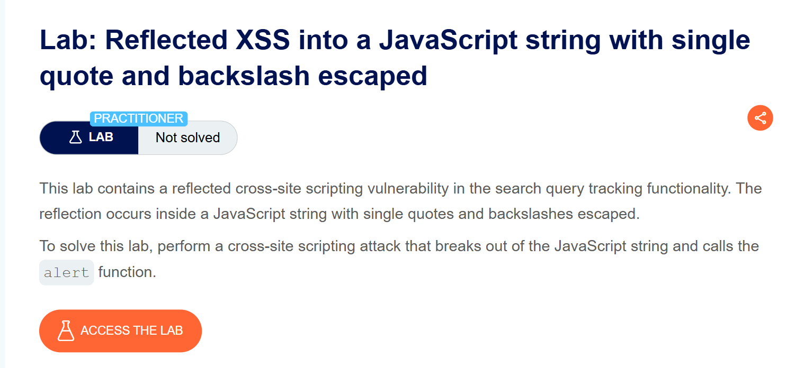
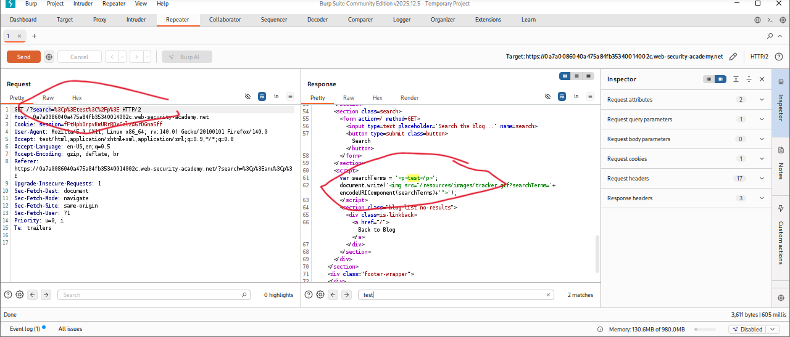
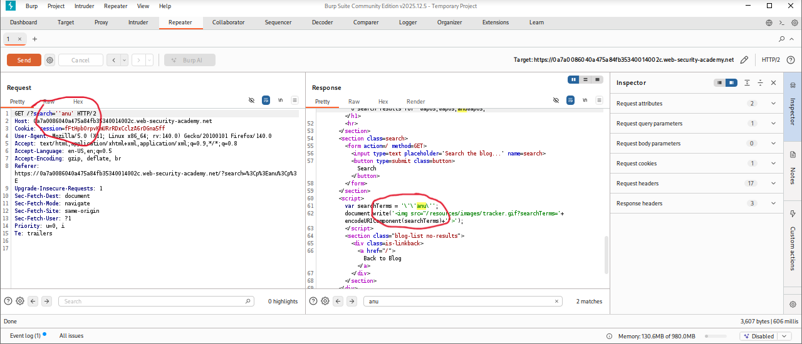
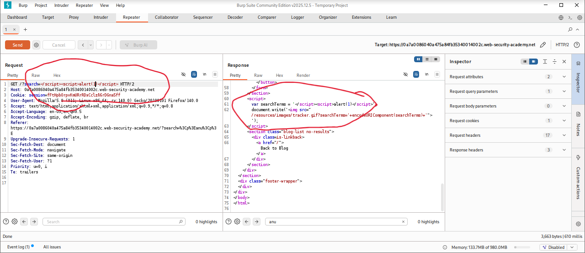
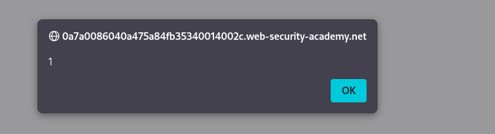
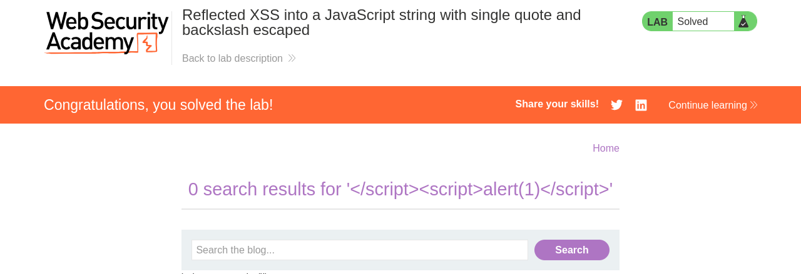

# Reflected XSS into a JavaScript String with Single Quote and Backslash Escaped

**Author:** Dnyaneshwar Yadav

---

## Overview

This lab demonstrates a **Reflected Cross-Site Scripting (XSS)** vulnerability in the search query tracking functionality.

User input is reflected inside a JavaScript string where:

* Single quotes (`'`) are escaped
* Backslashes (`\`) are escaped

Because of this, simple quote-based payloads cannot break out of the string. However, it is still possible to exploit the vulnerability by breaking out of the `<script>` context entirely and injecting a new script block.

**Goal:** Escape the JavaScript context and trigger the `alert()` function.

---

## Lab Information

- **Difficulty Level:** Practitioner
- **Vulnerability Type:** Reflected XSS
- **Target:** Search functionality with JavaScript string reflection

---

## Solution

### Step 1: Review the lab description

Open the lab and read the description to understand how user input is handled.

**Key observations:**

* Input is reflected inside a JavaScript string
* Single quotes and backslashes are escaped
* Output is not HTML-encoded



---

### Step 2: Submit normal input and observe reflection

Enter a simple test value in the search box, for example:
```html
<p>test</p>
```

Intercept the request using **Burp Suite** and inspect the response.

**Observation:**

* The input is reflected inside a JavaScript string
* HTML tags are not executed
* Reflection confirms a JavaScript sink



---

### Step 3: Test single-quote breaking attempt (fails)

Try submitting input containing a single quote, for example:
```
'anu'
```

Inspect the response in Burp.

**Observation:**

* The single quote is escaped with a backslash
* This prevents breaking out of the JavaScript string
* Quote-based injection is ineffective



---

### Step 4: Inject payload to break out of script context

Since escaping prevents breaking out of the string, inject a payload that closes the script block entirely and opens a new one:
```html
</script><script>alert(1)</script>
```

**This payload:**

* Closes the existing `<script>` tag
* Injects a new `<script>` block
* Executes `alert(1)`



---

### Step 5: Alert execution confirmation

Right-click on the page, select **Copy URL**, and paste it into the browser.

When the page loads, the injected script executes and an alert popup appears.



---

### Step 6: Lab solved confirmation

After successful execution of the payload, the lab status changes to **Solved**.



---

## Result

Successfully exploited a **Reflected XSS vulnerability** by:

* Identifying JavaScript string reflection
* Confirming quote and backslash escaping
* Bypassing string restrictions by closing the `<script>` tag
* Injecting a new executable script block

This lab demonstrates that escaping quotes alone is not sufficient if the script context itself can be broken.

---

## Screenshots Folder Structure
```text
screenshots/
├── 01-lab-description.png
├── 02-normal-input-burp.png
├── 03-single-quote-escaped.png
├── 04-malicious-payload.png
├── 05-alert-popup.png
└── 06-lab-solved.png
```

---

## Disclaimer

This repository is for educational purposes only. The techniques demonstrated here should only be used in authorized environments such as security labs and CTF challenges.

---