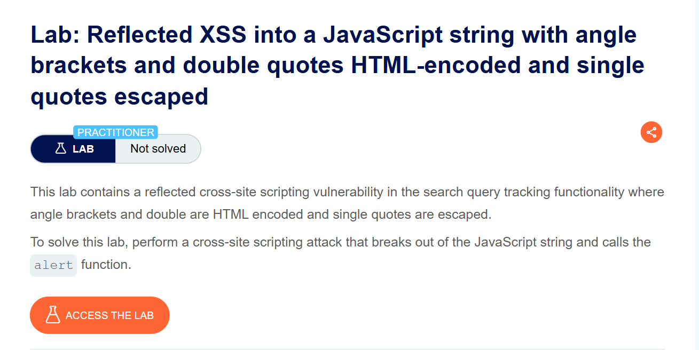
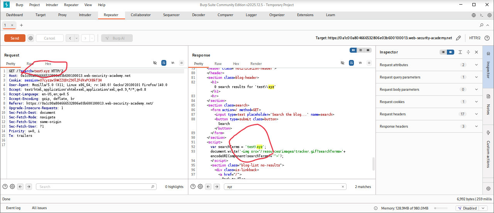
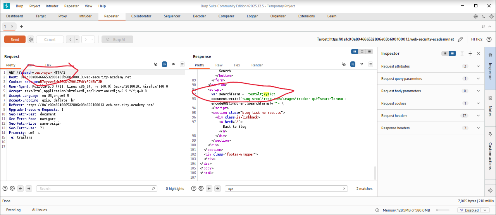
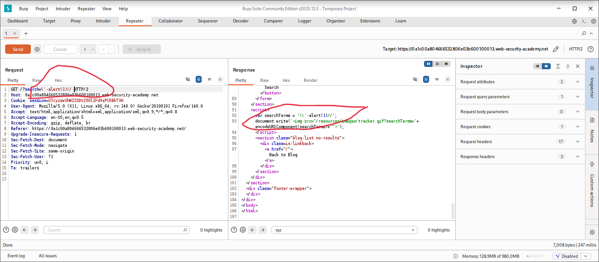
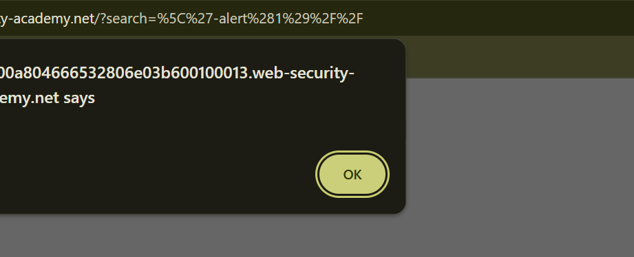
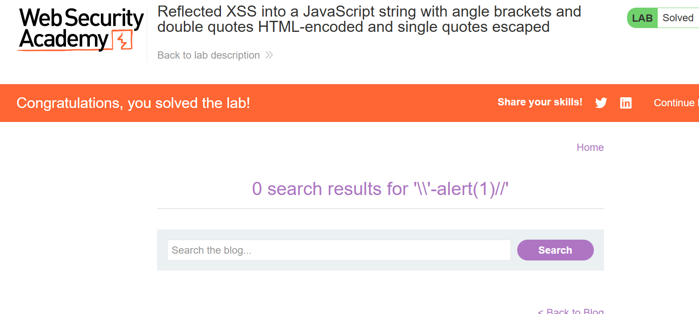

# Reflected XSS into a JavaScript String with Angle Brackets and Double Quotes HTML-Encoded and Single Quotes Escaped

**Author:** Dnyaneshwar Yadav

---

## Overview

This lab demonstrates a **Reflected Cross-Site Scripting (XSS)** vulnerability in the search query tracking functionality.

User input is reflected inside a JavaScript string, where:

* Angle brackets (`< >`) are HTML-encoded
* Double quotes (`"`) are HTML-encoded
* Single quotes (`'`) are backslash-escaped
* Backslashes (`\`) are **not escaped**

Because of this mixed encoding behavior, normal payloads fail. However, by abusing the **unescaped backslash**, it is possible to break out of the JavaScript string and execute arbitrary JavaScript.

**Goal:** Exploit this behavior and trigger the `alert()` function.

---

## Lab Information

- **Difficulty Level:** Practitioner
- **Vulnerability Type:** Reflected XSS
- **Target:** Search functionality with inconsistent escaping

---

## Solution

### Step 1: Review the lab description

Open the lab and read the description to understand the context of reflection and encoding.

**Key observations:**

* Input is reflected in a JavaScript string
* HTML tags cannot be injected directly
* Single quotes are escaped, but backslashes are not



---

### Step 2: Test single-quote injection attempt

Submit the following input:
```
test'xyz
```

Intercept the request using **Burp Suite** and inspect the response.

**Observation:**

* The single quote (`'`) is escaped with a backslash (`\'`)
* This prevents breaking out of the JavaScript string


---

### Step 3: Test backslash behavior

Submit the following input:
```
test\xyz
```

Inspect the response in Burp.

**Observation:**

* The backslash (`\`) is **not escaped**
* This indicates a potential injection vector



---

### Step 4: Test angle brackets encoding

Submit input containing angle brackets:
```
test<xyz>
```

**Observation:**

* Angle brackets are HTML-encoded
* HTML injection is not possible



---

### Step 5: Inject final XSS payload

Using the unescaped backslash, submit the following payload:
```
\'-alert(1)//
```

**This payload works because:**

* `\'` terminates the escaped single quote
* `-alert(1)` executes JavaScript
* `//` comments out the remaining script



---

### Step 6: Confirm alert execution

Right-click the page, select **Copy URL**, and paste it into the browser.

When the page loads, the injected JavaScript executes and the alert popup appears.



---

### Step 7: Lab solved confirmation

After successful execution of the payload, the lab status changes to **Solved**.



---

## Result

Successfully exploited a **Reflected XSS vulnerability** by:

* Identifying JavaScript string reflection
* Observing inconsistent escaping behavior
* Leveraging an unescaped backslash to break out of context
* Executing JavaScript using a crafted payload

This lab demonstrates that partial or inconsistent encoding can still lead to XSS vulnerabilities, even when common characters are escaped.

---

## Screenshots Folder Structure
```text
screenshots/
├── 01-lab-description.png
├── 02-single-quote-escaped.png
├── 03-backslash-not-escaped.png
├── 04-angle-brackets-encoded.png
├── 05-final-payload-burp.png
├── 06-alert-popup.png
└── 07-lab-solved.png
```

---

## Disclaimer

This repository is for educational purposes only. The techniques demonstrated here should only be used in authorized environments such as security labs and CTF challenges.

---