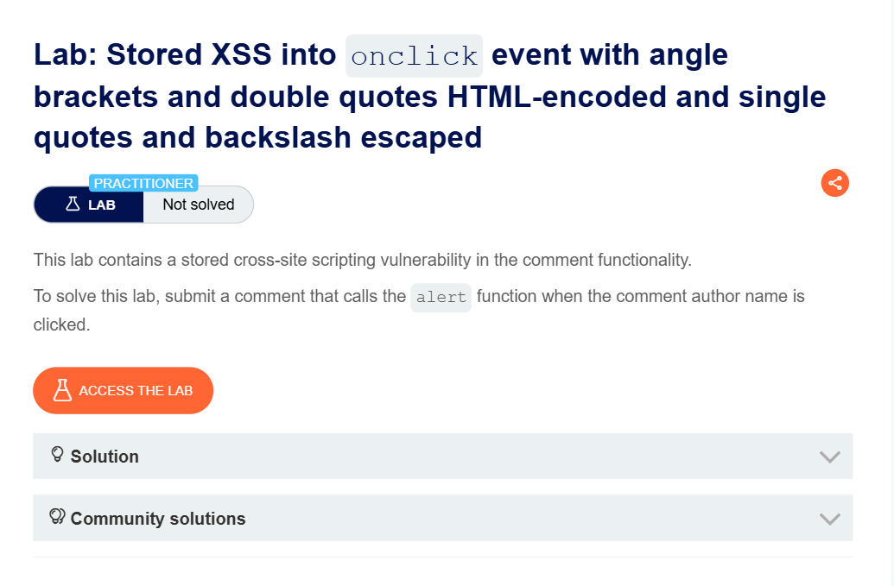
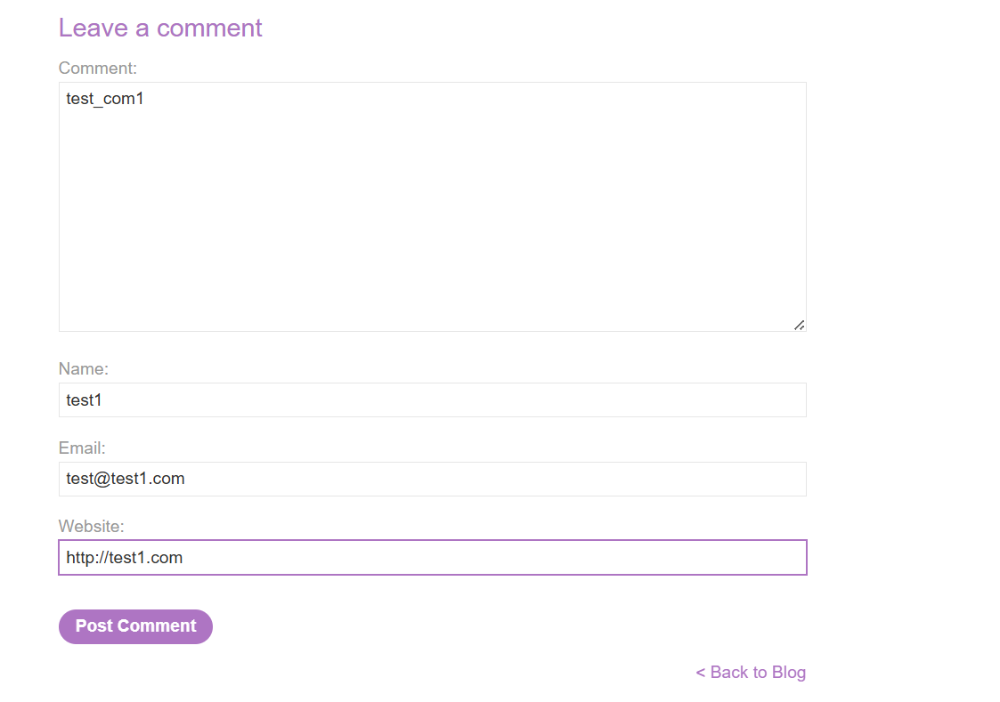
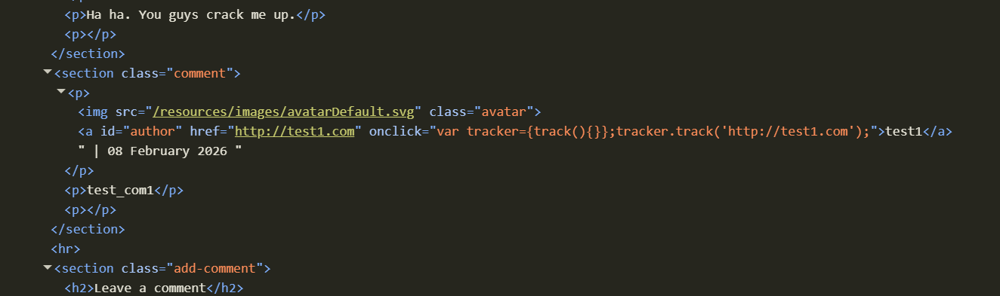
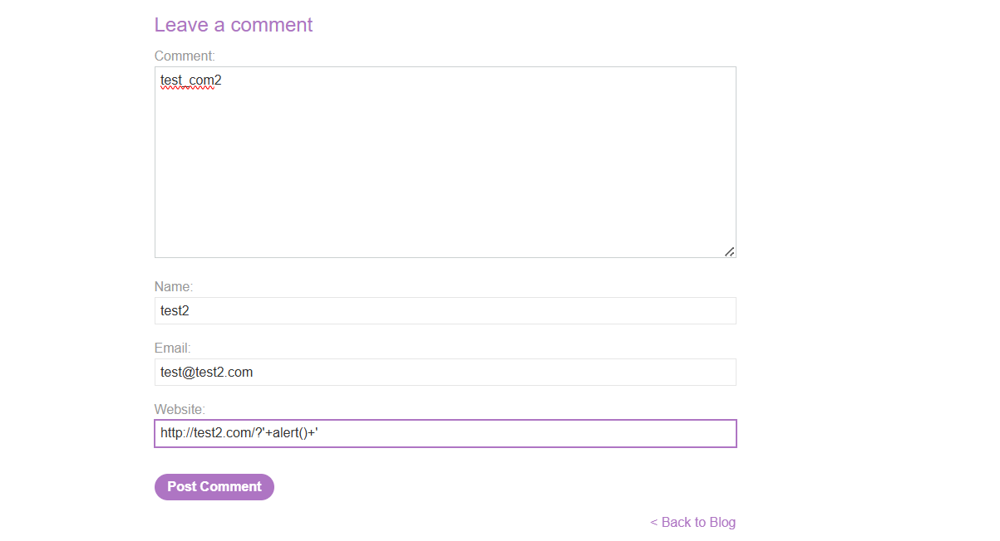
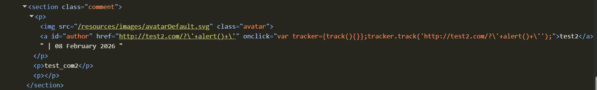
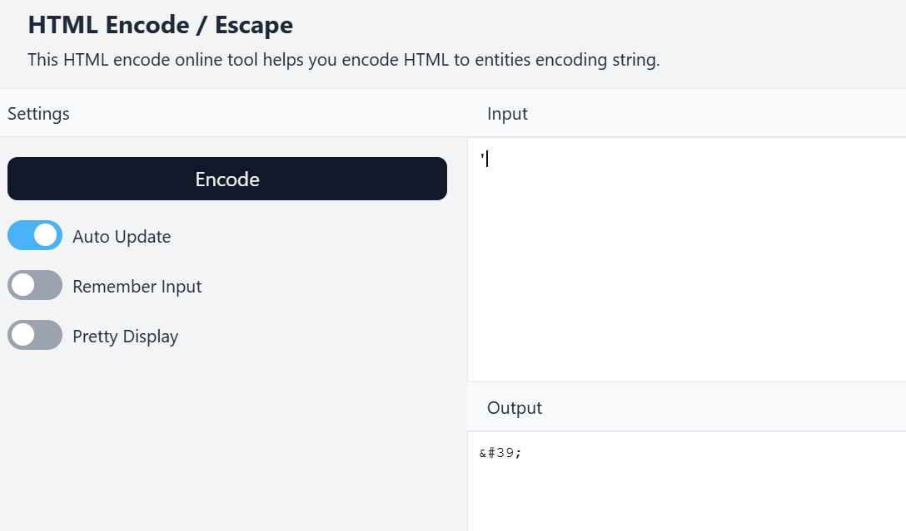
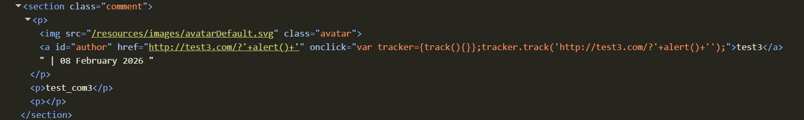
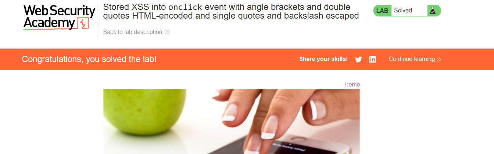

# Stored XSS into `onclick` Event with Angle Brackets and Double Quotes HTML-Encoded and Single Quotes and Backslash Escaped

**Author:** Dnyaneshwar Yadav

---

## Overview

This lab contains a **Stored Cross-Site Scripting (XSS)** vulnerability in the comment functionality.

User input is stored and reflected inside an `onclick` event handler, where:

* Angle brackets (`< >`) are HTML-encoded
* Double quotes (`"`) are HTML-encoded
* Single quotes (`'`) are backslash-escaped
* Backslashes (`\`) are escaped

However, the application fails to properly sanitize **HTML entities**, allowing an attacker to bypass the quote escaping by using encoded characters.

**Goal:** Submit a comment that calls the `alert()` function when the comment author name is clicked.

---

## Lab Information

- **Difficulty Level:** Practitioner
- **Vulnerability Type:** Stored XSS (onclick event attribute)
- **Target:** Comment functionality

---

## Solution

### Step 1: Review the lab description

Open the lab and read the description to understand the vulnerability context.

**Key points:**

* Stored XSS in comment functionality
* Input is reflected in `onclick` event
* Multiple encoding mechanisms are in place
* Payload must execute when author name is clicked



---

### Step 2: Submit a normal test comment

Submit a normal comment with regular test data:

- **Comment:** `test_com1`
- **Name:** `test1`
- **Email:** `test@test1.com`
- **Website:** `http://test1.com`

This establishes a baseline for how the application handles normal input.



---

### Step 3: Inspect normal comment in DOM

Right-click on the author name and inspect the element.

**Observation:**

The website URL is reflected inside the `href` attribute and an `onclick` event handler is present:
```html
<a id="author" href="http://test1.com" onclick="var tracker={track(){}};tracker.track('http://test1.com');">test1</a>
```

The user-controlled input appears in the `onclick` attribute.



---

### Step 4: Test single quote injection

Submit a comment with a single quote in the website field to test escaping:

- **Comment:** `test_com2`
- **Name:** `test2`
- **Email:** `test@test2.com`
- **Website:** `http://test2.com/?'+alert()+`



---

### Step 5: Observe single quote escaping in DOM

Inspect the author link element.

**Observation:**

The single quote is escaped with a backslash:
```html
onclick="var tracker={track(){}};tracker.track('http://test2.com/?\''+alert()+\'');"
```

This prevents breaking out of the JavaScript string using single quotes.



---

### Step 6: Use HTML encoder to find entity for single quote

Open an HTML encoder tool and encode the single quote character (`'`).

**Result:**
```
' → &#39;
```

HTML entities are **not escaped** by the application, providing a bypass mechanism.



---

### Step 7: Craft final payload using HTML entity

Submit a comment with the HTML entity-encoded single quote:

- **Comment:** `test_com3`
- **Name:** `test3`
- **Email:** `test@test3.com`
- **Website:** `http://test3.com/?&#39;+alert()+&#39;`

**Payload breakdown:**

- `&#39;` = Single quote (HTML entity)
- `+alert()+` = JavaScript to execute
- `&#39;` = Closing single quote (HTML entity)


---

### Step 8: Verify payload in DOM

Inspect the author link element.

**Observation:**

The HTML entity is decoded by the browser and breaks out of the JavaScript string:
```html
onclick="var tracker={track(){}};tracker.track('http://test3.com/?'+alert()+'');"
```

The payload is now valid JavaScript that will execute when clicked.



---

### Step 9: Trigger alert by clicking author name

Click on the author name (`test3`).

The `onclick` event fires and executes the injected JavaScript, triggering the `alert()` popup.


---

### Step 10: Lab solved confirmation

After the alert executes successfully, the lab status changes to **Solved**.



---

## Result

Successfully exploited a **Stored XSS vulnerability** by:

* Identifying input reflection in `onclick` event handler
* Testing and confirming single quote and backslash escaping
* Discovering that HTML entities are not sanitized
* Bypassing quote escaping using `&#39;` (HTML entity)
* Executing JavaScript when the author name is clicked

This lab demonstrates that **multiple encoding layers** are required to prevent XSS - escaping quotes alone is insufficient if HTML entities are decoded.

---

## Screenshots Folder Structure
```text
screenshots/
├── 01-lab-description.png
├── 02-normal-comment.png
├── 03-inspect-normal.png
├── 04-single-quote-test.png
├── 05-single-quote-escaped.png
├── 06-html-encoder.png
├── 07-final-payload.png
├── 08-payload-in-dom.png
├── 09-alert-triggered.png
└── 10-lab-solved.png
```

---

## Disclaimer

This repository is for educational purposes only. The techniques demonstrated here should only be used in authorized environments such as security labs and CTF challenges.

---