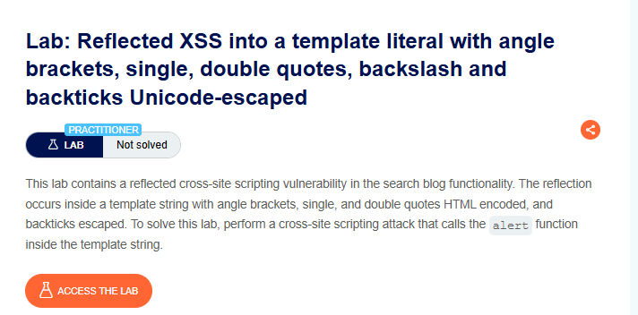
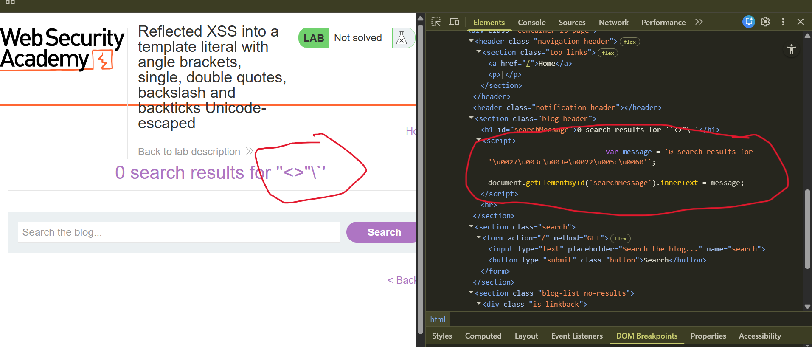
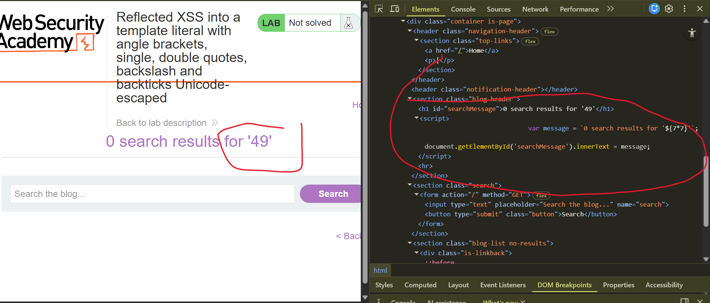
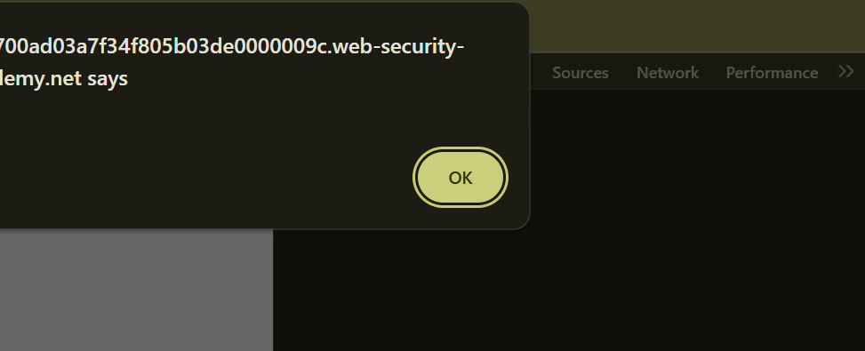
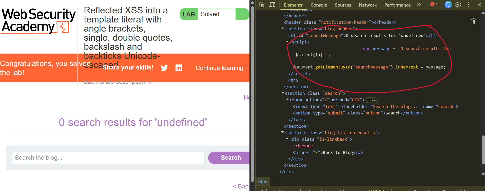

# Reflected XSS into a Template Literal with Angle Brackets, Single, Double Quotes, Backslash and Backticks Unicode-Escaped

**Author:** Dnyaneshwar Yadav

---

## Overview

This lab contains a **Reflected Cross-Site Scripting (XSS)** vulnerability in the search blog functionality.

The reflection occurs inside a JavaScript **template literal** (template string) where:

* Angle brackets (`< >`) are HTML-encoded
* Single quotes (`'`) are HTML-encoded
* Double quotes (`"`) are HTML-encoded
* Backslashes (`\`) are escaped
* Backticks (`` ` ``) are Unicode-escaped

However, template literals in JavaScript support **expression interpolation** using `${expression}` syntax, which can still be exploited even when traditional escape characters are encoded.

**Goal:** Perform a cross-site scripting attack that calls the `alert()` function inside the template string.

---

## Lab Information

- **Difficulty Level:** Practitioner
- **Vulnerability Type:** Reflected XSS (Template Literal Context)
- **Target:** Search functionality

---

## Solution

### Step 1: Review the lab description

Open the lab and read the description to understand the vulnerability context.

**Key points:**

* Reflected XSS in search functionality
* Input is reflected inside a template literal
* Multiple characters are encoded/escaped
* Must exploit template literal interpolation



---

### Step 2: Test with angle brackets and inspect template literal

Submit a search with angle brackets to test encoding:
```
"<>"\`'
```

Open **DevTools → Elements** and inspect the page source.

**Observation:**

The search input is reflected inside a JavaScript template literal:
```javascript
var message = `0 search results for '\u0027\u003c\u003e\u0022\u005c\u0060'`;
```

**Key findings:**

- Input is inside backticks (`` ` ``) indicating a template literal
- Special characters are Unicode-escaped
- Template literal interpolation `${}` is still possible



---

### Step 3: Test template literal interpolation

Template literals support expression interpolation using `${expression}`.

Submit a test payload:
```
${7*7}
```

Inspect the source code.

**Observation:**

The value appears inside the template literal context:
```javascript
var message = `0 search results for '${7*7}'`;
```

This confirms we can inject into the template literal interpolation context.



---

### Step 4: Craft and execute XSS payload

Use template literal interpolation to execute JavaScript:
```
${alert(1)}
```

**How this works:**

- `${}` syntax allows JavaScript expression evaluation
- `alert(1)` executes when the template literal is processed
- Encoding doesn't prevent interpolation syntax

When the page loads, the JavaScript executes immediately and the alert popup appears.



---

### Step 5: Lab solved confirmation

After the alert executes successfully, the lab status changes to **Solved**.

**Final payload in source:**
```javascript
var message = `0 search results for '${alert(1)}'`;
```

The template literal evaluates the expression and executes the alert.



---

## Result

Successfully exploited a **Reflected XSS vulnerability** by:

* Identifying JavaScript template literal context
* Observing Unicode escaping of special characters
* Understanding that template literal interpolation `${}` is not blocked
* Leveraging `${alert(1)}` to execute JavaScript
* Bypassing all encoding mechanisms using template literal features

This lab demonstrates that **encoding traditional XSS characters is insufficient** when the injection occurs inside a template literal, as the `${}` interpolation syntax provides an alternative execution path.

---

## Screenshots Folder Structure
```text
screenshots/
├── 01-lab-description.png
├── 02-template-literal-unicode.png
├── 03-template-literal-context.png
├── 04-alert-popup.png
└── 05-lab-solved.png
```

---

## Disclaimer

This repository is for educational purposes only. The techniques demonstrated here should only be used in authorized environments such as security labs and CTF challenges.

---