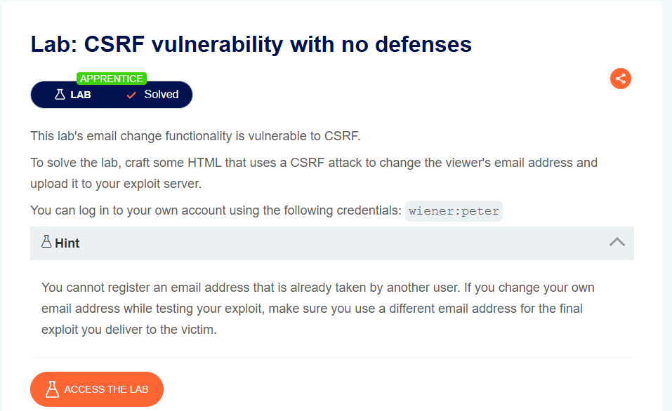
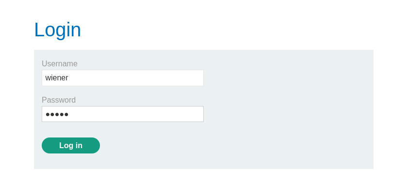
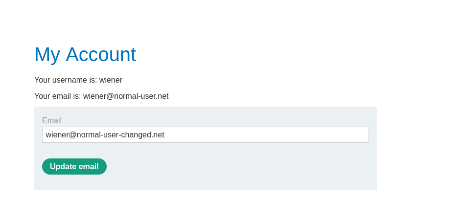
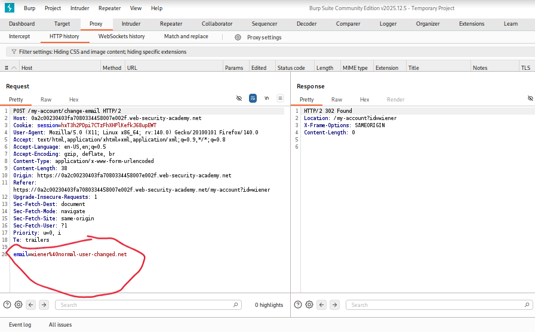
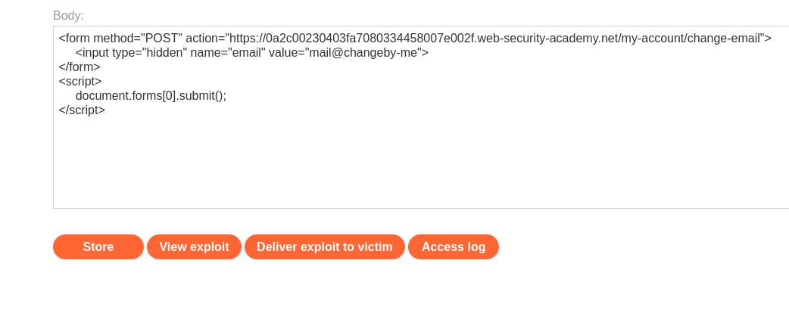

# CSRF Vulnerability with No Defenses

**Author:** Dnyaneshwar Yadav

---

## Overview

This lab's email change functionality is **vulnerable to CSRF (Cross-Site Request Forgery)**.

Unlike previous labs, this application has **no CSRF protection** - no tokens, no SameSite cookies, no validation. This makes it trivial to craft a malicious page that changes a victim's email without their knowledge.

**Goal:** Craft HTML that uses a CSRF attack to change the viewer's email address and upload it to the exploit server.

---

## Lab Information

- **Difficulty Level:** Apprentice
- **Vulnerability Type:** CSRF (No Defenses)
- **Target:** Email change functionality
- **Credentials:** `wiener:peter`

---

## Understanding CSRF

**CSRF (Cross-Site Request Forgery):**

A CSRF attack forces an authenticated user to perform unintended actions on a web application. The attack exploits the trust that a website has in the user's browser.

**How it works:**

1. Victim is authenticated to vulnerable site
2. Attacker tricks victim into visiting malicious page
3. Malicious page sends forged request to vulnerable site
4. Browser automatically includes victim's cookies
5. Vulnerable site processes request as legitimate
6. Action is performed without victim's knowledge

**Common CSRF defenses (NOT present in this lab):**

- CSRF tokens
- SameSite cookie attribute
- Referer/Origin header validation
- Custom request headers

---

## Solution

### Step 1: Review the lab description

Open the lab and read the description carefully.

**Key points:**

* Email change functionality is vulnerable to CSRF
* No CSRF defenses implemented
* Must upload exploit to exploit server
* Credentials provided: `wiener:peter`
* Cannot reuse email addresses



---

### Step 2: Login with provided credentials

Navigate to **My Account** and login:

- **Username:** `wiener`
- **Password:** `peter`



---

### Step 3: Test email change functionality

After login, observe the **My Account** page.

**Current email:** `wiener@normal-user.net`

Change the email to understand the functionality:

**New email:** `wiener@normal-user-changed.net`

Click **Update email**.

The email is successfully changed.



---

### Step 4: Analyze email change request in Burp Suite

Open **Burp Suite** and locate the POST request to `/my-account/change-email`.

**Critical Finding:**
```
POST /my-account/change-email HTTP/2
...
email=wiener@normal-user-changed.net
```

**Key observations:**

* Endpoint: `/my-account/change-email`
* Method: **POST**
* Only parameter: `email`
* **NO CSRF TOKEN** present
* **NO additional security headers**
* Request relies solely on session cookie

**Vulnerability confirmed:** The application accepts email change requests with only the email parameter, making it vulnerable to CSRF attacks.



---

### Step 5: Craft CSRF exploit

Since there are no CSRF defenses, we can create a simple HTML form that:
1. Targets the vulnerable endpoint
2. Includes the new email value
3. Auto-submits when the page loads

**CSRF Exploit HTML:**
```html
<form method="POST" action="https://0a2c00230403fa7080334458007e002f.web-security-academy.net/my-account/change-email">
    <input type="hidden" name="email" value="mail@changeby-me">
</form>
<script>
    document.forms[0].submit();
</script>
```

**Payload breakdown:**

* `<form method="POST" action="...">` - Creates POST form targeting email change endpoint
* `action="..."` - Full URL to vulnerable endpoint
* `<input type="hidden" name="email" value="mail@changeby-me">` - Hidden field with attacker-controlled email
* `type="hidden"` - Field is invisible to victim
* `name="email"` - Matches expected parameter name
* `value="mail@changeby-me"` - Email that will be set for the victim
* `<script>document.forms[0].submit();</script>` - Auto-submits form on page load
* `document.forms[0]` - Selects first form on page
* `.submit()` - Triggers form submission

**How it works:**

1. Victim visits attacker's page (exploit server)
2. HTML loads in victim's browser
3. Form auto-submits immediately
4. POST request sent to vulnerable site
5. Browser includes victim's session cookie automatically
6. Server processes request as legitimate
7. Victim's email is changed to `mail@changeby-me`
8. Victim is unaware anything happened



---

### Step 6: Upload exploit to exploit server

Navigate to the **Exploit Server**.

In the **Body** section, paste the CSRF exploit HTML.

Click **Store** to save the exploit.

*Optional:* Click **View exploit** to test it yourself.

Click **Deliver exploit to victim** to send the malicious link to the simulated victim.


---

### Step 7: Lab solved confirmation

When the victim clicks the exploit link:

1. Malicious HTML page loads
2. Form auto-submits
3. Victim's email is changed to `mail@changeby-me`
4. Victim sees no visible indication
5. Attack is successful

The lab is automatically marked as **Solved**.


---

## Result

Successfully exploited a **CSRF vulnerability with no defenses** by:

* Identifying email change functionality
* Analyzing POST request in Burp Suite
* Confirming absence of CSRF tokens
* Confirming absence of other CSRF defenses
* Crafting HTML form targeting vulnerable endpoint
* Using auto-submit JavaScript for immediate execution
* Uploading exploit to exploit server
* Changing victim's email without their knowledge

This lab demonstrates the **critical importance of CSRF protection** in state-changing operations.

---

## Why This Attack Works

**No CSRF Token:**
- Server doesn't verify request origin
- Cannot distinguish legitimate from forged requests

**Automatic Cookie Inclusion:**
- Browser automatically includes session cookies
- Server trusts the authenticated session

**No Additional Validation:**
- No Referer/Origin header checks
- No custom headers required
- No user confirmation

**Result:**
- Any malicious page can forge requests
- Complete account takeover possible
- Silent attack - victim is unaware

---

## Defense Recommendations

To prevent CSRF attacks:

1. **Implement CSRF Tokens**
   - Generate unique token per session/request
   - Include token in all state-changing forms
   - Validate token server-side

2. **Use SameSite Cookies**
   - Set `SameSite=Strict` or `SameSite=Lax`
   - Prevents cookie inclusion in cross-site requests

3. **Validate Referer/Origin Headers**
   - Check request originates from same domain
   - Reject requests from external origins

4. **Require User Confirmation**
   - Critical actions require re-authentication
   - Email/SMS verification for sensitive changes

5. **Use Custom Headers**
   - Require custom headers for state-changing requests
   - Cannot be set by cross-origin requests

---

## Attack Flow Diagram
```
Attacker → Creates malicious page with auto-submit form
            ↓
Victim → Logs into vulnerable application
            ↓
Attacker → Sends exploit link to victim
            ↓
Victim → Clicks link / Visits malicious page
            ↓
Browser → Auto-submits form with victim's cookies
            ↓
Server → Processes request as legitimate
            ↓
Result → Victim's email changed without knowledge
```

---

## Screenshots Folder Structure
```text
screenshots/
├── 01-lab-description.png
├── 02-login-page.png
├── 03-my-account-email-change.png
├── 04-burp-no-csrf-token.png
├── 05-exploit-server-payload.png
└── 06-lab-solved.png
```

---

## Disclaimer

This repository is for educational purposes only. The techniques demonstrated here should only be used in authorized environments such as security labs and CTF challenges.

---