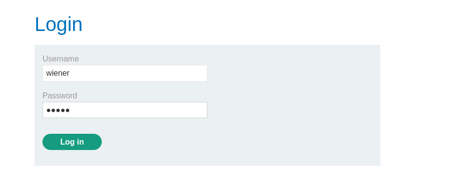
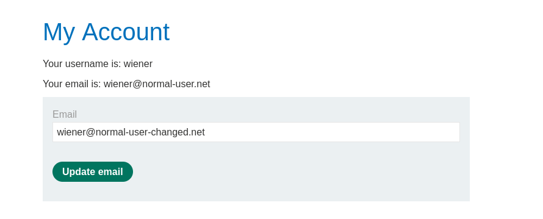
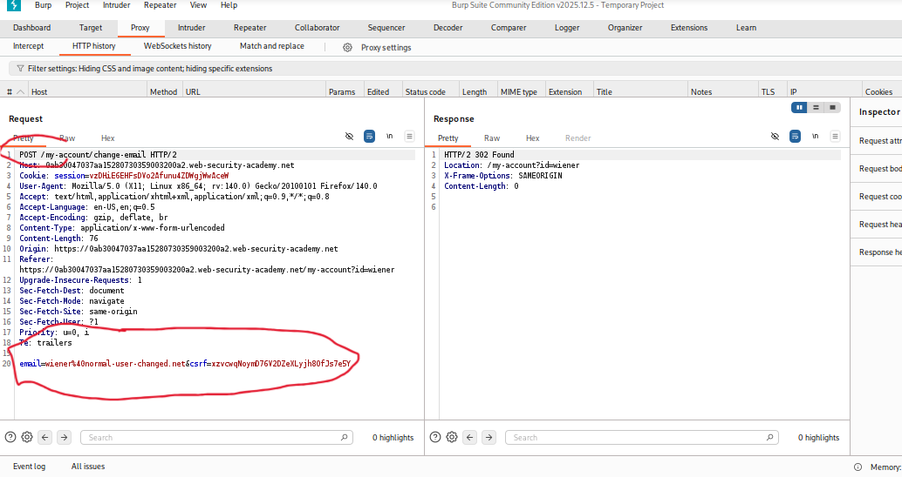
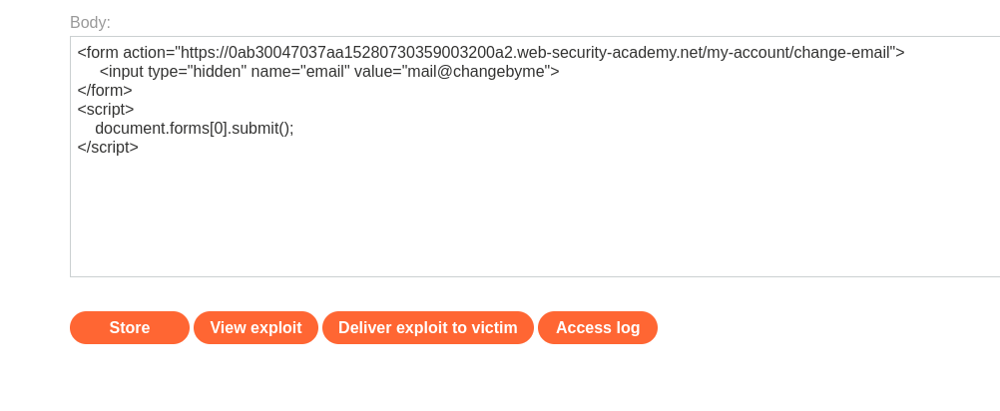
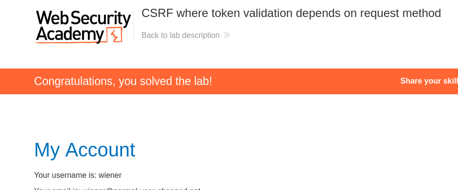

# CSRF Where Token Validation Depends on Request Method

**Author:** Dnyaneshwar Yadav

---

## Overview

This lab's email change functionality is **vulnerable to CSRF** due to flawed implementation of CSRF defenses.

The application **attempts to block CSRF attacks** by validating CSRF tokens, but it **only applies this defense to certain types of requests**. Specifically, the CSRF token is validated for POST requests but **not for GET requests**.

**Goal:** Use the exploit server to host an HTML page that uses a CSRF attack to change the viewer's email address by exploiting the method-dependent validation flaw.

---

## Lab Information

- **Difficulty Level:** Practitioner
- **Vulnerability Type:** CSRF (Method-Based Bypass)
- **Target:** Email change functionality
- **Credentials:** `wiener:peter`
- **Weakness:** CSRF token validated only on POST, not GET

---

## Understanding Method-Based CSRF Bypass

**Flawed CSRF Protection:**

Many applications implement CSRF protection with conditional logic like:
```python
if request.method == "POST":
    validate_csrf_token()
else:
    # No validation for GET, PUT, etc.
    process_request()
```

**The Vulnerability:**

- CSRF tokens are validated on POST requests
- GET requests are **not validated**
- Application accepts **both** POST and GET for state-changing operations
- Attacker can bypass CSRF protection by using GET instead of POST

**Why This is Dangerous:**

- Developers assume GET is "safe" (read-only)
- Browsers naturally send GET requests (links, images, iframes)
- CSRF attacks become trivial - no form submission needed

---

## Solution

### Step 1: Review the lab description

Open the lab and read the description carefully.

**Key points:**

* Email change functionality is vulnerable to CSRF
* Application attempts to block CSRF attacks
* Defenses only apply to **certain types of requests**
* Must upload exploit to exploit server
* Credentials provided: `wiener:peter`


---

### Step 2: Login with provided credentials

Navigate to **My Account** and login:

- **Username:** `wiener`
- **Password:** `peter`



---

### Step 3: Test email change functionality

After login, observe the **My Account** page.

**Current email:** `wiener@normal-user.net`

Change the email to understand the functionality:

**New email:** `wiener@normal-user-changed.net`

Click **Update email**.



---

### Step 4: Analyze email change request in Burp Suite

Open **Burp Suite** and locate the POST request to `/my-account/change-email`.

**Request observed:**
```
POST /my-account/change-email HTTP/2
...
email=wiener@normal-user-changed.net&csrf=zvovqNyvd76rZDZxALy3hQbf3cZa5J
```

**Key observations:**

* Endpoint: `/my-account/change-email`
* Method: **POST**
* Parameters:
  - `email` - New email address
  - `csrf` - CSRF token (present and required for POST)

**CSRF Token Present:**
Unlike the previous lab, this application **does have CSRF protection** for POST requests.



---

### Step 5: Test GET request method bypass

**Hypothesis:** The application validates CSRF tokens on POST but not on GET.

**Test:** Change the request method from POST to GET.

In **Burp Repeater:**

**Original POST request:**
```
POST /my-account/change-email HTTP/2
...
email=test@test.com&csrf=TOKEN
```

**Modified GET request:**
```
GET /my-account/change-email?email=test@test.com HTTP/2
```

**Result:**
- Email successfully changed
- **No CSRF token required**
- CSRF validation bypassed

**Vulnerability confirmed:** The application only validates CSRF tokens on POST requests, not GET requests.

---

### Step 6: Craft CSRF exploit using GET method

Since GET requests don't require CSRF tokens, we can craft a simple HTML form that:
1. Uses GET method instead of POST
2. Doesn't include CSRF token
3. Automatically submits on page load

**CSRF Exploit HTML:**
```html
<form action="https://0ab3004703faa152807303590003200a2.web-security-academy.net/my-account/change-email">
    <input type="hidden" name="email" value="mail@changebyme">
</form>
<script>
    document.forms[0].submit();
</script>
```

**Payload breakdown:**

* `<form action="...">` - Creates form targeting email change endpoint
* **NO `method="POST"`** - Defaults to GET method
* `action="..."` - Full URL to vulnerable endpoint
* `<input type="hidden" name="email" value="mail@changebyme">` - Email parameter
* **NO CSRF token included** - Not needed for GET requests
* `<script>document.forms[0].submit();</script>` - Auto-submits form

**How it works:**

1. Victim visits attacker's page (exploit server)
2. HTML form loads
3. Form auto-submits using **GET method**
4. Request URL becomes: `/my-account/change-email?email=mail@changebyme`
5. Browser includes victim's session cookie
6. Server **doesn't validate CSRF token** for GET requests
7. Email is changed to `mail@changebyme`
8. Victim is unaware



---

### Step 7: Upload and deliver exploit

Navigate to the **Exploit Server**.

In the **Body** section, paste the CSRF exploit HTML.

Click **Store** to save the exploit.

*Optional:* Click **View exploit** to test it.

Click **Deliver exploit to victim**.

---

### Step 8: Lab solved confirmation

When the victim clicks the exploit link:

1. Malicious HTML page loads
2. Form auto-submits via **GET** method
3. CSRF token validation is **skipped**
4. Victim's email is changed to `mail@changebyme`
5. Attack succeeds silently

The lab is automatically marked as **Solved**.



---

## Result

Successfully bypassed **method-dependent CSRF protection** by:

* Identifying email change functionality
* Analyzing POST request with CSRF token
* Testing GET request method
* Discovering CSRF validation only applies to POST
* Crafting HTML form without method attribute (defaults to GET)
* Omitting CSRF token (not required for GET)
* Uploading exploit to exploit server
* Changing victim's email without their knowledge

This lab demonstrates that **incomplete CSRF protection is as dangerous as no protection**.

---

## Why This Attack Works

**Flawed Defense Implementation:**

The application developers made a critical mistake:
```python
# Flawed logic
if request.method == "POST":
    if not validate_csrf_token(request.csrf):
        return "CSRF validation failed"
# Vulnerability: GET requests skip validation entirely
process_email_change(request.email)
```

**Correct Implementation:**
```python
# Secure logic
if not validate_csrf_token(request.csrf):
    return "CSRF validation failed"
# Validate on ALL methods
process_email_change(request.email)
```

**Root Causes:**

1. **Assumption that GET is safe** - Developers often assume GET requests don't change state
2. **Inconsistent validation** - CSRF checks only on certain methods
3. **Accepting multiple methods** - Endpoint accepts both POST and GET for state-changing operations

---

## Defense Recommendations

### 1. Validate CSRF Tokens on ALL Methods
```python
# Validate regardless of method
if not csrf_token_valid(request):
    abort(403)
```

### 2. Restrict HTTP Methods

Only accept appropriate methods for each endpoint:
```python
@app.route('/change-email', methods=['POST'])  # Only POST allowed
def change_email():
    # GET requests will be rejected automatically
```

### 3. Follow REST Principles

- **GET** - Read-only operations
- **POST/PUT/DELETE** - State-changing operations
- Never use GET for state changes

### 4. Use Framework CSRF Protection

Most frameworks have built-in CSRF protection:
```python
# Django (Python)
from django.middleware.csrf import csrf_protect

# Flask (Python)
from flask_wtf.csrf import CSRFProtect

# Express (Node.js)
const csrf = require('csurf')
```

### 5. Implement Defense in Depth

- CSRF tokens on all state-changing requests
- SameSite cookie attribute
- Referer/Origin header validation
- Custom headers for AJAX requests

---

## Common Variations

**Other method-based bypasses:**

1. **POST validated, PUT not validated**
2. **POST validated, DELETE not validated**
3. **Standard methods validated, custom methods not**
4. **Case sensitivity bypass:** `post` vs `POST`

**Testing checklist:**

- [ ] Test with GET method
- [ ] Test with PUT method
- [ ] Test with DELETE method
- [ ] Test with PATCH method
- [ ] Test with lowercase methods
- [ ] Test with custom methods

---

## Attack Flow Diagram
```
Attacker → Crafts HTML form with GET method (no CSRF token)
            ↓
Victim → Logs into vulnerable application
            ↓
Attacker → Sends exploit link to victim
            ↓
Victim → Clicks link / Visits malicious page
            ↓
Browser → Auto-submits GET request with victim's cookies
            ↓
Server → Checks if method == POST? → NO
            ↓
Server → Skips CSRF validation
            ↓
Server → Processes email change
            ↓
Result → Victim's email changed without knowledge
```

---

## Screenshots Folder Structure
```text
screenshots/
├── 01-lab-description.png
├── 02-login-page.png
├── 03-my-account-email-change.png
├── 04-burp-post-with-csrf.png
├── 05-exploit-server-get-method.png
└── 06-lab-solved.png
```

---

## Disclaimer

This repository is for educational purposes only. The techniques demonstrated here should only be used in authorized environments such as security labs and CTF challenges.

---